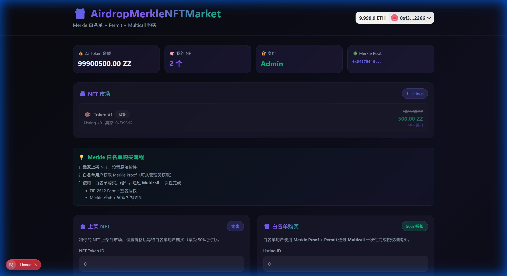
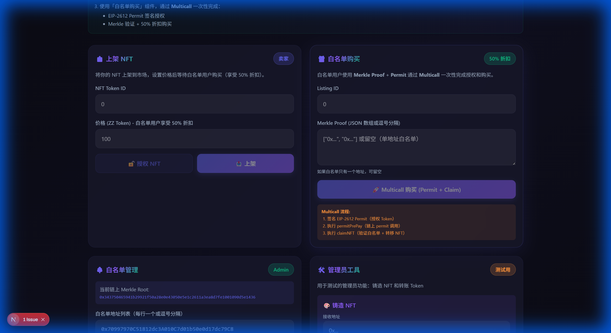

# AirdropMerkleNFTMarket

基于 Merkle 树白名单验证的 NFT 市场合约，支持 EIP-2612 Permit 授权和 Multicall 批量调用。

## ✨ 功能特点

- 🌳 **Merkle 树白名单验证** - 链下生成 Merkle 树，链上验证 Proof
- 💰 **50% 折扣优惠** - 白名单用户享受上架价格的 50% 折扣
- 🔐 **EIP-2612 Permit** - Token 支持离线签名授权，无需单独 approve
- 🚀 **Multicall 批量调用** - 一次交易完成 `permitPrePay` + `claimNFT`

---

## � 功能截图

### 主界面 - NFT 市场与统计信息



主界面展示：
- 用户 Token 余额、NFT 数量、身份信息
- NFT 市场列表（显示原价与 50% 折扣价）
- 上架 NFT 和白名单购买功能

### 白名单管理与管理员工具



白名单管理功能：
- **设置白名单** - 输入地址列表，自动计算 Merkle Root
- **生成 Merkle Proof** - 为白名单用户生成购买凭证
- **铸造 NFT** - 管理员给指定地址铸造 NFT
- **转账 Token** - 管理员转账 ZZ Token 用于测试

---

## �📋 需求与实现

### 需求 1：基于 Merkle 树验证用户是否在白名单中

**实现方案：**

```solidity
// AirdropMerkleNFTMarket.sol
import "@openzeppelin/contracts/utils/cryptography/MerkleProof.sol";

bytes32 public merkleRoot;  // 管理员设置的 Merkle 根

function claimNFT(uint256 listingId, bytes32[] calldata merkleProof) external {
    // 计算叶子节点: keccak256(abi.encodePacked(msg.sender))
    bytes32 leaf = keccak256(abi.encodePacked(msg.sender));
    
    // 使用 OpenZeppelin 的 MerkleProof 库验证
    if (!MerkleProof.verify(merkleProof, merkleRoot, leaf)) {
        revert InvalidMerkleProof();
    }
    // ... 购买逻辑
}
```

**前端 Merkle 树生成：** `frontend/utils/merkleTree.ts`

```typescript
export function buildMerkleTree(addresses: Address[]) {
    const leaves = addresses.map(addr => keccak256(encodePacked(['address'], [addr])));
    // 构建树并返回 root
}

export function getMerkleProof(addresses: Address[], targetAddress: Address) {
    // 返回目标地址的 Merkle Proof
}
```

---

### 需求 2：白名单用户使用 50% 优惠价格购买 NFT，Token 支持 Permit

**实现方案：**

**ZZToken (ERC20 + EIP-2612 Permit):**

```solidity
// ZZToken.sol - 继承 OpenZeppelin ERC20Permit
import "@openzeppelin/contracts/token/ERC20/extensions/ERC20Permit.sol";

contract ZZTOKEN is ERC20, ERC20Permit {
    constructor() ERC20("ZZTOKEN", "ZZ") ERC20Permit("ZZTOKEN") {
        _mint(msg.sender, 100_000_000 * 10 ** decimals());
    }
}
```

**50% 折扣计算：**

```solidity
// AirdropMerkleNFTMarket.sol
function claimNFT(...) external {
    uint256 originalPrice = listing.price;
    uint256 discountedPrice = originalPrice / 2;  // 50% 折扣
    
    IERC20(payToken).transferFrom(msg.sender, seller, discountedPrice);
}
```

---

### 需求 3：使用 Multicall (delegatecall) 一次性调用 permitPrePay + claimNFT

**实现方案：**

```solidity
// AirdropMerkleNFTMarket.sol

/// @notice 调用 Token 的 permit 进行授权
function permitPrePay(
    address token, address owner, address spender,
    uint256 value, uint256 deadline,
    uint8 v, bytes32 r, bytes32 s
) external {
    IERC20Permit(token).permit(owner, spender, value, deadline, v, r, s);
}

/// @notice 批量调用（使用 delegatecall 保持 msg.sender）
function multicall(bytes[] calldata data) external returns (bytes[] memory results) {
    results = new bytes[](data.length);
    for (uint256 i = 0; i < data.length; i++) {
        (bool success, bytes memory result) = address(this).delegatecall(data[i]);
        if (!success) revert MulticallFailed(i, result);
        results[i] = result;
    }
}
```

**前端调用示例：** `frontend/components/MerkleClaimNFT.tsx`

```typescript
// 1. 用户签名 EIP-2612 Permit
const signature = await signTypedDataAsync({ ... });

// 2. 编码两个函数调用
const permitData = encodeFunctionData({
    functionName: 'permitPrePay',
    args: [token, owner, spender, value, deadline, v, r, s]
});
const claimData = encodeFunctionData({
    functionName: 'claimNFT',
    args: [listingId, merkleProof]
});

// 3. 一次交易执行 multicall
await writeContract({
    functionName: 'multicall',
    args: [[permitData, claimData]]
});
```

**为什么使用 delegatecall：**
- 保持 `msg.sender` 为实际调用者（买家地址）
- `claimNFT` 中的 `msg.sender` 验证能正确识别白名单用户
- 一次交易完成授权 + 购买，节省 Gas

## 📁 项目结构

```
AirdropMerkleNFTMarket/
├── src/
│   ├── AirdropMerkleNFTMarket.sol  # 主合约
│   ├── ZZToken.sol                  # ERC20 + EIP-2612 Permit
│   └── ZZNFT.sol                    # ERC721 NFT
├── test/
│   └── AirdropMerkleNFTMarket.t.sol # 测试文件 (13 tests)
├── script/
│   └── Deploy.s.sol                 # 部署脚本
└── frontend/                        # Next.js 前端
    ├── app/                         # 页面
    ├── components/                  # 组件
    │   ├── ListNFT.tsx              # 上架 NFT
    │   ├── MerkleClaimNFT.tsx       # 白名单购买
    │   ├── WhitelistManager.tsx     # 白名单管理
    │   └── AdminTools.tsx           # 管理员工具
    ├── config/                      # 合约配置
    └── utils/                       # 工具函数
```

## 🚀 快速开始

### 1. 安装依赖

```bash
# 安装 Foundry 依赖
forge install

# 安装前端依赖
cd frontend && npm install
```

### 2. 运行测试

```bash
forge test -vvv
```

### 3. 本地部署

```bash
# 启动本地节点
anvil

# 部署合约（新终端）
forge script script/Deploy.s.sol --rpc-url http://127.0.0.1:8545 --broadcast
```

### 4. 启动前端

```bash
cd frontend
npm run dev
# 访问 http://localhost:3000
```

## 📖 使用流程

### 管理员操作

1. **铸造 NFT** - 使用管理员工具给卖家铸造 NFT
2. **转账 Token** - 给买家转账 ZZ Token
3. **设置白名单** - 输入白名单地址，系统自动计算 Merkle Root
4. **生成 Proof** - 为白名单用户生成 Merkle Proof

### 卖家操作

1. **授权 NFT** - 点击授权按钮
2. **上架 NFT** - 设置价格并上架

### 白名单买家操作

1. **获取 Proof** - 从管理员获取 Merkle Proof
2. **Multicall 购买** - 一键完成 Permit 签名 + Claim NFT

## 🔧 核心合约函数

| 函数 | 说明 |
|------|------|
| `list()` | 上架 NFT |
| `permitPrePay()` | 调用 Token permit 授权 |
| `claimNFT()` | Merkle 验证 + 50% 折扣购买 |
| `multicall()` | delegatecall 批量调用 |
| `setMerkleRoot()` | 管理员设置 Merkle Root |
| `isWhitelisted()` | 验证地址是否在白名单 |

## 🛠️ 技术栈

**智能合约**
- Solidity 0.8.30
- Foundry
- OpenZeppelin Contracts

**前端**
- Next.js 16
- RainbowKit
- wagmi / viem
- TailwindCSS

## 📜 License

MIT
