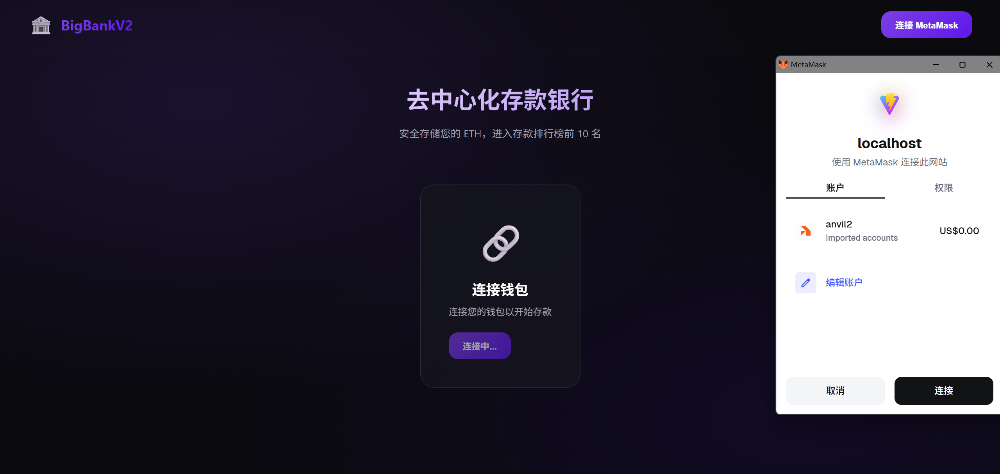
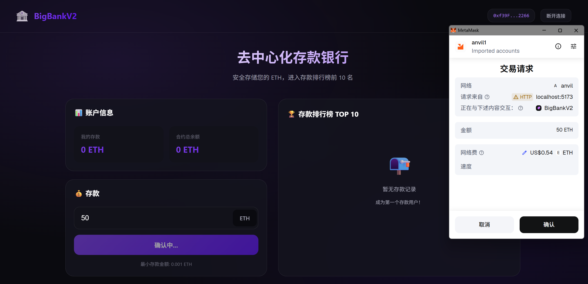
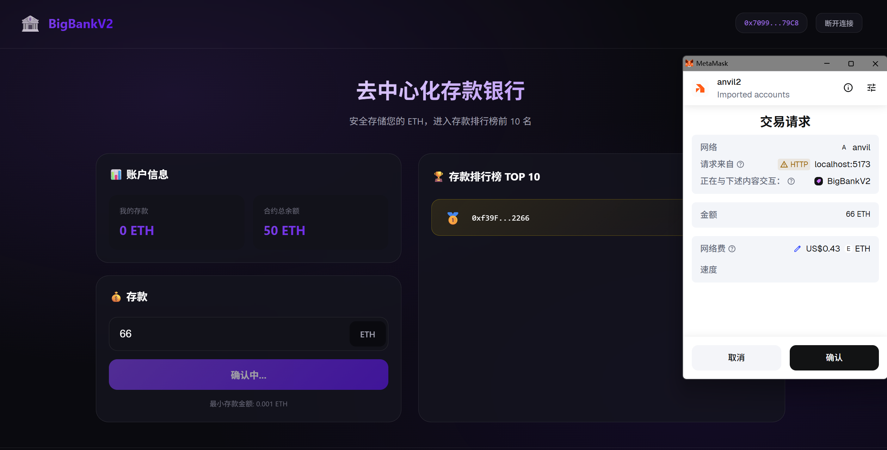
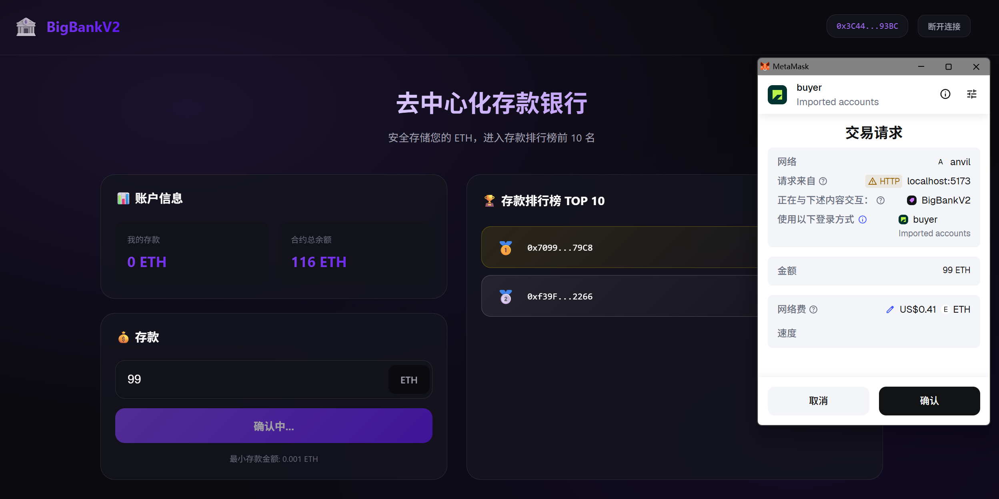
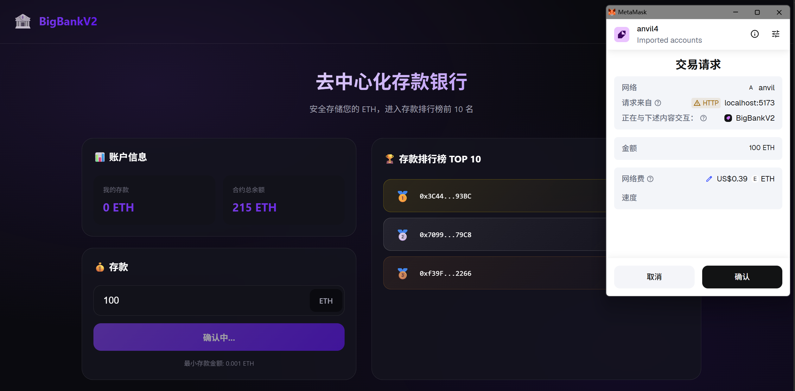
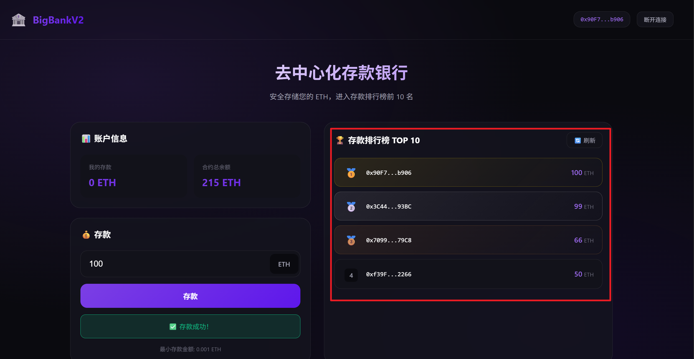

# BigBankV2

去中心化存款银行合约，支持直接 ETH 转账存款，使用**可迭代链表**维护前 10 名存款用户排行榜。

## 功能特性

- ✅ 通过 MetaMask 直接给合约地址存款
- ✅ 记录每个地址的存款金额
- ✅ 可迭代链表保存存款金额前 10 名用户
- ✅ 现代化前端界面 (Vite + React + wagmi)

## 功能展示













## 技术栈

**智能合约:**
- Solidity 0.8.20
- Foundry

**前端:**
- Vite + React + TypeScript
- wagmi + viem
- 深色主题 UI

## 快速开始

### 1. 启动 Anvil 本地节点

```bash
anvil
```

### 2. 部署合约

```bash
forge script script/Deploy.s.sol --rpc-url http://127.0.0.1:8545 --broadcast
```

### 3. 更新合约地址

将部署输出的地址更新到 `frontend/src/wagmi.ts`:

```typescript
export const CONTRACT_ADDRESS = '0x...' as const;
```

### 4. 启动前端

```bash
cd frontend
npm install
npm run dev
```

### 5. 配置 MetaMask

- 添加网络: `http://127.0.0.1:8545`, Chain ID: `31337`
- 导入 Anvil 测试账户私钥:
  ```
  0xac0974bec39a17e36ba4a6b4d238ff944bacb478cbed5efcae784d7bf4f2ff80
  ```

## 测试

```bash
forge test -vvv
```

## 合约接口

| 函数 | 说明 |
|------|------|
| `deposit()` | 存款 (最小 0.001 ETH) |
| `receive()` | 支持直接转账 |
| `getBalance(address)` | 查询余额 |
| `getTopDepositors()` | 获取前 10 名 |
| `withdraw(uint256, address)` | 管理员提现 |
