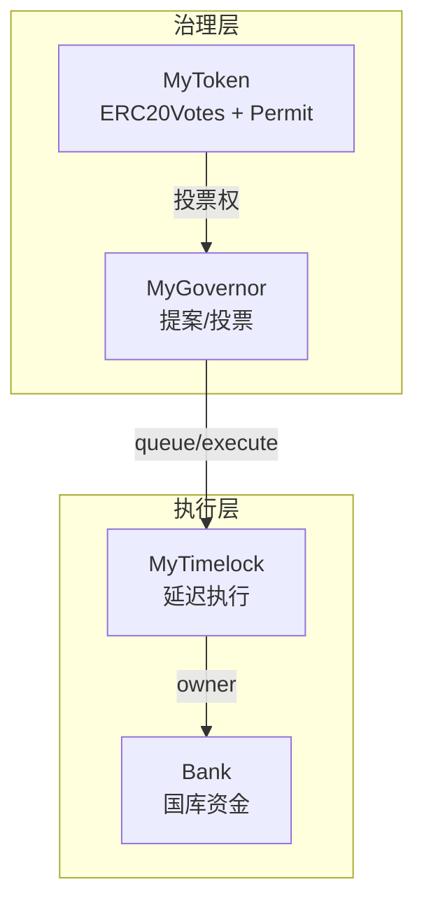

# DAO Treasury (Bank)

DAO 管理的国库合约系统，通过治理投票控制 ETH 和 ERC20 代币的提取。

## 架构



## 合约说明

| 合约 | 功能 |
|------|------|
| `MyToken.sol` | ERC20 治理代币，支持投票委托和 EIP-2612 签名授权 |
| `Bank.sol` | 国库合约，接收 ETH/ERC20，仅 owner (Timelock) 可提取 |
| `MyTimelock.sol` | 时间锁，延迟执行通过的提案（默认 1 天） |
| `MyGovernor.sol` | 治理合约，管理提案生命周期 |

## 快速开始

```bash
# 安装依赖
cd DAOTreasury
forge install

# 编译
forge build

# 运行测试
forge test -vvv

# 部署 (需要设置环境变量)
export PRIVATE_KEY=your_private_key
forge script script/Deploy.s.sol --rpc-url <RPC_URL> --broadcast
```

## 提案流程

### 1. 委托投票权 (关键步骤!)

> ⚠️ **必须先委托，否则投票权为 0！**

```solidity
// 委托给自己
token.delegate(msg.sender);

// 或委托给他人
token.delegate(delegatee);
```

### 2. 创建提案

```solidity
address[] memory targets = new address[](1);
uint256[] memory values = new uint256[](1);
bytes[] memory calldatas = new bytes[](1);

targets[0] = address(bank);
values[0] = 0;
calldatas[0] = abi.encodeWithSignature(
    "withdrawETH(address,uint256)",
    recipient,
    amount
);

uint256 proposalId = governor.propose(targets, values, calldatas, "提取 ETH 到 recipient");
```

### 3. 等待 → 投票 → 等待 → 排队 → 等待 → 执行

```
propose → [votingDelay] → castVote → [votingPeriod] → queue → [timelock delay] → execute
    ↓          ↓              ↓            ↓            ↓           ↓              ↓
  创建提案   1 区块后      投票开始     50400 区块    进入队列     1 天后        最终执行
```

### 4. 投票

```solidity
// 0 = Against, 1 = For, 2 = Abstain
governor.castVote(proposalId, 1); // 投赞成票
```

### 5. 排队和执行

```solidity
bytes32 descriptionHash = keccak256(bytes("提取 ETH 到 recipient"));

// 提案通过后排队
governor.queue(targets, values, calldatas, descriptionHash);

// 等待 timelock 延迟后执行
governor.execute(targets, values, calldatas, descriptionHash);
```

## 默认参数

| 参数 | 值 | 说明 |
|------|-----|------|
| votingDelay | 1 block | 提案创建后多久开始投票 |
| votingPeriod | 50400 blocks | 投票持续时间 (~1 周) |
| proposalThreshold | 0 | 创建提案所需最低代币 |
| quorum | 4% | 投票通过所需最低参与率 |
| timelock delay | 1 day | 执行前的延迟时间 |

## 常见问题

### Q: 为什么我的投票权是 0？

**A:** 必须先调用 `token.delegate(address)` 委托投票权。即使持有代币，不委托就没有投票权！

### Q: 为什么 EXECUTOR_ROLE 设为 address(0)？

**A:** 允许任何人执行已通过的提案，更加去中心化。Timelock 延迟已提供足够的安全保障。

### Q: Bank 的 owner 是谁？

**A:** 部署后 Bank 的 owner 被转移给 Timelock，只有通过治理投票才能调用 `withdrawETH`。

## 测试覆盖

| 测试 | 说明 |
|------|------|
| `test_BankCanReceiveETH` | Bank 可接收 ETH |
| `test_EOACannotWithdraw` | 非 owner 无法提取 |
| `test_GovernanceSuccessfulWithdrawal` | 完整治理成功流程 |
| `test_GovernanceFailedAgainstWins` | 反对票多数导致失败 |
| `test_GovernanceFailedQuorumNotReached` | 未达 quorum 导致失败 |
| `test_ReentrancyProtection` | 重入攻击防护 |
| `test_WithdrawERC20ThroughGovernance` | ERC20 治理提取 |

## 安全考虑

- ✅ `withdrawETH` 使用 `call` 而非 `transfer`（gas 兼容性）
- ✅ `nonReentrant` 防止重入攻击
- ✅ `onlyOwner` 限制提取权限
- ✅ Timelock 部署者权限已放弃（最小权限原则）
- ✅ 自定义错误提升 gas 效率

## 运行测试

```bash
cd DAOTreasury
forge test --summary
```

**测试输出（全部 14 个测试通过）：**

```
[⠊] Compiling...
No files changed, compilation skipped

Ran 14 tests for test/DAOTreasury.t.sol:DAOTreasuryTest
[PASS] test_BankCanReceiveETH() (gas: 20417)
[PASS] test_BankOwnerIsTimelock() (gas: 10184)
[PASS] test_BankReceiveEmitsEvent() (gas: 22103)
[PASS] test_DeployerCannotWithdrawAfterTransfer() (gas: 15491)
[PASS] test_EOACannotWithdraw() (gas: 15402)
[PASS] test_GovernanceFailedAgainstWins() (gas: 516068)
[PASS] test_GovernanceFailedQuorumNotReached() (gas: 362609)
[PASS] test_GovernanceSuccessfulWithdrawal() (gas: 543799)
[PASS] test_ReentrancyProtection() (gas: 1021757)
[PASS] test_VotingWithoutDelegationHasNoPower() (gas: 119897)
[PASS] test_WithdrawERC20ThroughGovernance() (gas: 1242885)
[PASS] test_WithdrawInsufficientBalanceReverts() (gas: 667869)
[PASS] test_WithdrawToZeroAddressReverts() (gas: 664397)
[PASS] test_WithdrawZeroAmountReverts() (gas: 666488)
Suite result: ok. 14 passed; 0 failed; 0 skipped

╭─────────────────┬────────┬────────┬─────────╮
│ Test Suite      │ Passed │ Failed │ Skipped │
╞═════════════════╪════════╪════════╪═════════╡
│ DAOTreasuryTest │ 14     │ 0      │ 0       │
╰─────────────────┴────────┴────────┴─────────╯
```

### 核心测试解读

| 测试 | 验证内容 |
|------|---------|
| `test_GovernanceSuccessfulWithdrawal` | 完整治理流程：mint→delegate→propose→vote→queue→execute |
| `test_VotingWithoutDelegationHasNoPower` | 未 delegate 时投票权为 0 |
| `test_GovernanceFailedAgainstWins` | 反对票 > 赞成票时提案失败 |
| `test_GovernanceFailedQuorumNotReached` | 未达 4% quorum 时提案失败 |
| `test_ReentrancyProtection` | 恶意合约无法重入攻击 |

## 手动测试（本地 Anvil 节点）

### 1. 启动本地节点

**终端 1：启动 Anvil**
```bash
anvil --block-time 1
```

> 默认账户：
> - Account #0: `0xf39Fd6e51aad88F6F4ce6aB8827279cffFb92266`
> - Private Key: `0xac0974bec39a17e36ba4a6b4d238ff944bacb478cbed5efcae784d7bf4f2ff80`

### 2. 部署合约

**终端 2：部署**
```bash
# 设置环境变量 (PowerShell)
$env:PRIVATE_KEY="0xac0974bec39a17e36ba4a6b4d238ff944bacb478cbed5efcae784d7bf4f2ff80"

# 部署
forge script script/Deploy.s.sol --rpc-url http://127.0.0.1:8545 --broadcast -vvv
```

> 记录输出的合约地址，例如：
> - Token: `0x5FbDB2315678afecb367f032d93F642f64180aa3`
> - Timelock: `0xe7f1725E7734CE288F8367e1Bb143E90bb3F0512`
> - Governor: `0x9fE46736679d2D9a65F0992F2272dE9f3c7fa6e0`
> - Bank: `0xCf7Ed3AccA5a467e9e704C703E8D87F634fB0Fc9`

### 3. 向 Bank 存入 ETH

```bash
# 发送 10 ETH 到 Bank
cast send 0xCf7Ed3AccA5a467e9e704C703E8D87F634fB0Fc9 --value 10ether --private-key 0xac0974bec39a17e36ba4a6b4d238ff944bacb478cbed5efcae784d7bf4f2ff80 --rpc-url http://127.0.0.1:8545

# 验证 Bank 余额
cast balance 0xCf7Ed3AccA5a467e9e704C703E8D87F634fB0Fc9 --rpc-url http://127.0.0.1:8545
# 预期: 10000000000000000000 (10 ETH)
```

### 4. ⚠️ 委托投票权（关键！）

```bash
# 查看当前投票权（应该为 0）
cast call 0x5FbDB2315678afecb367f032d93F642f64180aa3 "getVotes(address)" 0xf39Fd6e51aad88F6F4ce6aB8827279cffFb92266 --rpc-url http://127.0.0.1:8545

# 委托给自己
cast send 0x5FbDB2315678afecb367f032d93F642f64180aa3 "delegate(address)" 0xf39Fd6e51aad88F6F4ce6aB8827279cffFb92266 --private-key 0xac0974bec39a17e36ba4a6b4d238ff944bacb478cbed5efcae784d7bf4f2ff80 --rpc-url http://127.0.0.1:8545

# 再次查看投票权（应该为 1000000 * 10^18）
cast call 0x5FbDB2315678afecb367f032d93F642f64180aa3 "getVotes(address)" 0xf39Fd6e51aad88F6F4ce6aB8827279cffFb92266 --rpc-url http://127.0.0.1:8545
```

### 5. 创建提款提案

```bash
# 准备 calldata: withdrawETH(recipient, 1 ether)
# recipient = 0x70997970C51812dc3A010C7d01b50e0d17dc79C8 (Account #1)
cast calldata "withdrawETH(address,uint256)" 0x70997970C51812dc3A010C7d01b50e0d17dc79C8 1000000000000000000
# 输出: 0x4782f779000000000000000000000000709979...

# 创建提案
cast send 0x9fE46736679d2D9a65F0992F2272dE9f3c7fa6e0 "propose(address[],uint256[],bytes[],string)" "[0xCf7Ed3AccA5a467e9e704C703E8D87F634fB0Fc9]" "[0]" "[0x4782f779000000000000000000000000709979970c51812dc3a010c7d01b50e0d17dc79c80000000000000000000000000000000000000000000000000de0b6b3a7640000]" "Withdraw 1 ETH to Account #1" --private-key 0xac0974bec39a17e36ba4a6b4d238ff944bacb478cbed5efcae784d7bf4f2ff80 --rpc-url http://127.0.0.1:8545
```

> 从交易日志中获取 `proposalId`（ProposalCreated 事件第一个参数）

### 6. 查看提案状态

```bash
# 替换 <PROPOSAL_ID> 为实际值
cast call 0x9fE46736679d2D9a65F0992F2272dE9f3c7fa6e0 "state(uint256)" <PROPOSAL_ID> --rpc-url http://127.0.0.1:8545
```

**状态码：**
| 值 | 状态 |
|----|------|
| 0 | Pending |
| 1 | Active |
| 2 | Canceled |
| 3 | Defeated |
| 4 | Succeeded |
| 5 | Queued |
| 6 | Expired |
| 7 | Executed |

### 7. 等待并投票

```bash
# 推进区块（超过 votingDelay）
cast rpc anvil_mine 2 --rpc-url http://127.0.0.1:8545

# 确认状态变为 Active (1)
cast call 0x9fE46736679d2D9a65F0992F2272dE9f3c7fa6e0 "state(uint256)" <PROPOSAL_ID> --rpc-url http://127.0.0.1:8545

# 投赞成票 (support: 0=Against, 1=For, 2=Abstain)
cast send 0x9fE46736679d2D9a65F0992F2272dE9f3c7fa6e0 "castVote(uint256,uint8)" <PROPOSAL_ID> 1 --private-key 0xac0974bec39a17e36ba4a6b4d238ff944bacb478cbed5efcae784d7bf4f2ff80 --rpc-url http://127.0.0.1:8545
```

### 8. 等待投票期结束

```bash
# 推进 50401 个区块（超过 votingPeriod）
cast rpc anvil_mine 50401 --rpc-url http://127.0.0.1:8545

# 确认状态变为 Succeeded (4)
cast call 0x9fE46736679d2D9a65F0992F2272dE9f3c7fa6e0 "state(uint256)" <PROPOSAL_ID> --rpc-url http://127.0.0.1:8545
```

### 9. 排队到 Timelock

```bash
# 计算 descriptionHash
cast keccak "Withdraw 1 ETH to Account #1"
# 输出: 0x...

# 调用 queue
cast send 0x9fE46736679d2D9a65F0992F2272dE9f3c7fa6e0 "queue(address[],uint256[],bytes[],bytes32)" "[0xCf7Ed3AccA5a467e9e704C703E8D87F634fB0Fc9]" "[0]" "[0x4782f779000000000000000000000000709979970c51812dc3a010c7d01b50e0d17dc79c80000000000000000000000000000000000000000000000000de0b6b3a7640000]" <DESCRIPTION_HASH> --private-key 0xac0974bec39a17e36ba4a6b4d238ff944bacb478cbed5efcae784d7bf4f2ff80 --rpc-url http://127.0.0.1:8545

# 确认状态变为 Queued (5)
cast call 0x9fE46736679d2D9a65F0992F2272dE9f3c7fa6e0 "state(uint256)" <PROPOSAL_ID> --rpc-url http://127.0.0.1:8545
```

### 10. 等待 Timelock 延迟

```bash
# 获取当前时间戳
cast block latest --field timestamp --rpc-url http://127.0.0.1:8545

# 推进时间 1 天 + 1 秒（替换 <CURRENT_TIMESTAMP> 为上一步的值）
cast rpc anvil_setNextBlockTimestamp $((CURRENT_TIMESTAMP + 86401)) --rpc-url http://127.0.0.1:8545
cast rpc anvil_mine 1 --rpc-url http://127.0.0.1:8545
```

### 11. 执行提案

```bash
cast send 0x9fE46736679d2D9a65F0992F2272dE9f3c7fa6e0 "execute(address[],uint256[],bytes[],bytes32)" "[0xCf7Ed3AccA5a467e9e704C703E8D87F634fB0Fc9]" "[0]" "[0x4782f779000000000000000000000000709979970c51812dc3a010c7d01b50e0d17dc79c80000000000000000000000000000000000000000000000000de0b6b3a7640000]" <DESCRIPTION_HASH> --private-key 0xac0974bec39a17e36ba4a6b4d238ff944bacb478cbed5efcae784d7bf4f2ff80 --rpc-url http://127.0.0.1:8545

# 确认状态变为 Executed (7)
cast call 0x9fE46736679d2D9a65F0992F2272dE9f3c7fa6e0 "state(uint256)" <PROPOSAL_ID> --rpc-url http://127.0.0.1:8545
```

### 12. 验证结果

```bash
# Bank 余额应减少 1 ETH
cast balance 0xCf7Ed3AccA5a467e9e704C703E8D87F634fB0Fc9 --rpc-url http://127.0.0.1:8545
# 预期: 9000000000000000000 (9 ETH)

# Recipient (Account #1) 应收到 1 ETH
cast balance 0x70997970C51812dc3A010C7d01b50e0d17dc79C8 --rpc-url http://127.0.0.1:8545
# 预期: 增加 1 ETH
```

### 快速参考：完整命令流程

```
1. anvil --block-time 1
2. forge script ... --broadcast
3. cast send Bank --value 10ether
4. cast send Token "delegate(self)"         ← 关键！
5. cast send Governor "propose(...)"
6. cast rpc anvil_mine 2
7. cast send Governor "castVote(id, 1)"
8. cast rpc anvil_mine 50401
9. cast send Governor "queue(...)"
10. cast rpc anvil_setNextBlockTimestamp    ← 推进 1 天
11. cast send Governor "execute(...)"
12. cast balance Bank / Recipient           ← 验证
```

## 许可证

MIT
