# TokenBankV4 DApp - 五种存款方式演示

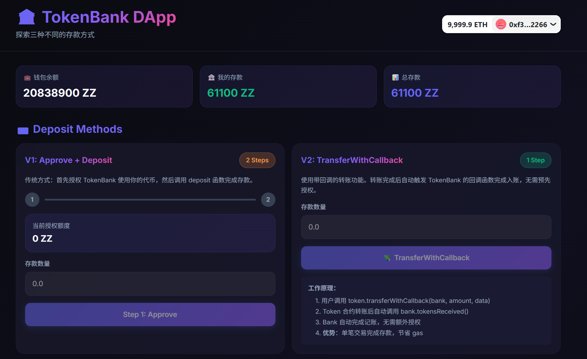

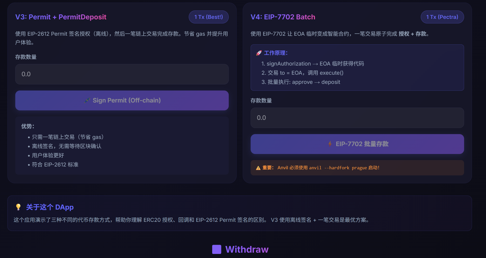
## 🚀 一键启动步骤

### 第一步：启动本地区块链

打开终端，进入项目目录：

```bash
cd c:\Users\ticsmts\Desktop\web3_study_code\EIP712_EIP7702
anvil
```

**保持这个终端运行**。你会看到类似输出：

```
Available Accounts
==================
(0) 0xf39Fd6e51aad88F6F4ce6aB8827279cffFb92266 (10000 ETH)
(1) 0x70997970C51812dc3A010C7d01b50e0d17dc79C8 (10000 ETH)
...

Private Keys
==================
(0) 0xac0974bec39a17e36ba4a6b4d238ff944bacb478cbed5efcae784d7bf4f2ff80
(1) 0x59c6995e998f97a5a0044966f0945389dc9e86dae88c7a8412f4603b6b78690d
...
```

### 第二步：部署智能合约

打开**新的终端**窗口：

```bash
cd c:\Users\ticsmts\Desktop\web3_study_code\EIP712_EIP7702

# 编译合约
forge build

# 部署合约
forge script script/Deploy.s.sol --rpc-url http://localhost:8545 --broadcast
```

部署成功后会显示：

```
=== Deployment Summary ===
Network: Local Anvil (Prague hardfork)
Deployer: 0xf39Fd6e51aad88F6F4ce6aB8827279cffFb92266
Permit2: 0x000000000022D473030F116dDEE9F6B43aC78BA3
ZZTokenV2: 0x5FbDB2315678afecb367f032d93F642f64180aa3
TokenBankV4: 0xe7f1725E7734CE288F8367e1Bb143E90bb3F0512
SimpleDelegator: 0x9fE46736679d2D9a65F0992F2272dE9f3c7fa6e0
```

**复制这两个合约地址！**

### 第三步：更新前端配置

1. 打开文件：`frontend/config/contracts.ts`
2. 更新合约地址为上一步部署的实际地址

### 第四步：启动前端

打开**新的终端**窗口：

```bash
cd c:\Users\ticsmts\Desktop\web3_study_code\EIP712_EIP7702\frontend
npm run dev
```

访问：http://localhost:3000

### 第五步：配置 MetaMask

1. **添加网络**：
   - 网络名称：`Anvil Local`
   - RPC URL：`http://127.0.0.1:8545`
   - Chain ID：`31337`
   - 货币符号：`ETH`

2. **导入账户**（使用 Anvil 显示的私钥）：
   - 账户 #0: `0xac0974bec39a17e36ba4a6b4d238ff944bacb478cbed5efcae784d7bf4f2ff80`
   - 账户 #1: `0x59c6995e998f97a5a0044966f0945389dc9e86dae88c7a8412f4603b6b78690d`

### 第六步：开始使用！

1. 点击 "Connect Wallet" 按钮
2. 选择 MetaMask
3. 连接到 Anvil Local 网络
4. 开始测试五种存款方式！

## 💡 快速测试流程

### 测试 V1（传统方式）
1. 在 V1 卡片输入数量：`10000`
2. 点击 "Step 1: Approve"
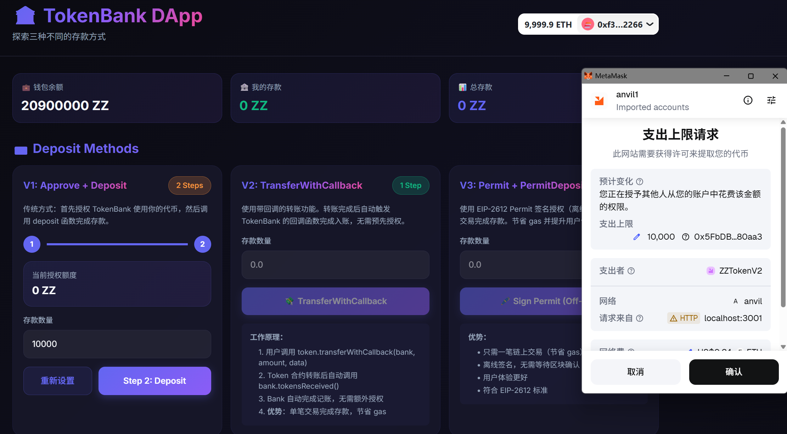
3. 在 MetaMask 确认
4. 点击 "Step 2: Deposit"

5. 再次确认

### 测试 V2
1. 在 V2 卡片输入数量：`20000`
2. 点击 "TransferWithCallback"
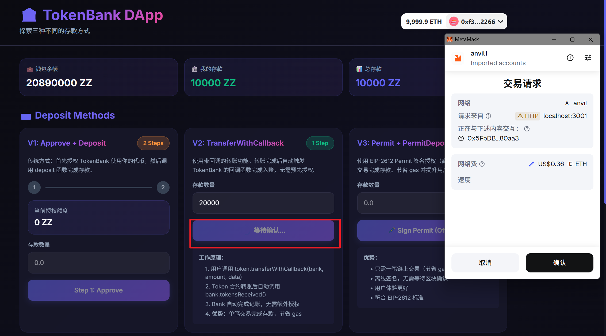
3. 在 MetaMask 确认
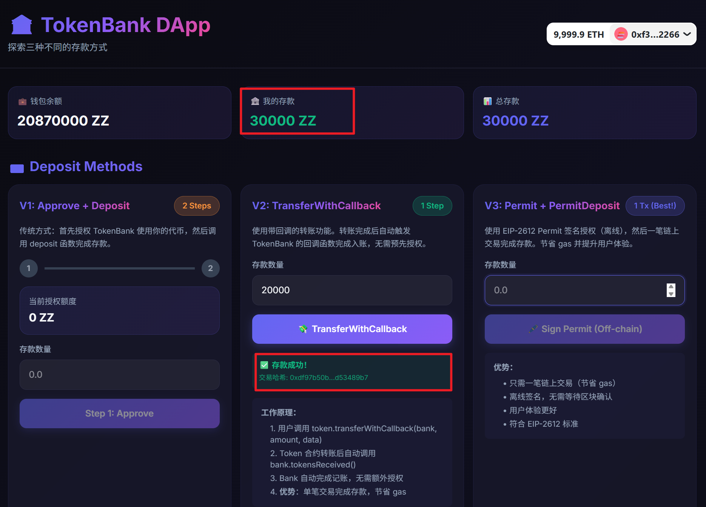
4. 再次确认

### 测试 V3（推荐方式）⭐
1. 在 V3 卡片输入数量：`30000`
2. 点击 "Sign Permit"（离线签名，不消耗 gas）
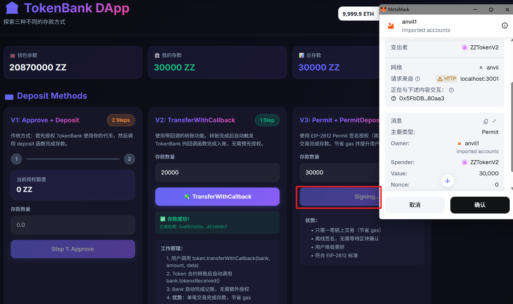
3. 在 MetaMask 签名
4. 点击 "Submit Transaction"
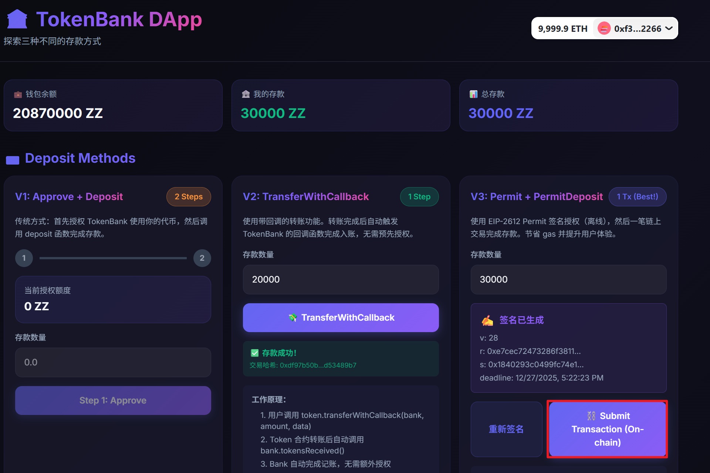
5. 确认交易
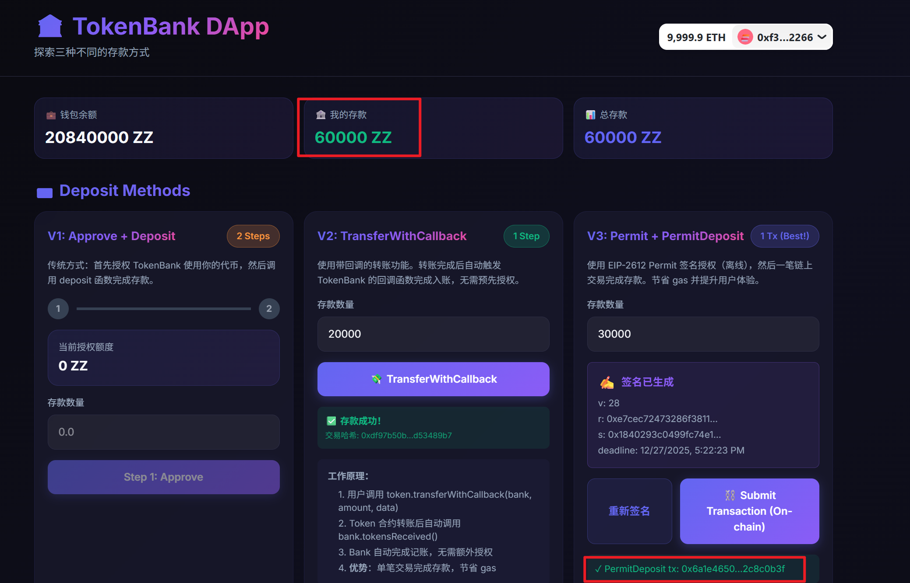

### 测试 V4
1. 在 V4 卡片输入数量：`20000`
2. 点击 "TransferWithCallback"

3. 交易细节

   cast tx 0x493ed2f111bb3716ea3f3cabd00f21c0dc8a061245f3443c8951d58221b34b4d --rpc-url http://127.0.0.1:8545
   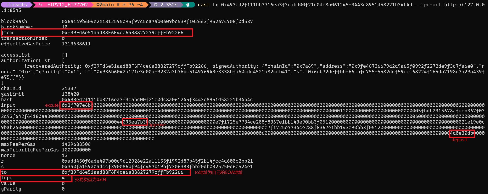
   cast receipt 0x493ed2f111bb3716ea3f3cabd00f21c0dc8a061245f3443c8951d58221b34b4d --rpc-url http://127.0.0.1:8545
   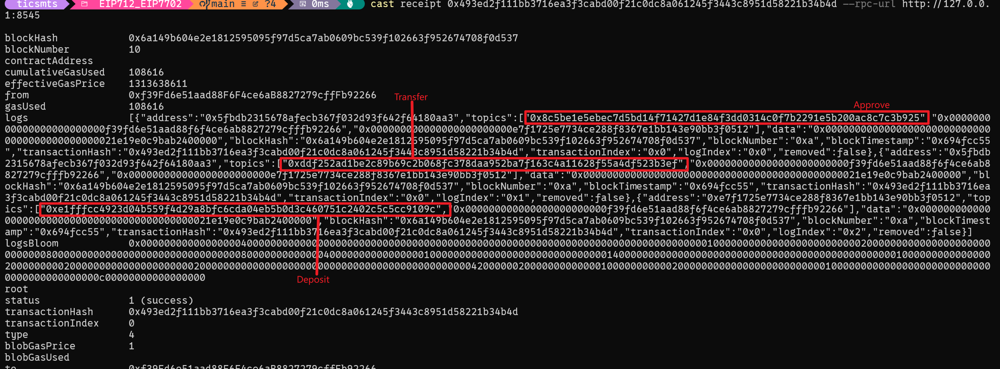
   cast code 0xf39Fd6e51aad88F6F4ce6aB8827279cffFb92266 --rpc-url http://127.0.0.1:8545 
   

### 测试 V5 (Permit2) 🔐
1. 首次使用：在 V5 卡片中点击 "授权" 按钮（授权 Token 给 Permit2）
2. 在 MetaMask 确认授权交易
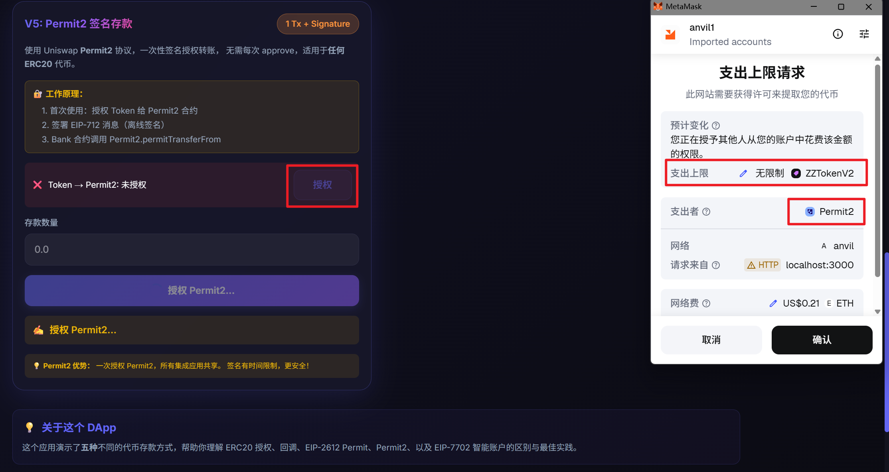
3. 输入存款数量：`50000`
4. 点击 "🔐 Permit2 签名存款"
5. 在 MetaMask 中签名 EIP-712 消息（离线，不消耗 gas）
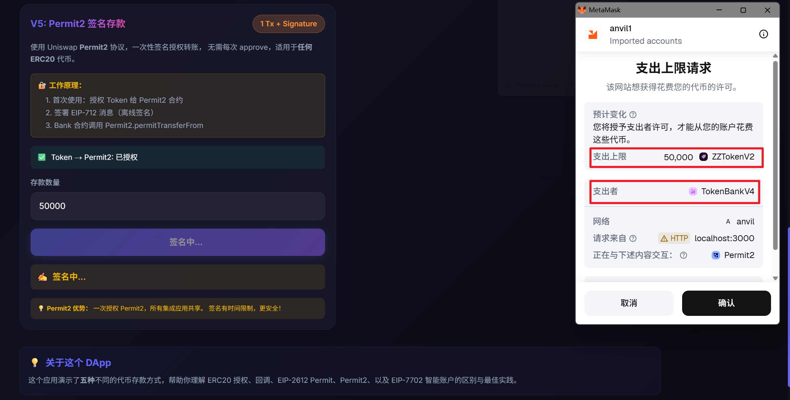
6. 签名后自动提交交易，在 MetaMask 确认
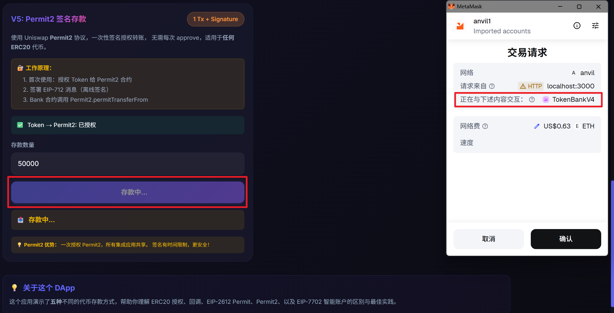

> 💡 V5 优势：一次授权 Permit2 合约，所有集成应用共享此授权！

### 测试 Withdraw
1. 查看 "您的存款" 金额
2. 点击 "Withdraw All"
3. 确认交易

## 🎯 功能特色

- ✨ **V1**: 展示传统的 Approve + Deposit 两步流程
- 🔄 **V2**: TransferWithCallback 一笔交易
- 🚀 **V3**: EIP-2612 Permit 离线签名 + 一笔交易
- ⚡ **V4**: EIP-7702 智能账户批量操作
- 🔐 **V5**: Permit2 统一授权协议（一次授权，所有应用共享）
- 💰 **实时余额**: 钱包、存款、总额实时更新
- 🎨 **精美 UI**: 玻璃态效果、渐变色、流畅动画

## 🐛 遇到问题？

**交易失败**：
- 重启 Anvil 后，在 MetaMask 中：设置 → 高级 → 清除活动和 nonce 数据

**余额不更新**：
- 刷新页面或重新连接钱包

**连接失败**：
- 确保 MetaMask 连接到正确的网络（Chain ID: 31337）
- 确保 Anvil 正在运行

## 📚 更多信息

详细文档请查看 `frontend/README.md`
