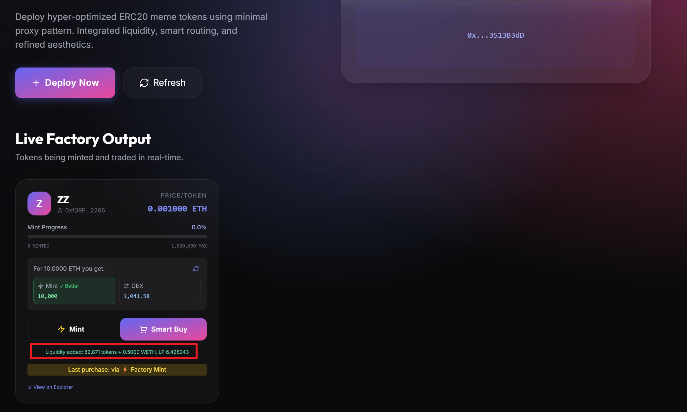

# ERC20MemeFactory

基于 ERC1167 最小代理模式的 Meme 代币工厂合约，集成 MiniDex 流动性添加和 Swap 功能。

## ✨ 功能特性

- ✅ **最小代理部署**: 使用 ERC1167 Clone 模式部署 Meme 代币，节省约 97% Gas
- ✅ **费用分配**: 铸造费用 5% 给项目方，95% 给 Meme 发行者
- ✅ **自动流动性**: 项目方 5% ETH + 对应 Token 自动添加到 MiniDex
- ✅ **智能购买**: `buyMeme()` 自动比较 DEX vs Mint 价格，选择最优方案

## 🧭 系统架构概览

核心参与方：
- **MemeFactory**: 部署 MemeToken、收取 ETH、分配费用、添加流动性、智能购买
- **MemeToken (Clone)**: 可初始化 ERC20，只有工厂可 mint
- **MiniDex Router/Factory**: 创建交易对并进行 addLiquidity / swap

关键调用路径：
```
User -> MemeFactory.deployMeme() -> MemeToken.initialize()
User -> MemeFactory.mintMeme() -> _distributeFees() -> _addLiquidity() -> Router.addLiquidity()
User -> MemeFactory.buyMeme() -> DEX swap or mint path
```

## 项目展示




## 📁 项目结构

```
ERC20MemeFactory/
├── src/
│   ├── MemeToken.sol           # 可初始化 ERC20 代币（用于 Clone）
│   ├── MemeFactory.sol         # 工厂合约
│   └── interfaces/
│       └── IMiniDex.sol        # MiniDex 接口
├── test/
│   └── MemeFactory.t.sol       # 测试用例
├── script/
│   └── Deploy.s.sol            # 部署脚本
├── foundry.toml
└── README.md
```

## 🚀 快速开始

### 1) 安装依赖

```bash
cd ERC20MemeFactory
forge install
```

### 2) 编译合约

```bash
forge build
```

### 3) 运行测试

```bash
forge test -vv
```

### 4) 本地部署

```bash
# 终端 1: 启动 Anvil
anvil

# 终端 2: 部署
forge script script/Deploy.s.sol:Deploy --rpc-url http://127.0.0.1:8545 --broadcast
```

### 5) 与 MiniDex 集成部署

```bash
$env:ROUTER_ADDRESS="0x..."
$env:WETH_ADDRESS="0x..."
forge script script/Deploy.s.sol:DeployWithMiniDex --rpc-url http://127.0.0.1:8545 --broadcast
```

## 🧩 核心合约

### MemeToken.sol

可初始化的 ERC20 Meme 代币合约，用于最小代理 Clone 部署。

**核心功能**:
- `initialize()`: 初始化代币参数
- `mint()`: 铸造 perMint 数量的代币（仅工厂可调用）
- `getMintCost()`: 计算铸造费用

```solidity
// 每次铸造费用 = perMint * price / 1e18
function getMintCost() external view returns (uint256 cost) {
    return (perMint * price) / 1e18;
}
```

### MemeFactory.sol

Meme 工厂合约，管理代币部署和铸造。

**核心方法**:

#### 1) deployMeme

```solidity
function deployMeme(
    string memory symbol,   // 代币符号
    uint256 totalSupply,    // 总发行量
    uint256 perMint,        // 每次铸造数量
    uint256 price           // 每个代币价格 (wei)
) external returns (address memeToken);
```

#### 2) mintMeme

```solidity
function mintMeme(address tokenAddr) external payable;
```

费用分配:
- **95%** → Meme 发行者 (creator)
- **5%** → 项目方 (自动添加到 MiniDex 流动性)

#### 3) buyMeme

```solidity
function buyMeme(address tokenAddr) external payable;
```

智能购买逻辑:
1. 获取 DEX 价格（通过 `getAmountsOut`）
2. 计算 Mint 价格
3. 选择更优方案执行

## 🔬 关键实现细节（源码级）

### 1) Clone 初始化流程

`initialize()` 设置符号、总量、每次铸造数量、价格、creator 与 factory：

```solidity
function initialize(
    string memory _symbol,
    uint256 _totalSupply,
    uint256 _perMint,
    uint256 _price,
    address _creator,
    address _factory
) external initializer {
    __ERC20_init(TOKEN_NAME, _symbol);
    maxSupply = _totalSupply;
    perMint = _perMint;
    price = _price;
    creator = _creator;
    factory = _factory;
}
```

### 2) mintMeme 费用分配与加池流程

```solidity
function mintMeme(address tokenAddr) external payable {
    MemeToken token = MemeToken(tokenAddr);
    uint256 mintCost = token.getMintCost();
    if (msg.value < mintCost) revert InsufficientPayment();

    token.mint(msg.sender);
    _distributeFees(tokenAddr, mintCost, info.creator);
}
```

### 3) buyMeme 路由决策

```solidity
uint256 dexOutput = _getDexOutput(tokenAddr, msg.value);
uint256 mintOutput = (msg.value / mintCost) * perMint;
if (dexOutput > mintOutput && dexOutput > 0) {
    _buyViaDex(...);
} else {
    _mintMeme(...);
}
```

### 4) 自动加池逻辑

- 首次加池: 创建交易对并添加初始流动性
- 存量池: 按储备比例计算所需 token 数量

```solidity
if (pair == address(0)) {
    _addFirstLiquidity(...);
} else {
    _addExistingLiquidity(...);
}
```

## 🧯 关键 Bug 修复记录

### 问题 1：DEX 无流动性（pair 未创建）

**现象**: 前端显示 "No liquidity"，`getPair` 为 `0x0`。  
**原因**: `createPair` 需要较高 gas，前端默认估算不足导致 OOG。  
**修复**: 前端将 mint/smart buy 的 gasLimit 下限提高到 >= 3,000,000。

### 问题 2：Smart Buy 后 mint 不再加池

**现象**: smart buy 后池子价格变化，后续 mint 不再触发 `LiquidityAdded`。  
**原因**: `_addExistingLiquidity` 中 `requiredTokens < perMint` 时直接返回。  
**修复**: 当 `requiredTokens < perMint` 时强制至少 mint 1 次并尝试加池。

```solidity
uint256 mintsNeeded = requiredTokens / info.perMint;
if (mintsNeeded == 0) {
    mintsNeeded = 1;
}
```

### 问题 3：pair 存在但储备为 0 时无法加池

**现象**: 手动创建 pair 后，mint 仍不加池。  
**原因**: `wethReserve == 0` 时直接退出。  
**修复**: reserve 为 0 时走首池逻辑 `_addFirstLiquidity()`。

```solidity
if (wethReserve == 0 || tokenReserve == 0) {
    _addFirstLiquidity(...);
    return;
}
```

## 🧪 测试用例

| 测试 | 描述 |
|------|------|
| `test_MintMeme_CorrectFeeDistribution` | 费用按 5%/95% 正确分配 |
| `test_MintMeme_AddsLiquidity` | 铸造时正确添加流动性 |
| `test_BuyMeme_UsesMintWhenCheaper` | Mint 更便宜时使用 Mint |

## 🧰 技术栈

- Solidity ^0.8.28
- Foundry
- OpenZeppelin Contracts / Upgradeable
- ERC1167 Minimal Proxy (Clones)

## 📜 License

MIT
