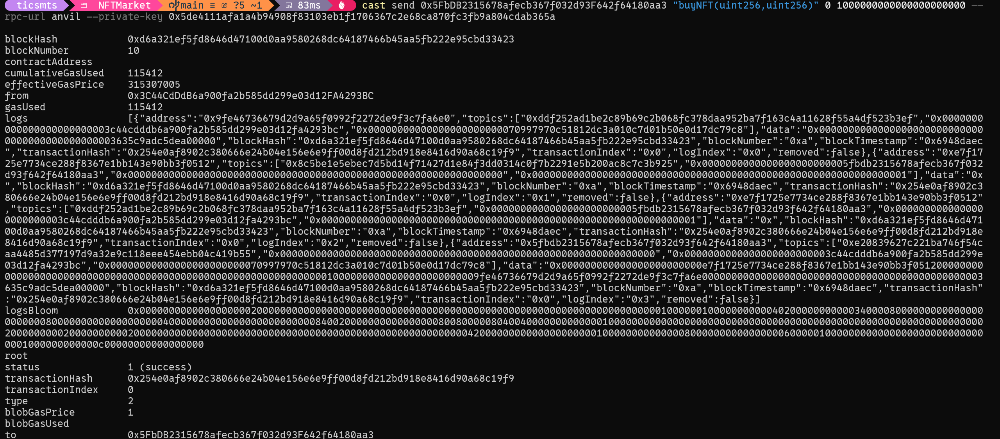
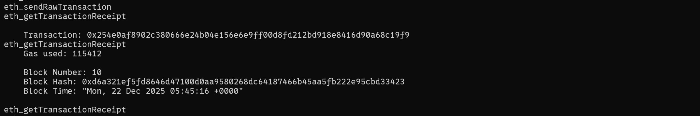
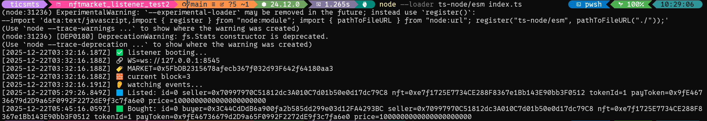

# 练习Anvil及Cast命令

## 实现截图

### 购买NFT


### Anvil 


### 监听到事件


## 命令
```command
/**
ZZNFTMarket合约地址： 0x5FbDB2315678afecb367f032d93F642f64180aa3
ZZNFT合约地址:  0xe7f1725E7734CE288F8367e1Bb143E90bb3F0512
ZZTOKEN合约地址:   0x9fE46736679d2D9a65F0992F2272dE9f3c7fa6e0

deploy 地址： 0xf39Fd6e51aad88F6F4ce6aB8827279cffFb92266
Seller 地址:  0x70997970C51812dc3A010C7d01b50e0d17dc79C8
Buyer 地址:  0x3C44CdDdB6a900fa2b585dd299e03d12FA4293BC
 */

forge:
    //查看合约的字节码，abi, errors, events等信息
    forge inspect -h
    forge inspect .\src\ZZNFTMarketV2.sol:ZZNFTMarketV2 abi
    forge inspect .\src\ZZNFTMarketV2.sol:ZZNFTMarketV2 bytecode
    forge inspect .\src\ZZNFTMarketV2.sol:ZZNFTMarketV2 deployedbytecode
    forge inspect .\src\ZZNFTMarketV2.sol:ZZNFTMarketV2 errors
    forge inspect .\src\ZZNFTMarketV2.sol:ZZNFTMarketV2 events

anvil:
    anvil --chain-id 31337 --host 127.0.0.1 --port 8545

cast:
    cast wallet address --private-key 0x5de4111afa1a4b94908f83103eb1f1706367c2e68ca870fc3fb9a804cdab365a

    //部署ZZNFTMarket合约
    forge create --rpc-url anvil --private-key 0xac0974bec39a17e36ba4a6b4d238ff944bacb478cbed5efcae784d7bf4f2ff80 src/ZZNFTMarketV2.sol:ZZNFTMarketV2
    forge create --rpc-url anvil --private-key 0xac0974bec39a17e36ba4a6b4d238ff944bacb478cbed5efcae784d7bf4f2ff80 src/ZZNFTMarketV2.sol:ZZNFTMarketV2 --broadcast
    cast call 0x5FbDB2315678afecb367f032d93F642f64180aa3 "nextListingId()(uint256)" --rpc-url anvil

    //部署ZZTOKEN, ZZNFT合约
    forge create --broadcast --rpc-url anvil --private-key 0xac0974bec39a17e36ba4a6b4d238ff944bacb478cbed5efcae784d7bf4f2ff80 src/ZZNFT.sol:ZZNFT --constructor-args "ZZNFT" "ZZNFT" "ipfs://QmZ4F9WkgKzLxmiVUdrpJrxhrnUBjwGz9eT4br91BqjTf1/"
    forge create --broadcast --rpc-url anvil --private-key 0xac0974bec39a17e36ba4a6b4d238ff944bacb478cbed5efcae784d7bf4f2ff80 src/ZZTOKEN.sol:ZZTOKEN
    cast call 0xe7f1725E7734CE288F8367e1Bb143E90bb3F0512 "name()(string)" --rpc-url anvil
    cast call 0x9fE46736679d2D9a65F0992F2272dE9f3c7fa6e0 "name()(string)" --rpc-url anvil

    //mint ZZNFT
    cast send 0xe7f1725E7734CE288F8367e1Bb143E90bb3F0512 "mint(address,uint256)" 0x70997970C51812dc3A010C7d01b50e0d17dc79C8 1 --rpc-url anvil --private-key 0xac0974bec39a17e36ba4a6b4d238ff944bacb478cbed5efcae784d7bf4f2ff80
    cast call 0xe7f1725E7734CE288F8367e1Bb143E90bb3F0512 "ownerOf(uint256)(address)" 1 --rpc-url anvil

    //transfer ZZTOKEN
    cast send 0x9fE46736679d2D9a65F0992F2272dE9f3c7fa6e0 "transfer(address,uint256)" 0x3C44CdDdB6a900fa2b585dd299e03d12FA4293BC 50000000000000000000000 --rpc-url anvil --private-key 0xac0974bec39a17e36ba4a6b4d238ff944bacb478cbed5efcae784d7bf4f2ff80
    cast call 0x9fE46736679d2D9a65F0992F2272dE9f3c7fa6e0 "balanceOf(address)(uint256)" 0x3C44CdDdB6a900fa2b585dd299e03d12FA4293BC --rpc-url anvil
    cast from-wei 50000000000000000000000

    //seller approve NFT, List
    cast send 0xe7f1725E7734CE288F8367e1Bb143E90bb3F0512 "approve(address,uint256)" 0x5FbDB2315678afecb367f032d93F642f64180aa3 1  --rpc-url anvil --private-key 0x59c6995e998f97a5a0044966f0945389dc9e86dae88c7a8412f4603b6b78690d
    cast to-wei 1000 ether
    
    cast send 0x5FbDB2315678afecb367f032d93F642f64180aa3 "list(address,uint256,address,uint256)"  0xe7f1725E7734CE288F8367e1Bb143E90bb3F0512 1 0x9fE46736679d2D9a65F0992F2272dE9f3c7fa6e0 1000000000000000000000  --rpc-url anvil --private-key 0x59c6995e998f97a5a0044966f0945389dc9e86dae88c7a8412f4603b6b78690d
    cast call 0x5FbDB2315678afecb367f032d93F642f64180aa3 "nextListingId()(uint256)" --rpc-url anvil

    //buyer approve token, buy 
    cast send 0x9fE46736679d2D9a65F0992F2272dE9f3c7fa6e0 "approve(address,uint256)(bool)" 0x5FbDB2315678afecb367f032d93F642f64180aa3 1000000000000000000000 --rpc-url anvil --private-key 0x5de4111afa1a4b94908f83103eb1f1706367c2e68ca870fc3fb9a804cdab365a
    cast call 0x9fE46736679d2D9a65F0992F2272dE9f3c7fa6e0 "allowance(address,address)(uint256)"   0x3C44CdDdB6a900fa2b585dd299e03d12FA4293BC 0x5FbDB2315678afecb367f032d93F642f64180aa3 --rpc-url anvil
    cast send 0x5FbDB2315678afecb367f032d93F642f64180aa3 "buyNFT(uint256,uint256)" 0 1000000000000000000000 --rpc-url anvil --private-key 0x5de4111afa1a4b94908f83103eb1f1706367c2e68ca870fc3fb9a804cdab365a

    //查看交易receipt
    cast receipt 0x254e0af8902c380666e24b04e156e6e9ff00d8fd212bd918e8416d90a68c19f9 --rpc-url anvil
```

