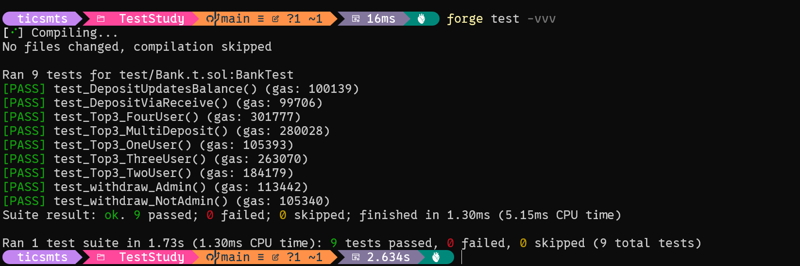

# Foundry Test学习

## 配置运行
forge init --no-git  
forge install foundry-rs/forge-std 
forge remappings > remappings.txt  
vscode插件可以识别lib库：Solidity (Juan Blanco)插件


.vscode/settings.json:
```json
{
  "solidity.packageDefaultDependenciesDirectory": "lib",
  "solidity.packageDefaultDependenciesContractsDirectory": "",
  "solidity.remappings": [
    "forge-std/=lib/forge-std/src/",
    "@openzeppelin/=lib/openzeppelin-contracts/"
  ]
}
```

## 题目内容
为 Bank 合约 编写测试，测试Case 包含：

    1. 断言检查存款前后用户在 Bank 合约中的存款额更新是否正确。
    2. 检查存款金额的前 3 名用户是否正确，分别检查有1个、2个、3个、4 个用户， 以及同一个用户多次存款的情况。
    3. 检查只有管理员可取款，其他人不可以取款。

## 截图
