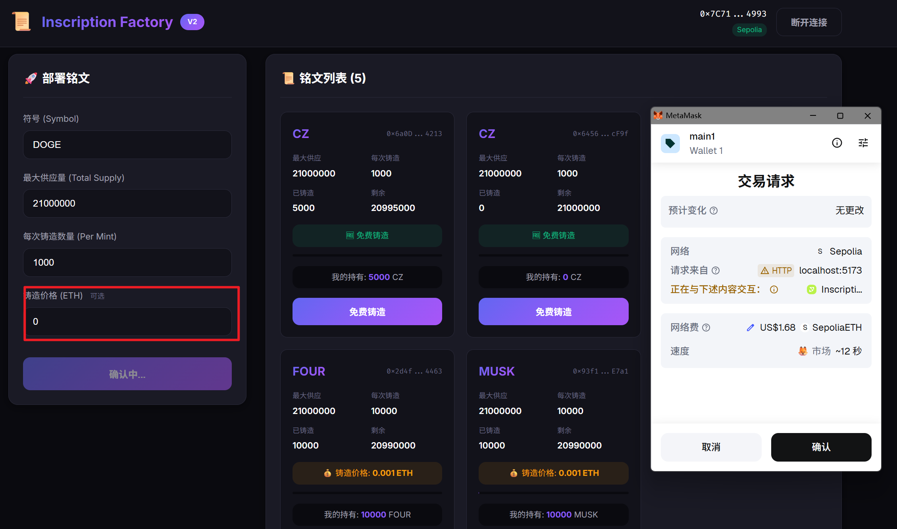
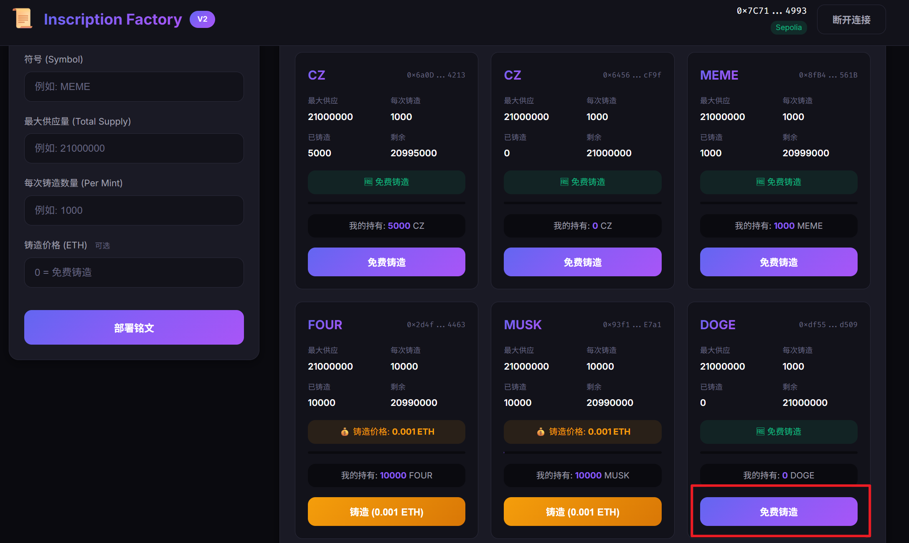
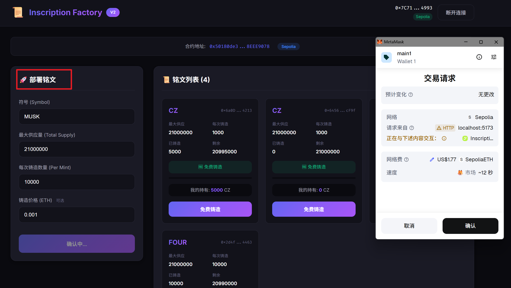
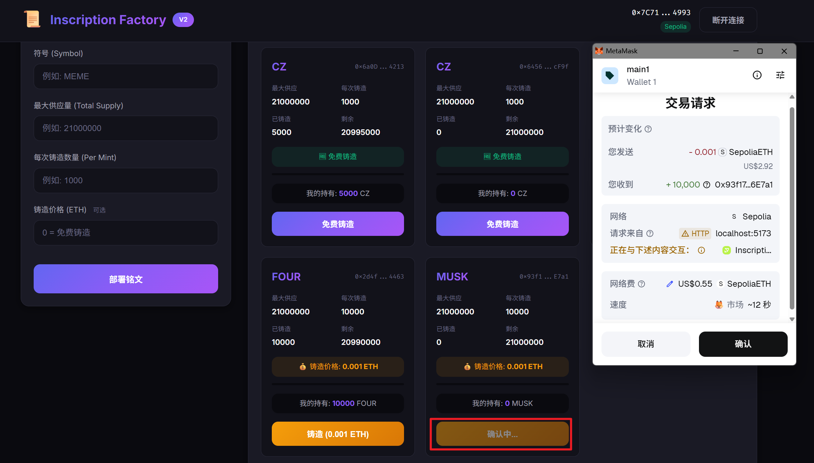
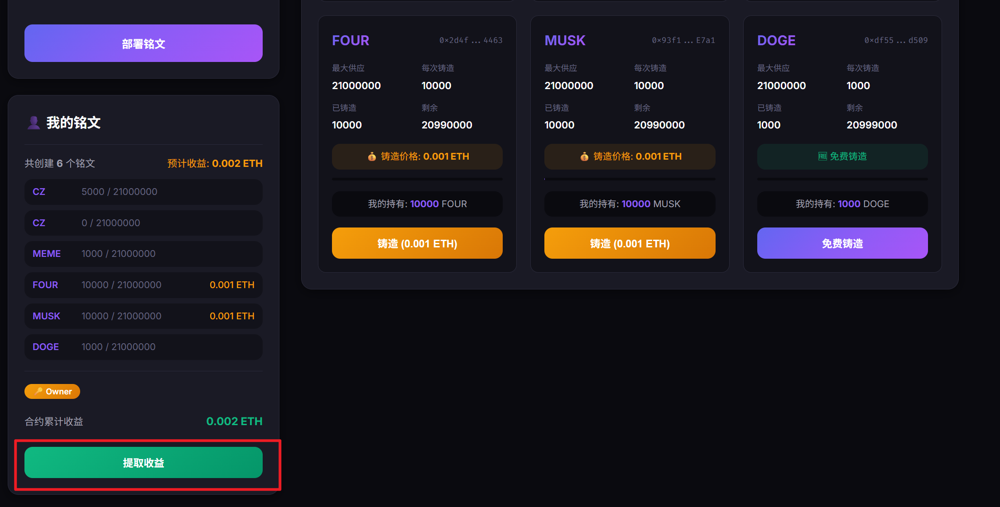

# Inscription Factory

可升级的铭文工厂合约，基于 UUPS 代理模式，支持部署和铸造 ERC20 铭文代币。

## 合约地址 (Sepolia Testnet)

| 合约 | 地址 | Etherscan |
|------|------|-----------|
| 代理合约 (Proxy) | `0x50180de3322F3309Db32f19D5537C3698EEE9078` | [查看](https://sepolia.etherscan.io/address/0x50180de3322F3309Db32f19D5537C3698EEE9078) |
| V1 实现 | `0xcea66d15f6800Ea380D09a649dAA02E6B5ec963c` | [查看](https://sepolia.etherscan.io/address/0xcea66d15f6800Ea380D09a649dAA02E6B5ec963c) |
| V2 实现 | `0x2227B9300ED19eAdFF91DBd7f536dD45D1A84e6f` | [查看](https://sepolia.etherscan.io/address/0x2227b9300ed19eadff91dbd7f536dd45d1a84e6f) |
| TokenV2 实现 | `0x5C86ccaebE69f50DC23c4c44d66597D39ed9ab55` | [查看](https://sepolia.etherscan.io/address/0x5C86ccaebE69f50DC23c4c44d66597D39ed9ab55) |

## 功能

### V1 功能
- `deployInscription(symbol, totalSupply, perMint)` - 部署新铭文代币
- `mintInscription(tokenAddr)` - 免费铸造铭文

### V2 新增功能
- `deployInscription(symbol, totalSupply, perMint, price)` - 带价格参数部署
- `mintInscription(tokenAddr)` - 支付 ETH 铸造（按照部署时设定的价格）
- 使用 ERC1167 最小代理部署，节省 gas
- `withdrawFees()` - Owner 提取收益

## 功能展示
### V1 部署新铭文代币


### V1 免费铸造铭文



### V2 部署新铭文代币，设置铸造价格


### V2 铸造新铭文代币


### Owner提取收益


## 开发

### 安装依赖

```shell
forge install OpenZeppelin/openzeppelin-contracts@v5.1.0 --no-commit
forge install OpenZeppelin/openzeppelin-contracts-upgradeable@v5.1.0 --no-commit
forge install foundry-rs/forge-std --no-commit
```

### 编译

```shell
forge build
```

### 测试

```shell
forge test -vvv
```

### 部署

```shell
# 部署 V1
forge script script/DeployFactoryV1.s.sol:DeployFactoryV1 --rpc-url sepolia --broadcast --verify

# 升级到 V2
forge script script/UpgradeToV2.s.sol:UpgradeToV2 --rpc-url sepolia --broadcast --verify
```

## 前端

```shell
cd frontend
npm install
npm run dev
```

## 测试覆盖

- V1: 10 个测试用例
- V2: 9 个测试用例（包括升级状态保持测试）
- 总计: 19 个测试全部通过
