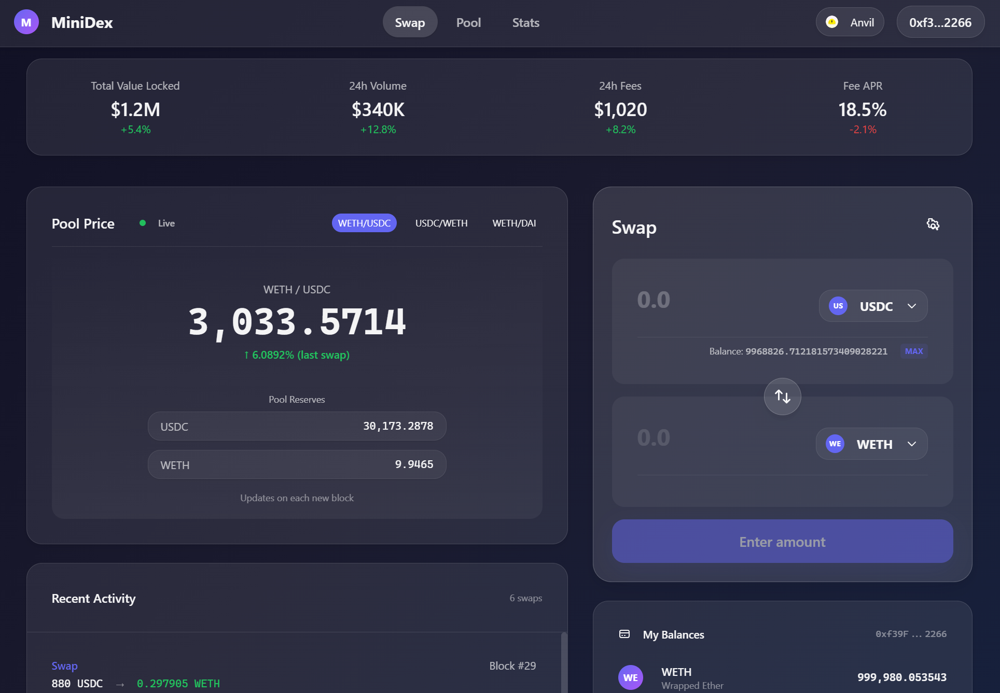
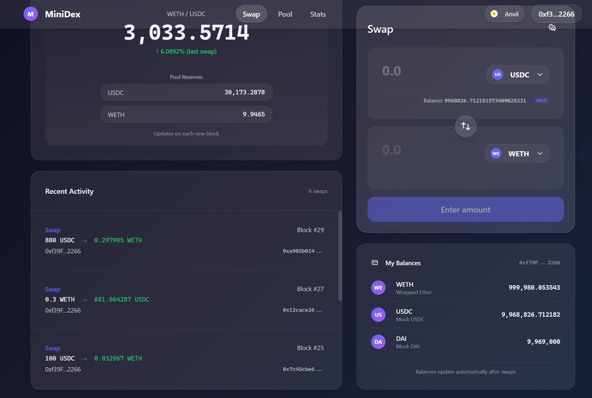

# MiniDex - Uniswap V2 DEX 完整实现

一个完整的去中心化交易所实现，包含带详细中英文注释的 Uniswap V2 智能合约和 Apple 风格玻璃态前端。

## 目录

- [项目概览](#-项目概览)
- [快速开始](#-快速开始)
- [核心技术原理](#-核心技术原理)
  - [AMM 自动做市商机制](#1-amm-自动做市商机制)
  - [价格计算详解](#2-价格计算详解)
  - [路由机制](#3-路由机制)
  - [滑点与价格影响](#4-滑点与价格影响)
  - [流动性管理](#5-流动性管理)
- [智能合约详解](#-智能合约详解)
  - [UniswapV2Pair - 交易对核心](#1-uniswapv2pairsol---交易对核心)
  - [UniswapV2Factory - 工厂合约](#2-uniswapv2factorysol---工厂合约)
  - [UniswapV2Router02 - 路由合约](#3-uniswapv2router02sol---路由合约)
  - [UniswapV2Library - 工具库](#4-uniswapv2librarysol---工具库)
- [CREATE2 确定性地址](#-create2-确定性地址)
- [前端集成](#-前端集成)
- [安全考虑](#-安全考虑)

---

## 📋 项目概览

| 模块 | 状态 | 说明 |
|------|------|------|
| 智能合约 | ✅ 完成 | 12个Solidity文件，中英双语注释 |
| 本地部署 | ✅ 完成 | 成功部署到Anvil |
| Swap测试 | ✅ 完成 | 3个测试全部通过 |
| 玻璃态前端 | ✅ 完成 | Next.js 16 + React组件 |
| 前端集成 | ✅ 完成 | 实时价格、余额、交易记录 |

---

## 项目展示





### 项目结构

```
MiniDex/
├── src/
│   ├── core/                         # 核心合约
│   │   ├── UniswapV2ERC20.sol           # LP代币 + EIP-2612许可签名
│   │   ├── UniswapV2Pair.sol            # AMM核心: x*y=k + 闪电贷 + TWAP
│   │   └── UniswapV2Factory.sol         # 工厂合约: CREATE2创建交易对
│   ├── periphery/                    # 周边合约
│   │   ├── UniswapV2Router02.sol        # 路由: 流动性管理 + 多跳swap
│   │   └── UniswapV2Library.sol         # 工具库: pairFor + 价格计算
│   ├── libraries/                    # 数学库
│   │   ├── Math.sol                     # 平方根算法
│   │   └── UQ112x112.sol                # 定点数格式 (用于TWAP)
│   ├── interfaces/                   # 接口定义
│   └── mocks/                        # 测试代币
├── script/
│   ├── Deploy.s.sol                     # 完整部署脚本
│   └── GetInitCodeHash.s.sol            # 计算init_code_hash
├── test/
│   └── SwapTest.t.sol                   # Swap测试
└── frontend/                         # Next.js前端
    └── src/
        ├── app/                         # 页面路由
        ├── components/                  # React组件
        ├── hooks/                       # 自定义Hooks
        │   ├── useTokenBalance.ts          # 代币余额
        │   ├── useQuote.ts                 # 价格查询
        │   ├── useSwap.ts                  # 交易执行
        │   ├── usePoolPrice.ts             # 池子价格
        │   └── useSwapEvents.ts            # 交易事件监听
        └── lib/
            ├── contracts.ts                # 合约地址配置
            └── abis/                       # 合约ABI
```

---

## 🚀 快速开始

### 1. 编译合约
```bash
cd MiniDex
forge build
```

### 2. 运行测试
```bash
forge test --match-contract SwapTest -vv
```

### 3. 部署到本地 Anvil
```bash
# 终端1: 启动Anvil
anvil

# 终端2: 部署
forge script script/Deploy.s.sol:Deploy --rpc-url http://127.0.0.1:8545 --broadcast
```

### 4. 启动前端
```bash
cd frontend
npm install
npm run dev
# 访问 http://localhost:3000
```

### 5. 连接MetaMask
- 网络: Localhost 8545 (Chain ID: 31337)
- 导入测试账户私钥: `0xac0974bec39a17e36ba4a6b4d238ff944bacb478cbed5efcae784d7bf4f2ff80`

---

## 📚 核心技术原理

### 1. AMM 自动做市商机制

#### 1.1 恒定乘积公式 (Constant Product Formula)

Uniswap V2 的核心是 **恒定乘积做市商 (CPMM)**：

```
x * y = k
```

其中：
- `x` = Token A 的储备量 (reserveA)
- `y` = Token B 的储备量 (reserveB)
- `k` = 常数（只在添加/移除流动性时改变）

**图形理解：**
```
Price
  │
  │    ╲
  │     ╲
  │      ╲_____
  │           ╲____
  │                ╲_____
  └──────────────────────── Quantity
        恒定乘积曲线 x*y=k
```

#### 1.2 为什么使用恒定乘积？

1. **无限流动性**: 无论交易多大，总能完成（只是价格会很差）
2. **自动价格发现**: 价格由供需自动调整
3. **简单高效**: 链上计算成本低

#### 1.3 交易如何改变储备

假设池子有 3000 USDC 和 1 WETH：
```
初始状态: x=3000, y=1, k=3000
用户想用 300 USDC 买 WETH
```

计算过程：
```
新的 x' = 3000 + 300 = 3300
根据 x' * y' = k
y' = k / x' = 3000 / 3300 = 0.909...
用户获得 y - y' = 1 - 0.909 = 0.091 WETH
```

---

### 2. 价格计算详解

#### 2.1 理论价格 vs 实际价格

**理论价格 (不考虑手续费和滑点):**
```solidity
// 价格 = reserveOut / reserveIn
// 例如: 3000 USDC / 1 WETH = 3000 USDC per WETH
price = reserveOut / reserveIn;
```

**实际输出金额 (考虑0.3%手续费):**
```solidity
// UniswapV2Library.sol - getAmountOut()
function getAmountOut(
    uint amountIn,      // 输入金额
    uint reserveIn,     // 输入代币储备
    uint reserveOut     // 输出代币储备
) internal pure returns (uint amountOut) {
    require(amountIn > 0, 'INSUFFICIENT_INPUT_AMOUNT');
    require(reserveIn > 0 && reserveOut > 0, 'INSUFFICIENT_LIQUIDITY');

    // 扣除0.3%手续费: amountIn * 997 / 1000
    uint amountInWithFee = amountIn * 997;

    // 分子: amountInWithFee * reserveOut
    uint numerator = amountInWithFee * reserveOut;

    // 分母: reserveIn * 1000 + amountInWithFee
    uint denominator = reserveIn * 1000 + amountInWithFee;

    // 输出金额
    amountOut = numerator / denominator;
}
```

**公式推导：**
```
设输入金额为 Δx，输出金额为 Δy
手续费后的有效输入: Δx' = Δx * 0.997

根据恒定乘积:
(x + Δx') * (y - Δy) = x * y = k

展开:
xy - xΔy + Δx'y - Δx'Δy = xy

整理得:
Δy = (Δx' * y) / (x + Δx')
   = (Δx * 997 * y) / (x * 1000 + Δx * 997)
```

#### 2.2 反向计算：已知输出求输入

```solidity
// UniswapV2Library.sol - getAmountIn()
function getAmountIn(
    uint amountOut,     // 期望输出金额
    uint reserveIn,     // 输入代币储备
    uint reserveOut     // 输出代币储备
) internal pure returns (uint amountIn) {
    require(amountOut > 0, 'INSUFFICIENT_OUTPUT_AMOUNT');
    require(reserveIn > 0 && reserveOut > 0, 'INSUFFICIENT_LIQUIDITY');

    // 分子: reserveIn * amountOut * 1000
    uint numerator = reserveIn * amountOut * 1000;

    // 分母: (reserveOut - amountOut) * 997
    uint denominator = (reserveOut - amountOut) * 997;

    // 需要的输入金额 (向上取整)
    amountIn = (numerator / denominator) + 1;
}
```

#### 2.3 前端价格查询实现

```typescript
// hooks/useQuote.ts
export function useQuote(
  amountIn: string,
  fromToken?: Address,
  toToken?: Address
) {
  const path = fromToken && toToken ? [fromToken, toToken] : [];
  const parsedAmountIn = amountIn ? parseUnits(amountIn, 18) : 0n;

  const { data } = useReadContract({
    address: CONTRACTS.router,
    abi: routerAbi,
    functionName: 'getAmountsOut',  // 调用Router的报价函数
    args: [parsedAmountIn, path],
    query: {
      enabled: parsedAmountIn > 0n && path.length === 2,
    },
  });

  const amounts = data as bigint[] | undefined;
  // amounts[0] = 输入金额, amounts[1] = 输出金额
  const amountOut = amounts?.[amounts.length - 1] ?? 0n;

  return {
    amountOut,
    formattedAmountOut: formatUnits(amountOut, 18),
  };
}
```

---

### 3. 路由机制

#### 3.1 什么是路由？

当两个代币之间没有直接的交易对时，需要通过中间代币进行多跳交换。

**示例：DAI → WBTC**
```
直接路径: DAI → WBTC (如果不存在此交易对)
路由路径: DAI → WETH → WBTC (通过WETH中转)
```

#### 3.2 多跳路径计算

```solidity
// UniswapV2Library.sol - getAmountsOut()
// 计算整条路径的输出金额
function getAmountsOut(
    address factory,
    uint amountIn,
    address[] memory path  // 路径数组: [tokenA, tokenB, tokenC, ...]
) internal view returns (uint[] memory amounts) {
    require(path.length >= 2, 'INVALID_PATH');

    amounts = new uint[](path.length);
    amounts[0] = amountIn;

    // 遍历路径，逐段计算
    for (uint i = 0; i < path.length - 1; i++) {
        // 获取当前交易对的储备
        (uint reserveIn, uint reserveOut) = getReserves(factory, path[i], path[i + 1]);
        // 计算这一跳的输出
        amounts[i + 1] = getAmountOut(amounts[i], reserveIn, reserveOut);
    }
}
```

#### 3.3 路由执行

```solidity
// UniswapV2Router02.sol - swapExactTokensForTokens()
function swapExactTokensForTokens(
    uint amountIn,           // 输入金额
    uint amountOutMin,       // 最小输出金额（滑点保护）
    address[] calldata path, // 路由路径
    address to,              // 接收地址
    uint deadline            // 截止时间
) external returns (uint[] memory amounts) {
    // 1. 计算每一跳的金额
    amounts = UniswapV2Library.getAmountsOut(factory, amountIn, path);

    // 2. 滑点检查
    require(amounts[amounts.length - 1] >= amountOutMin, 'INSUFFICIENT_OUTPUT_AMOUNT');

    // 3. 转入第一个代币到第一个交易对
    TransferHelper.safeTransferFrom(
        path[0],
        msg.sender,
        UniswapV2Library.pairFor(factory, path[0], path[1]),
        amounts[0]
    );

    // 4. 执行多跳交换
    _swap(amounts, path, to);
}

// 内部多跳执行
function _swap(uint[] memory amounts, address[] memory path, address _to) internal {
    for (uint i = 0; i < path.length - 1; i++) {
        (address input, address output) = (path[i], path[i + 1]);
        (address token0,) = UniswapV2Library.sortTokens(input, output);

        uint amountOut = amounts[i + 1];

        // 确定输出方向
        (uint amount0Out, uint amount1Out) = input == token0
            ? (uint(0), amountOut)
            : (amountOut, uint(0));

        // 确定下一跳的接收地址
        address to = i < path.length - 2
            ? UniswapV2Library.pairFor(factory, output, path[i + 2])  // 下一个交易对
            : _to;  // 最终接收者

        // 调用交易对的swap
        IUniswapV2Pair(UniswapV2Library.pairFor(factory, input, output))
            .swap(amount0Out, amount1Out, to, new bytes(0));
    }
}
```

---

### 4. 滑点与价格影响

#### 4.1 什么是滑点 (Slippage)？

滑点是交易预期价格与实际成交价格之间的差异，主要原因：
1. **价格影响**: 大额交易改变储备比例
2. **市场波动**: 交易确认期间价格变化
3. **抢跑攻击**: MEV机器人抢先交易

#### 4.2 价格影响计算

```typescript
// 价格影响 = (执行价格 - 市场价格) / 市场价格 * 100%

// 示例计算
const reserveUSDC = 30000n * 10n**18n;  // 30000 USDC
const reserveWETH = 10n * 10n**18n;      // 10 WETH

// 市场价格: 3000 USDC/WETH
const marketPrice = Number(reserveUSDC) / Number(reserveWETH); // 3000

// 用户想用 3000 USDC 买 WETH
const amountIn = 3000n * 10n**18n;

// 实际获得 (使用 getAmountOut)
const amountOut = getAmountOut(amountIn, reserveUSDC, reserveWETH);
// ≈ 0.909 WETH

// 执行价格: 3000 / 0.909 ≈ 3300 USDC/WETH
const executionPrice = 3000 / 0.909;

// 价格影响: (3300 - 3000) / 3000 * 100% ≈ 10%
const priceImpact = (executionPrice - marketPrice) / marketPrice * 100;
```

#### 4.3 滑点保护实现

```solidity
// 用户设置最小输出金额
uint amountOutMin = expectedAmount * (100 - slippageTolerance) / 100;

// Router 检查
require(amounts[amounts.length - 1] >= amountOutMin, 'INSUFFICIENT_OUTPUT_AMOUNT');
```

**前端实现：**
```typescript
// hooks/useSwap.ts
const swap = async (amountIn, amountOutMin, fromToken, toToken) => {
  // 滑点计算: 用户设置0.5%滑点
  const slippage = 0.5; // 百分比
  const minOutput = expectedOutput * (1 - slippage / 100);

  // 执行交易
  return writeContract({
    address: CONTRACTS.router,
    abi: routerAbi,
    functionName: 'swapExactTokensForTokens',
    args: [
      parseUnits(amountIn, 18),
      parseUnits(minOutput.toFixed(18), 18),  // 滑点保护
      [fromToken, toToken],
      userAddress,
      BigInt(Math.floor(Date.now() / 1000) + 60 * 20)  // 20分钟截止
    ],
  });
};
```

---

### 5. 流动性管理

#### 5.1 添加流动性

**首次添加流动性 (创建池子):**
```solidity
// UniswapV2Pair.sol - mint()
function mint(address to) external lock returns (uint liquidity) {
    (uint112 _reserve0, uint112 _reserve1,) = getReserves();
    uint balance0 = IERC20(token0).balanceOf(address(this));
    uint balance1 = IERC20(token1).balanceOf(address(this));
    uint amount0 = balance0 - _reserve0;
    uint amount1 = balance1 - _reserve1;

    uint _totalSupply = totalSupply;

    if (_totalSupply == 0) {
        // 首次添加: LP = sqrt(amount0 * amount1) - MINIMUM_LIQUIDITY
        liquidity = Math.sqrt(amount0 * amount1) - MINIMUM_LIQUIDITY;
        _mint(address(0), MINIMUM_LIQUIDITY); // 永久锁定最小流动性，防止除零攻击
    } else {
        // 后续添加: 按比例铸造
        liquidity = min(
            amount0 * _totalSupply / _reserve0,
            amount1 * _totalSupply / _reserve1
        );
    }

    require(liquidity > 0, 'INSUFFICIENT_LIQUIDITY_MINTED');
    _mint(to, liquidity);

    _update(balance0, balance1, _reserve0, _reserve1);
}
```

**为什么用 sqrt？**
- 使 LP Token 价值与两种代币价值的几何平均数成正比
- 防止通过单边存入获利

#### 5.2 移除流动性

```solidity
// UniswapV2Pair.sol - burn()
function burn(address to) external lock returns (uint amount0, uint amount1) {
    uint balance0 = IERC20(token0).balanceOf(address(this));
    uint balance1 = IERC20(token1).balanceOf(address(this));
    uint liquidity = balanceOf[address(this)];  // 用户转入的LP数量

    uint _totalSupply = totalSupply;

    // 按比例计算可取回的代币数量
    amount0 = liquidity * balance0 / _totalSupply;
    amount1 = liquidity * balance1 / _totalSupply;

    require(amount0 > 0 && amount1 > 0, 'INSUFFICIENT_LIQUIDITY_BURNED');

    _burn(address(this), liquidity);  // 销毁LP

    // 转出代币
    _safeTransfer(token0, to, amount0);
    _safeTransfer(token1, to, amount1);

    _update(...);
}
```

#### 5.3 无常损失 (Impermanent Loss)

当池子中代币价格变化时，LP 相比单纯持有会有损失。

**计算公式：**
```
IL = 2 * sqrt(价格比率) / (1 + 价格比率) - 1

价格变化 → 无常损失
1.25x   → 0.6%
1.50x   → 2.0%
2.00x   → 5.7%
3.00x   → 13.4%
5.00x   → 25.5%
```

---

## 🔧 智能合约详解

### 1. UniswapV2Pair.sol - 交易对核心

这是 Uniswap V2 最核心的合约，实现了 AMM 的所有功能。

#### 1.1 状态变量

```solidity
contract UniswapV2Pair is UniswapV2ERC20 {
    uint public constant MINIMUM_LIQUIDITY = 10**3;  // 最小流动性锁定

    address public factory;      // 工厂合约地址
    address public token0;       // 代币0地址 (地址较小的)
    address public token1;       // 代币1地址 (地址较大的)

    uint112 private reserve0;    // 代币0储备 (使用uint112节省gas)
    uint112 private reserve1;    // 代币1储备
    uint32  private blockTimestampLast;  // 最后更新区块时间戳

    uint public price0CumulativeLast;  // 代币0累积价格 (用于TWAP)
    uint public price1CumulativeLast;  // 代币1累积价格
    uint public kLast;                 // 最后的k值 (用于协议费用)

    uint private unlocked = 1;   // 重入锁
}
```

#### 1.2 核心函数：swap()

```solidity
function swap(
    uint amount0Out,    // 输出的token0数量
    uint amount1Out,    // 输出的token1数量
    address to,         // 接收地址
    bytes calldata data // 闪电贷回调数据
) external lock {
    require(amount0Out > 0 || amount1Out > 0, 'INSUFFICIENT_OUTPUT_AMOUNT');

    (uint112 _reserve0, uint112 _reserve1,) = getReserves();
    require(amount0Out < _reserve0 && amount1Out < _reserve1, 'INSUFFICIENT_LIQUIDITY');

    // 1. 乐观转账 - 先转出代币
    if (amount0Out > 0) _safeTransfer(token0, to, amount0Out);
    if (amount1Out > 0) _safeTransfer(token1, to, amount1Out);

    // 2. 闪电贷回调 (如果有)
    if (data.length > 0) {
        IUniswapV2Callee(to).uniswapV2Call(msg.sender, amount0Out, amount1Out, data);
    }

    // 3. 获取当前余额
    uint balance0 = IERC20(token0).balanceOf(address(this));
    uint balance1 = IERC20(token1).balanceOf(address(this));

    // 4. 计算输入金额
    uint amount0In = balance0 > _reserve0 - amount0Out
        ? balance0 - (_reserve0 - amount0Out) : 0;
    uint amount1In = balance1 > _reserve1 - amount1Out
        ? balance1 - (_reserve1 - amount1Out) : 0;
    require(amount0In > 0 || amount1In > 0, 'INSUFFICIENT_INPUT_AMOUNT');

    // 5. 验证 k 值 (扣除0.3%手续费后)
    // 新k >= 旧k (因为手续费留在池子里)
    uint balance0Adjusted = balance0 * 1000 - amount0In * 3;
    uint balance1Adjusted = balance1 * 1000 - amount1In * 3;
    require(
        balance0Adjusted * balance1Adjusted >= uint(_reserve0) * uint(_reserve1) * 1000**2,
        'K'
    );

    // 6. 更新储备
    _update(balance0, balance1, _reserve0, _reserve1);
}
```

**关键点：**
- **乐观转账**: 先转出代币，再验证。这使得闪电贷成为可能。
- **k 值验证**: 确保交易后 k 值不减少（手续费会使 k 略微增加）。
- **重入锁**: `lock` 修饰符防止重入攻击。

#### 1.3 TWAP 时间加权平均价格

```solidity
function _update(uint balance0, uint balance1, uint112 _reserve0, uint112 _reserve1) private {
    uint32 blockTimestamp = uint32(block.timestamp % 2**32);
    uint32 timeElapsed = blockTimestamp - blockTimestampLast;

    if (timeElapsed > 0 && _reserve0 != 0 && _reserve1 != 0) {
        // 累积价格 = 旧累积价格 + 当前价格 * 时间间隔
        // 使用 UQ112x112 定点数格式防止溢出
        price0CumulativeLast += uint(UQ112x112.encode(_reserve1).uqdiv(_reserve0)) * timeElapsed;
        price1CumulativeLast += uint(UQ112x112.encode(_reserve0).uqdiv(_reserve1)) * timeElapsed;
    }

    reserve0 = uint112(balance0);
    reserve1 = uint112(balance1);
    blockTimestampLast = blockTimestamp;
}
```

**TWAP 使用方法：**
```solidity
// 在时间点 T1 记录累积价格
uint price0Cumulative_T1 = pair.price0CumulativeLast();
uint timestamp_T1 = block.timestamp;

// 在时间点 T2 记录累积价格
uint price0Cumulative_T2 = pair.price0CumulativeLast();
uint timestamp_T2 = block.timestamp;

// TWAP = (累积价格差) / (时间差)
uint twap = (price0Cumulative_T2 - price0Cumulative_T1) / (timestamp_T2 - timestamp_T1);
```

---

### 2. UniswapV2Factory.sol - 工厂合约

工厂合约负责创建和管理所有交易对。

#### 2.1 创建交易对

```solidity
function createPair(address tokenA, address tokenB) external returns (address pair) {
    require(tokenA != tokenB, 'IDENTICAL_ADDRESSES');

    // 排序地址，确保唯一性
    (address token0, address token1) = tokenA < tokenB ? (tokenA, tokenB) : (tokenB, tokenA);
    require(token0 != address(0), 'ZERO_ADDRESS');
    require(getPair[token0][token1] == address(0), 'PAIR_EXISTS');

    // 使用 CREATE2 创建合约
    bytes memory bytecode = type(UniswapV2Pair).creationCode;
    bytes32 salt = keccak256(abi.encodePacked(token0, token1));
    assembly {
        pair := create2(0, add(bytecode, 32), mload(bytecode), salt)
    }

    // 初始化交易对
    IUniswapV2Pair(pair).initialize(token0, token1);

    // 记录映射
    getPair[token0][token1] = pair;
    getPair[token1][token0] = pair;  // 双向映射
    allPairs.push(pair);
}
```

---

### 3. UniswapV2Router02.sol - 路由合约

路由合约是用户交互的主要入口。

#### 3.1 添加流动性

```solidity
function addLiquidity(
    address tokenA,
    address tokenB,
    uint amountADesired,    // 期望存入的A数量
    uint amountBDesired,    // 期望存入的B数量
    uint amountAMin,        // 最小A数量（滑点保护）
    uint amountBMin,        // 最小B数量（滑点保护）
    address to,
    uint deadline
) external returns (uint amountA, uint amountB, uint liquidity) {
    // 1. 计算最优存入比例
    (amountA, amountB) = _addLiquidity(tokenA, tokenB, amountADesired, amountBDesired, amountAMin, amountBMin);

    // 2. 获取交易对地址
    address pair = UniswapV2Library.pairFor(factory, tokenA, tokenB);

    // 3. 转入代币
    TransferHelper.safeTransferFrom(tokenA, msg.sender, pair, amountA);
    TransferHelper.safeTransferFrom(tokenB, msg.sender, pair, amountB);

    // 4. 铸造LP
    liquidity = IUniswapV2Pair(pair).mint(to);
}

function _addLiquidity(...) internal returns (uint amountA, uint amountB) {
    // 如果池子不存在，创建
    if (IUniswapV2Factory(factory).getPair(tokenA, tokenB) == address(0)) {
        IUniswapV2Factory(factory).createPair(tokenA, tokenB);
    }

    (uint reserveA, uint reserveB) = UniswapV2Library.getReserves(factory, tokenA, tokenB);

    if (reserveA == 0 && reserveB == 0) {
        // 首次添加，直接使用期望值
        (amountA, amountB) = (amountADesired, amountBDesired);
    } else {
        // 按当前比例计算最优值
        uint amountBOptimal = UniswapV2Library.quote(amountADesired, reserveA, reserveB);
        if (amountBOptimal <= amountBDesired) {
            require(amountBOptimal >= amountBMin, 'INSUFFICIENT_B_AMOUNT');
            (amountA, amountB) = (amountADesired, amountBOptimal);
        } else {
            uint amountAOptimal = UniswapV2Library.quote(amountBDesired, reserveB, reserveA);
            require(amountAOptimal >= amountAMin, 'INSUFFICIENT_A_AMOUNT');
            (amountA, amountB) = (amountAOptimal, amountBDesired);
        }
    }
}
```

---

### 4. UniswapV2Library.sol - 工具库

#### 4.1 pairFor - 计算交易对地址

```solidity
function pairFor(address factory, address tokenA, address tokenB) internal pure returns (address pair) {
    (address token0, address token1) = sortTokens(tokenA, tokenB);

    // CREATE2 地址计算
    pair = address(uint160(uint(keccak256(abi.encodePacked(
        hex'ff',
        factory,
        keccak256(abi.encodePacked(token0, token1)),  // salt
        hex'd957d9319aa9c57e979e5c7eb31d7d064e6210694cfb559175779c891dde3c8d'  // init_code_hash
    )))));
}
```

---

## 🔑 CREATE2 确定性地址

### 什么是 CREATE2？

CREATE2 是以太坊的一个操作码，允许在合约部署前计算其地址。

**地址计算公式：**
```
address = keccak256(0xff + deployer + salt + keccak256(init_code))[12:]
```

其中：
- `0xff`: 固定前缀
- `deployer`: 部署者地址（Factory合约）
- `salt`: 盐值（token0 + token1 的哈希）
- `init_code`: 合约创建字节码

### 为什么使用 CREATE2？

1. **链下计算**: 无需链上调用就能知道交易对地址
2. **节省 Gas**: 不用调用 Factory.getPair() 查询
3. **可预测**: 地址在部署前就可确定

### init_code_hash

**当前项目的 init_code_hash:**
```
0xd957d9319aa9c57e979e5c7eb31d7d064e6210694cfb559175779c891dde3c8d
```

**计算方法：**
```bash
# 方法1: 使用 forge
forge inspect UniswapV2Pair bytecode | cast keccak

# 方法2: 在 Solidity 中
bytes32 hash = keccak256(type(UniswapV2Pair).creationCode);
```

**⚠️ 重要**: 如果修改了 `UniswapV2Pair.sol`，必须重新计算并更新 `UniswapV2Library.sol` 中的 hash！

---

## 🖥️ 前端集成

### 技术栈

- **框架**: Next.js 16 + TypeScript
- **Web3**: wagmi + viem + RainbowKit
- **样式**: Tailwind CSS

### 核心 Hooks

#### 1. useTokenBalance - 查询代币余额

```typescript
// hooks/useTokenBalance.ts
export function useTokenBalance(tokenAddress?: Address) {
  const { address } = useAccount();

  const { data, refetch } = useReadContract({
    address: tokenAddress,
    abi: erc20Abi,
    functionName: 'balanceOf',
    args: address ? [address] : undefined,
    query: { enabled: !!address && !!tokenAddress },
  });

  return {
    balance: data as bigint | undefined,
    formattedBalance: data ? formatUnits(data as bigint, 18) : '0',
    refetch,
  };
}
```

#### 2. useSwap - 执行交易

```typescript
// hooks/useSwap.ts
export function useSwap() {
  const { address } = useAccount();
  const { writeContractAsync } = useWriteContract();
  const publicClient = usePublicClient();

  const swap = async (amountIn, amountOutMin, fromToken, toToken) => {
    // 1. 检查授权额度
    const allowance = await publicClient.readContract({
      address: fromToken,
      abi: erc20Abi,
      functionName: 'allowance',
      args: [address, CONTRACTS.router],
    });

    // 2. 如果授权不足，先授权
    if (allowance < parsedAmountIn) {
      const approveTx = await writeContractAsync({
        address: fromToken,
        abi: erc20Abi,
        functionName: 'approve',
        args: [CONTRACTS.router, parsedAmountIn],
      });
      await publicClient.waitForTransactionReceipt({ hash: approveTx });
    }

    // 3. 执行 swap
    return writeContractAsync({
      address: CONTRACTS.router,
      abi: routerAbi,
      functionName: 'swapExactTokensForTokens',
      args: [parsedAmountIn, parsedAmountOutMin, path, address, deadline],
    });
  };

  return { swap };
}
```

#### 3. usePoolPrice - 实时价格

```typescript
// hooks/usePoolPrice.ts
export function usePoolPrice(tokenA: Address, tokenB: Address) {
  const publicClient = usePublicClient();
  const { data: blockNumber } = useBlockNumber({ watch: true });

  useEffect(() => {
    async function fetchPrice() {
      // 1. 获取交易对地址
      const pairAddress = await publicClient.readContract({
        address: CONTRACTS.factory,
        abi: factoryAbi,
        functionName: 'getPair',
        args: [tokenA, tokenB],
      });

      // 2. 获取储备量
      const [reserve0, reserve1] = await publicClient.readContract({
        address: pairAddress,
        abi: pairAbi,
        functionName: 'getReserves',
      });

      // 3. 计算价格
      const price = Number(reserveB) / Number(reserveA);
    }

    fetchPrice();
  }, [blockNumber]);  // 每个新区块更新
}
```

#### 4. useSwapEvents - 监听交易事件

```typescript
// hooks/useSwapEvents.ts
export function useSwapEvents() {
  const publicClient = usePublicClient();

  useEffect(() => {
    async function fetchEvents() {
      // 监听 Swap 事件
      const logs = await publicClient.getLogs({
        address: pairAddress,
        event: parseAbiItem(
          'event Swap(address indexed sender, uint amount0In, uint amount1In, uint amount0Out, uint amount1Out, address indexed to)'
        ),
        fromBlock: currentBlock - 100n,
      });

      // 解析事件数据...
    }
  }, [blockNumber]);
}
```

---

## 🔒 安全考虑

### 1. 重入攻击防护

```solidity
uint private unlocked = 1;
modifier lock() {
    require(unlocked == 1, 'LOCKED');
    unlocked = 0;
    _;
    unlocked = 1;
}
```

### 2. 整数溢出

Solidity 0.8+ 自动检查溢出，但某些地方使用 unchecked 块提升性能。

### 3. 闪电贷安全

- swap 函数最后验证 k 值
- 确保不能无成本借出代币

### 4. 价格操控

- TWAP 使用累积价格，难以在单个区块内操控
- 但仍建议使用多区块 TWAP 增加安全性

### 5. 前端安全

- 滑点保护防止三明治攻击
- deadline 防止交易长时间挂起

---

## 📖 学习资源

- [Uniswap V2 白皮书](https://uniswap.org/whitepaper.pdf)
- [Uniswap V2 核心合约](https://github.com/Uniswap/v2-core)
- [Uniswap V2 周边合约](https://github.com/Uniswap/v2-periphery)
- [Foundry Book](https://book.getfoundry.sh/)
- [wagmi 文档](https://wagmi.sh/)
- [viem 文档](https://viem.sh/)

---

## 📁 部署地址 (Anvil 本地)

| 合约 | 地址 |
|------|------|
| Factory | `0x5FbDB2315678afecb367f032d93F642f64180aa3` |
| Router02 | `0x9fE46736679d2D9a65F0992F2272dE9f3c7fa6e0` |
| WETH | `0xe7f1725E7734CE288F8367e1Bb143E90bb3F0512` |
| USDC | `0xCf7Ed3AccA5a467e9e704C703E8D87F634fB0Fc9` |
| DAI | `0xDc64a140Aa3E981100a9becA4E685f962f0cF6C9` |

**初始流动性配置:**
- USDC/WETH: 30,000 USDC + 10 WETH (1 WETH = 3,000 USDC)
- DAI/WETH: 30,000 DAI + 10 WETH (1 WETH = 3,000 DAI)
- USDC/DAI: 1,000 USDC + 1,000 DAI (1:1)

---

## 许可证

MIT License

---

**Built with ❤️ for DeFi 学习**
