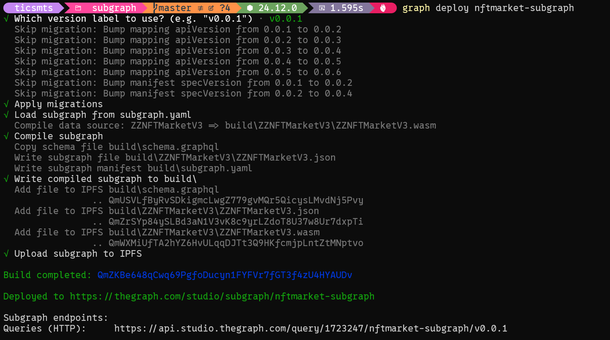
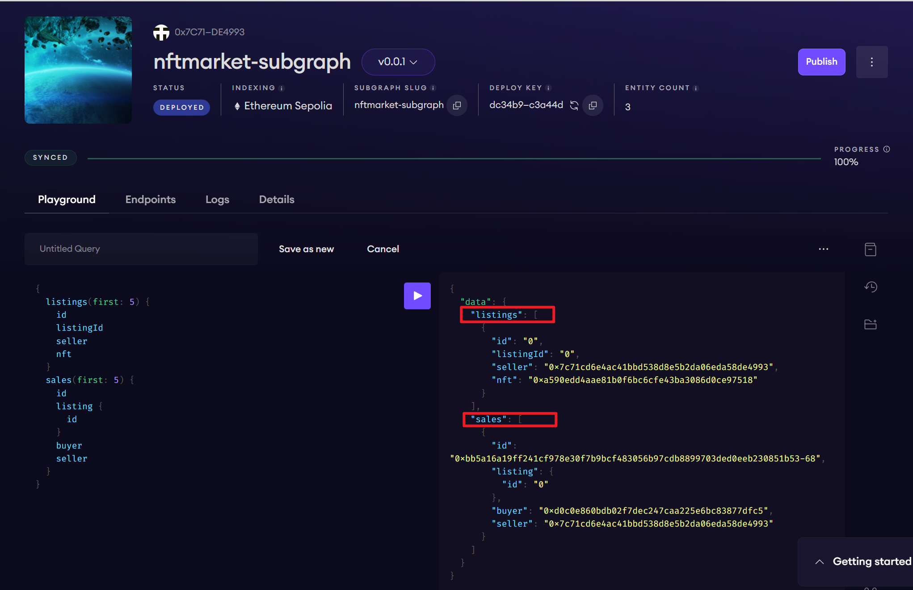

# NFTMarket Subgraph

基于 ZZNFTMarketV3 合约的 The Graph Subgraph 索引项目，用于查询 NFT 上架和成交记录。

## 📋 目录

- [项目概述](#项目概述)
- [合约地址](#合约地址)
- [部署合约](#部署合约)
- [部署 Subgraph](#部署-subgraph)
- [GraphQL 查询示例](#graphql-查询示例)
- [常见问题排查](#常见问题排查)

---

## 截图





## 项目概述

### 数据模型

```
链上事件 (Listed/Bought) → The Graph 索引 → GraphQL API → 前端查询
```

| 实体 | 说明 |
|------|------|
| `Listing` | 上架记录：卖家、NFT、价格、状态 (ACTIVE/SOLD) |
| `Sale` | 成交记录：买家、成交价、关联的 Listing |

### 关联关系

- `Sale.listing` → 正向关系，指向关联的 Listing
- `Listing.sales` → 使用 `@derivedFrom` 反向查询

---

## 合约地址

| 合约 | Sepolia 地址 | 说明 |
|------|-------------|------|
| ZZTOKEN | `0x636d7e09ff1825827d94d929f8bfc97fac3e97a8` | ERC20 支付代币 |
| ZZNFT | `0xa590edd4aae81b0f6bc6cfe43ba3086d0ce97518` | ERC721 NFT |
| ZZNFTMarketV3 | `0x78d2e8d39d3bd68fe62f1f7c94e86ab63573a4c4` | NFT 市场合约 |

**startBlock**: `10070537`

---

## 部署合约

### 1. 环境配置

```bash
cd contracts
cp .env.example .env
# 编辑 .env 填入你的值
```

**.env 变量**:
```bash
SEPOLIA_RPC_URL=https://eth-sepolia.g.alchemy.com/v2/YOUR_KEY
PRIVATE_KEY=your_private_key
ETHERSCAN_API_KEY=your_etherscan_key
```

### 2. 部署到 Sepolia

```bash
# 加载环境变量
source .env

# 部署并验证
forge script script/DeploySepolia.s.sol \
  --rpc-url $SEPOLIA_RPC_URL \
  --broadcast \
  --verify \
  --etherscan-api-key $ETHERSCAN_API_KEY \
  -vvvv
```

### 3. 手动验证（如果自动验证失败）

```bash
# 验证 ZZNFTMarketV3
forge verify-contract <MARKET_ADDRESS> src/ZZNFTMarketV3.sol:ZZNFTMarketV3 \
  --chain sepolia \
  --etherscan-api-key $ETHERSCAN_API_KEY \
  --constructor-args $(cast abi-encode "constructor(address)" <SIGNER_ADDRESS>)

# 验证 ZZNFT
forge verify-contract <NFT_ADDRESS> src/ZZNFT.sol:ZZNFT \
  --chain sepolia \
  --etherscan-api-key $ETHERSCAN_API_KEY \
  --constructor-args $(cast abi-encode "constructor(string,string,string)" "ZZ NFT Collection" "ZZNFT" "https://api.example.com/nft/")

# 验证 ZZTOKEN
forge verify-contract <TOKEN_ADDRESS> src/ZZToken.sol:ZZTOKEN \
  --chain sepolia \
  --etherscan-api-key $ETHERSCAN_API_KEY
```

---

## 部署 Subgraph

### 1. 更新配置

编辑 `subgraph/subgraph.yaml`:
- 将 `address` 替换为部署的 ZZNFTMarketV3 地址
- 将 `startBlock` 替换为部署交易的区块号

### 2. 在 The Graph Studio 创建 Subgraph

1. 访问 [The Graph Studio](https://thegraph.com/studio/)
2. 连接钱包
3. 点击 "Create a Subgraph"
4. 输入名称 `nftmarket-subgraph`
5. 获取 Deploy Key

### 3. 安装依赖并构建

```bash
cd subgraph
npm install

# 生成类型
npm run codegen

# 构建
npm run build
```

### 4. 部署 Subgraph

```bash
# 授权
graph auth --studio <YOUR_DEPLOY_KEY>

# 部署
npm run deploy
# 或
graph deploy --studio nftmarket-subgraph
```

---

## 触发事件（用于测试 Subgraph）

### 环境变量

在 `.env` 中添加：
```bash
BUYER_PRIVATE_KEY=你的买家私钥
```

### 1. 上架 NFT（触发 Listed 事件）

```bash
cd contracts

# 授权 NFT 给市场合约
cast send 0xa590edd4aae81b0f6bc6cfe43ba3086d0ce97518 \
  "approve(address,uint256)" \
  0x78d2e8d39d3bd68fe62f1f7c94e86ab63573a4c4 1 \
  --rpc-url $SEPOLIA_RPC_URL \
  --private-key $PRIVATE_KEY

# 上架 NFT (tokenId=1, 价格=1 ZZTOKEN)
cast send 0x78d2e8d39d3bd68fe62f1f7c94e86ab63573a4c4 \
  "list(address,uint256,address,uint256)" \
  0xa590edd4aae81b0f6bc6cfe43ba3086d0ce97518 1 \
  0x636d7e09ff1825827d94d929f8bfc97fac3e97a8 1000000000000000000 \
  --rpc-url $SEPOLIA_RPC_URL \
  --private-key $PRIVATE_KEY
```

### 2. 购买 NFT（触发 Bought 事件）

> 注意：买家不能是卖家，需要使用不同的钱包

```bash
# 转代币给买家（使用卖家私钥）
cast send 0x636d7e09ff1825827d94d929f8bfc97fac3e97a8 \
  "transfer(address,uint256)" \
  <BUYER_ADDRESS> 10000000000000000000 \
  --rpc-url $SEPOLIA_RPC_URL \
  --private-key $PRIVATE_KEY

# 买家授权代币给市场合约
cast send 0x636d7e09ff1825827d94d929f8bfc97fac3e97a8 \
  "approve(address,uint256)" \
  0x78d2e8d39d3bd68fe62f1f7c94e86ab63573a4c4 1000000000000000000 \
  --rpc-url $SEPOLIA_RPC_URL \
  --private-key $BUYER_PRIVATE_KEY

# 买家购买 NFT (listingId=0, 价格=1 ZZTOKEN)
cast send 0x78d2e8d39d3bd68fe62f1f7c94e86ab63573a4c4 \
  "buyNFT(uint256,uint256)" \
  0 1000000000000000000 \
  --rpc-url $SEPOLIA_RPC_URL \
  --private-key $BUYER_PRIVATE_KEY
```

### 3. 获取买家地址

```bash
cast wallet address $BUYER_PRIVATE_KEY
```

---

## GraphQL 查询示例

### Query 1: 查询最新活跃上架单

```graphql
query GetActiveListings {
  listings(
    where: { status: "ACTIVE" }
    orderBy: createdAt
    orderDirection: desc
    first: 10
  ) {
    id
    listingId
    seller
    nft
    tokenId
    payToken
    price
    status
    createdAt
    createdTx
  }
}
```

### Query 2: 查询最新成交记录（含 Listing 信息）

```graphql
query GetRecentSales {
  sales(
    orderBy: soldAt
    orderDirection: desc
    first: 10
  ) {
    id
    buyer
    price
    isPermitBuy
    soldAt
    soldTx
    listing {
      id
      listingId
      seller
      nft
      tokenId
      createdAt
    }
  }
}
```

### Query 3: 查询单个 Listing 详情及关联 Sales

```graphql
query GetListingWithSales($listingId: ID!) {
  listing(id: $listingId) {
    id
    listingId
    seller
    nft
    tokenId
    payToken
    price
    status
    createdAt
    createdTx
    sales {
      id
      buyer
      price
      isPermitBuy
      soldAt
      soldTx
    }
  }
}
```

**Variables**:
```json
{ "listingId": "0" }
```

---

## 常见问题排查

### 1. Indexing 慢

- 确保 `startBlock` 设置为合约部署的区块号
- 不要从区块 0 开始索引

### 2. ABI 不匹配

- 确保 `abis/ZZNFTMarketV3.json` 与部署的合约版本一致
- 重新从 `contracts/out/` 复制 ABI

### 3. 查询返回空

- 检查 Studio Dashboard 是否显示 "Synced"
- 确认合约上是否有事件触发
- 验证合约地址是否正确

### 4. 合约验证失败

- 确保 `solc` 版本与 `foundry.toml` 中一致
- 检查 optimizer 设置是否匹配
- 使用 `--constructor-args` 传递构造函数参数

---

## 项目结构

```
NFTMarketSubgraph/
├── contracts/                    # Foundry 合约项目
│   ├── src/
│   │   ├── ZZNFTMarketV3.sol
│   │   ├── ZZNFT.sol
│   │   └── ZZToken.sol
│   ├── script/
│   │   └── DeploySepolia.s.sol
│   ├── foundry.toml
│   └── .env.example
├── subgraph/                     # The Graph Subgraph
│   ├── schema.graphql
│   ├── subgraph.yaml
│   ├── src/
│   │   └── mapping.ts
│   ├── abis/
│   │   └── ZZNFTMarketV3.json
│   └── package.json
└── README.md
```

---


## License

MIT
