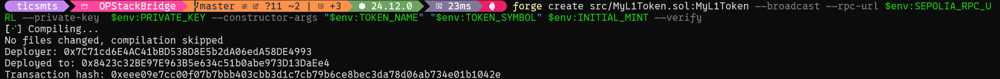
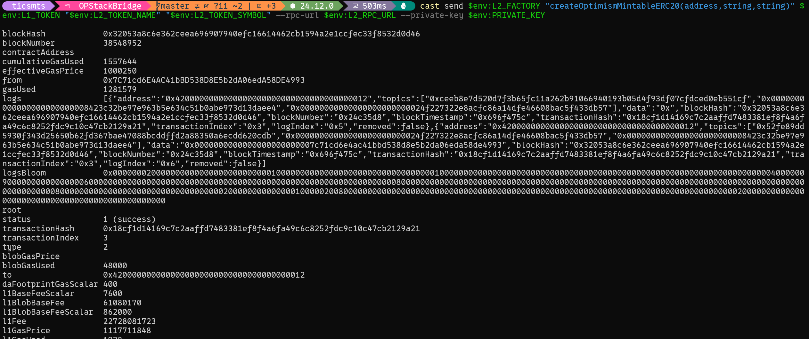
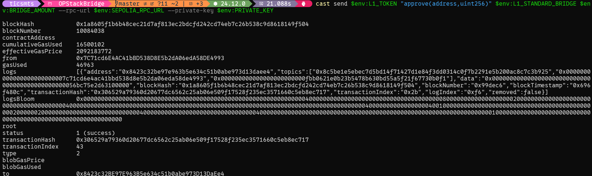
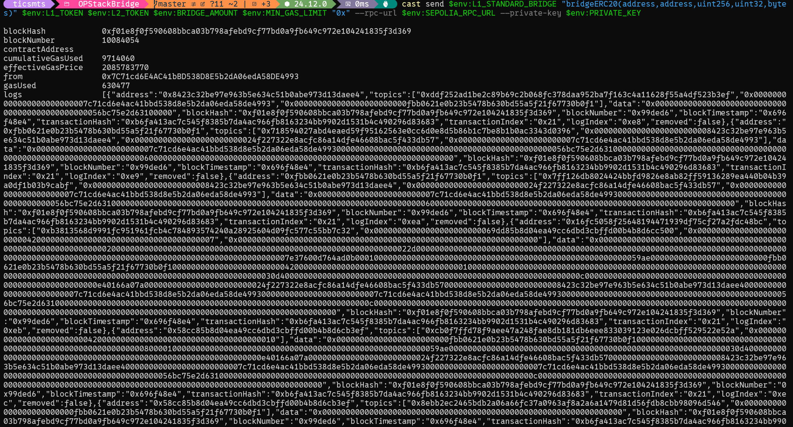
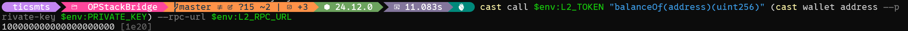
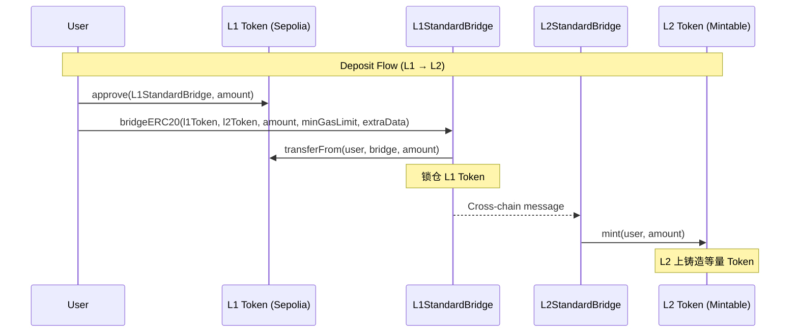

# OP Stack Standard Bridge 跨链教程

## 项目目标

编写并部署自己的 ERC20 Token 到 Ethereum Sepolia (L1)，使用 OP Stack 标准桥将其跨链到 Optimism Sepolia 或 Base Sepolia (L2)。

---

## 运行测试

https://sepolia.etherscan.io/tx/0xb6fa413ac7c545f8385b7da4ac966fb8163234bb9902d1531b4c490296d83683
https://sepolia-optimism.etherscan.io/tx/0x402a37a0d2a46cb8cc4ae3bbf4414962d1bd85db33a987630c80692e532fd4a5

部署Token到Sepolia:


创建L2 Token映射Token:


approve L1Token:


Bridge L1Token:


验证L2Token余额:

---

## A. 总体架构解释

### 1. OP Stack Standard Bridge 工作原理



### 2. 三种 Token 角色

| 角色 | 说明 | 部署位置 |
|------|------|----------|
| **L1 Native Token** | 你自己部署的原生 ERC20 | Ethereum Sepolia |
| **L2 Mintable Token** | 通过 Factory 创建的映射 Token | L2 (OP/Base Sepolia) |
| **IOptimismMintableERC20** | L2 Token 必须实现的接口 | - |

### 3. 为什么需要 IOptimismMintableERC20？

L2 映射 Token **必须**实现 `IOptimismMintableERC20` 接口，原因：

1. **桥合约权限**: L2StandardBridge 需要调用 `mint()` 和 `burn()` 函数
2. **Token 配对验证**: 桥需要通过 `remoteToken()` 验证 L1↔L2 Token 对应关系
3. **安全性**: 确保只有桥合约能铸造/销毁 Token

```solidity
interface IOptimismMintableERC20 {
    function remoteToken() external view returns (address);
    function bridge() external view returns (address);
    function mint(address _to, uint256 _amount) external;
    function burn(address _from, uint256 _amount) external;
}
```

### 4. 重要限制

> [!CAUTION]
> Standard Bridge **不支持**以下类型的 ERC20：
> - **Fee-on-transfer tokens**: 转账时扣手续费的 Token
> - **Rebasing tokens**: 余额会自动变化的 Token (如 stETH)
> - **非标准 decimals**: 建议 L1/L2 都使用 18 decimals

---

## B. 网络配置

### Option 1: Optimism Sepolia

| 参数 | 值 |
|------|-----|
| L2 Chain ID | 11155420 |
| L2 RPC | https://sepolia.optimism.io |
| L2 浏览器 | https://sepolia-optimism.etherscan.io |
| OptimismMintableERC20Factory | `0x4200000000000000000000000000000000000012` |
| L1StandardBridge (on Sepolia) | `0xFBb0621E0B23b5478B630BD55a5f21f67730B0F1` |

### Option 2: Base Sepolia

| 参数 | 值 |
|------|-----|
| L2 Chain ID | 84532 |
| L2 RPC | https://sepolia.base.org |
| L2 浏览器 | https://sepolia.basescan.org |
| OptimismMintableERC20Factory | `0x4200000000000000000000000000000000000012` |
| L1StandardBridge (on Sepolia) | `0xfd0Bf71F60660E2f608ed56e1659C450eB113120` |

### L1: Ethereum Sepolia

| 参数 | 值 |
|------|-----|
| Chain ID | 11155111 |
| 浏览器 | https://sepolia.etherscan.io |

---

## C. 逐步操作清单

### 前置准备

```bash
# 1. 设置环境变量（请替换 <...> 为你的实际值）
export SEPOLIA_RPC_URL="<你的_Sepolia_RPC_URL>"  # Alchemy/Infura/Ankr
export PRIVATE_KEY="<你的私钥>"                   # 不带 0x 前缀

# 选择 L2 网络（二选一）

# ── Option 1: Optimism Sepolia ──
export L2_RPC_URL="https://sepolia.optimism.io"
export L1_STANDARD_BRIDGE="0xFBb0621E0B23b5478B630BD55a5f21f67730B0F1"
export L2_EXPLORER="https://sepolia-optimism.etherscan.io"

# ── Option 2: Base Sepolia ──
export L2_RPC_URL="https://sepolia.base.org"
export L1_STANDARD_BRIDGE="0xfd0Bf71F60660E2f608ed56e1659C450eB113120"
export L2_EXPLORER="https://sepolia.basescan.org"

# 通用配置
export L2_FACTORY="0x4200000000000000000000000000000000000012"
```

---

### Step 1: 部署 L1 Token 到 Sepolia

#### 1.1 创建 Foundry 项目

```bash
mkdir OPStackBridge && cd OPStackBridge
forge init --no-commit
```

#### 1.2 编写 MyL1Token.sol

**文件路径**: `src/MyL1Token.sol`

```solidity
// SPDX-License-Identifier: MIT
pragma solidity ^0.8.20;

import "@openzeppelin/contracts/token/ERC20/ERC20.sol";
import "@openzeppelin/contracts/access/Ownable.sol";

/// @title MyL1Token - L1 原生 ERC20 Token
/// @notice 部署在 Ethereum Sepolia，可通过 Standard Bridge 跨链到 L2
contract MyL1Token is ERC20, Ownable {
    uint256 public constant FAUCET_AMOUNT = 1000 * 10**18;
    
    mapping(address => bool) public hasClaimed;
    
    constructor(
        string memory name_,
        string memory symbol_,
        uint256 initialMint_
    ) ERC20(name_, symbol_) Ownable(msg.sender) {
        // 给部署者铸造初始供应量
        _mint(msg.sender, initialMint_ * 10**18);
    }
    
    /// @notice 水龙头：每个地址可领取一次
    function faucet() external {
        require(!hasClaimed[msg.sender], "Already claimed");
        hasClaimed[msg.sender] = true;
        _mint(msg.sender, FAUCET_AMOUNT);
    }
    
    /// @notice Owner 可给任意地址铸币
    function mint(address to, uint256 amount) external onlyOwner {
        _mint(to, amount);
    }
}
```

#### 1.3 安装 OpenZeppelin 依赖

```bash
forge install OpenZeppelin/openzeppelin-contracts --no-commit
```

**更新 `foundry.toml`**:

```toml
[profile.default]
src = "src"
out = "out"
libs = ["lib"]
remappings = [
    "@openzeppelin/contracts/=lib/openzeppelin-contracts/contracts/"
]
```

#### 1.4 编译合约

```bash
forge build
```

#### 1.5 部署 L1 Token

**目的**: 在 Sepolia 上部署你的 L1 原生 Token

```bash
# 设置 Token 参数
export TOKEN_NAME="<你的Token名称>"     # 例如: "My Bridge Token"
export TOKEN_SYMBOL="<你的Token符号>"    # 例如: "MBT"
export INITIAL_MINT="10000"              # 初始铸币量（会乘以 10^18）

# 部署合约
forge create src/MyL1Token.sol:MyL1Token \
    --rpc-url $SEPOLIA_RPC_URL \
    --private-key $PRIVATE_KEY \
    --constructor-args "$TOKEN_NAME" "$TOKEN_SYMBOL" $INITIAL_MINT \
    --verify
```

**预期输出**:
```
Deployed to: 0x... (L1_TOKEN_ADDRESS)
Transaction hash: 0x...
```

```bash
# 保存 L1 Token 地址
export L1_TOKEN="<部署返回的地址>"
```

#### 1.6 验证部署

```bash
# 查询 Token 信息
cast call $L1_TOKEN "name()(string)" --rpc-url $SEPOLIA_RPC_URL
cast call $L1_TOKEN "symbol()(string)" --rpc-url $SEPOLIA_RPC_URL
cast call $L1_TOKEN "decimals()(uint8)" --rpc-url $SEPOLIA_RPC_URL

# 查询你的余额
cast call $L1_TOKEN "balanceOf(address)(uint256)" $(cast wallet address --private-key $PRIVATE_KEY) --rpc-url $SEPOLIA_RPC_URL
```

---

### Step 2: 在 L2 创建映射 Token

**目的**: 通过 OptimismMintableERC20Factory 在 L2 上创建标准映射 Token

#### 2.1 调用 Factory 创建 Token

```bash
# 设置 L2 Token 参数
export L2_TOKEN_NAME="<L2_Token名称>"    # 例如: "My Bridge Token (L2)"
export L2_TOKEN_SYMBOL="<L2_Token符号>"   # 例如: "MBT.L2"

# 调用 createOptimismMintableERC20
cast send $L2_FACTORY \
    "createOptimismMintableERC20(address,string,string)" \
    $L1_TOKEN "$L2_TOKEN_NAME" "$L2_TOKEN_SYMBOL" \
    --rpc-url $L2_RPC_URL \
    --private-key $PRIVATE_KEY
```

**预期输出**: 返回交易 hash

#### 2.2 获取 L2 Token 地址

**方法 A: 从交易事件中获取**

```bash
# 替换 <TX_HASH> 为上一步返回的交易 hash
cast receipt <TX_HASH> --rpc-url $L2_RPC_URL
```

查找 `OptimismMintableERC20Created` 事件的 log，解析出 L2 Token 地址。

**方法 B: 预计算地址（推荐）**

你也可以在区块浏览器上查看交易详情，找到新创建的合约地址。

```bash
# 保存 L2 Token 地址
export L2_TOKEN="<创建的L2_Token地址>"
```

#### 2.3 验证 L2 Token

```bash
# 验证映射关系
cast call $L2_TOKEN "remoteToken()(address)" --rpc-url $L2_RPC_URL
# 应该返回你的 L1_TOKEN 地址

cast call $L2_TOKEN "bridge()(address)" --rpc-url $L2_RPC_URL
# 应该返回 0x4200000000000000000000000000000000000010 (L2StandardBridge)

cast call $L2_TOKEN "decimals()(uint8)" --rpc-url $L2_RPC_URL
# 应该返回 18
```

> [!TIP]
> **关于 createOptimismMintableERC20WithDecimals**
> 
> 如果你的 L1 Token 不是 18 decimals，使用：
> ```bash
> cast send $L2_FACTORY \
>     "createOptimismMintableERC20WithDecimals(address,string,string,uint8)" \
>     $L1_TOKEN "$L2_TOKEN_NAME" "$L2_TOKEN_SYMBOL" <decimals> \
>     --rpc-url $L2_RPC_URL \
>     --private-key $PRIVATE_KEY
> ```

---

### Step 3: 授权 L1StandardBridge

**目的**: 允许 L1StandardBridge 从你的账户转走 Token

```bash
# 设置跨链数量（以 wei 为单位）
export BRIDGE_AMOUNT="100000000000000000000"  # 100 tokens (100 * 10^18)

# 授权
cast send $L1_TOKEN \
    "approve(address,uint256)" \
    $L1_STANDARD_BRIDGE $BRIDGE_AMOUNT \
    --rpc-url $SEPOLIA_RPC_URL \
    --private-key $PRIVATE_KEY
```

#### 3.1 验证授权

```bash
cast call $L1_TOKEN \
    "allowance(address,address)(uint256)" \
    $(cast wallet address --private-key $PRIVATE_KEY) $L1_STANDARD_BRIDGE \
    --rpc-url $SEPOLIA_RPC_URL
# 应该返回你授权的数量
```

---

### Step 4: 发起跨链 (Deposit)

**目的**: 调用 L1StandardBridge.bridgeERC20 将 Token 从 L1 跨到 L2

#### 4.1 理解 bridgeERC20 vs bridgeERC20To

| 函数 | 接收者 | 适用场景 |
|------|--------|----------|
| `bridgeERC20` | msg.sender | **EOA 钱包调用**（推荐） |
| `bridgeERC20To` | 指定地址 | 合约钱包/代理跨链 |

> [!WARNING]
> `bridgeERC20` 有以下限制：
> - 如果调用者代码长度 > 0（即是合约），会 revert
> - 合约钱包（如 Safe）必须使用 `bridgeERC20To`

#### 4.2 函数签名

```solidity
function bridgeERC20(
    address _localToken,   // L1 Token 地址
    address _remoteToken,  // L2 Token 地址
    uint256 _amount,       // 跨链数量
    uint32 _minGasLimit,   // L2 执行最小 gas（推荐 200000）
    bytes calldata _extraData  // 额外数据（通常为 0x）
) external;
```

#### 4.3 执行跨链

```bash
# 设置参数
export MIN_GAS_LIMIT="200000"  # L2 上执行 mint 所需的最小 gas

# 调用 bridgeERC20
cast send $L1_STANDARD_BRIDGE \
    "bridgeERC20(address,address,uint256,uint32,bytes)" \
    $L1_TOKEN $L2_TOKEN $BRIDGE_AMOUNT $MIN_GAS_LIMIT "0x" \
    --rpc-url $SEPOLIA_RPC_URL \
    --private-key $PRIVATE_KEY
```

**预期输出**: 交易 hash

```bash
# 保存跨链交易 hash
export BRIDGE_TX="<跨链交易hash>"
```

#### 4.4 （可选）使用 bridgeERC20To

```bash
export RECIPIENT="<接收者地址>"  # 可以是你自己的地址

cast send $L1_STANDARD_BRIDGE \
    "bridgeERC20To(address,address,address,uint256,uint32,bytes)" \
    $L1_TOKEN $L2_TOKEN $RECIPIENT $BRIDGE_AMOUNT $MIN_GAS_LIMIT "0x" \
    --rpc-url $SEPOLIA_RPC_URL \
    --private-key $PRIVATE_KEY
```

---

### Step 5: 等待并验证跨链结果

#### 5.1 等待时间

- **正常情况**: 1-5 分钟
- **网络拥堵时**: 可能更长

#### 5.2 在 L2 查询余额

```bash
# 查询 L2 Token 余额
cast call $L2_TOKEN \
    "balanceOf(address)(uint256)" \
    $(cast wallet address --private-key $PRIVATE_KEY) \
    --rpc-url $L2_RPC_URL
```

**预期**: 返回你跨链的数量

#### 5.3 使用区块浏览器验证

1. **L1 交易**: 在 Sepolia Etherscan 查看 `$BRIDGE_TX`
   - 确认 `ERC20BridgeInitiated` 事件
   
2. **L2 交易**: 在 L2 浏览器 (`$L2_EXPLORER`) 查询你的地址
   - 确认 `ERC20BridgeFinalized` 事件
   - 确认 Token 余额变化

---

## D. 运行测试

| 验收项 | 内容 | 示例 |
|--------|------|------|
| ✅ L1 Token 合约地址 | Sepolia 上部署的地址 | `0x8423c32BE97E963B5e634c51b0abe973D13DaEe4` |
| ✅ L1 Token 部署交易 | 部署交易 hash | `0xeee09e7cc00f07b7bbb403cbb3d1c7cb79b6ce8bec3da78d06ab734e01b1042e` |
| ✅ L2 Token 合约地址 | L2 上创建的映射 Token | `0x24F227322E8ACfC86a14dFe46608bAC5F433db57` |
| ✅ L2 Token 创建交易 | Factory 调用交易 hash | `0x18cf1d14169c7c2aaffd7483381ef8f4a6fa49c6c8252fdc9c10c47cb2129a21` |
| ✅ Approve 交易 hash | L1 授权交易 | `0x306529a79360d20677dc6562c25ab06e509f17528f235ec3571660c5eb8ec717` |
| ✅ Bridge 交易 hash | L1 跨链交易 | `0xb6fa413ac7c545f8385b7da4ac966fb8163234bb9902d1531b4c490296d83683` |
| ✅ L2 余额截图/查询结果 | 证明 mint 成功 | `100000000000000000000` |


### 事件日志检查点

**L1 交易应包含事件**:
- `Approval(owner, spender, value)` - approve 交易
- `ERC20BridgeInitiated(localToken, remoteToken, from, to, amount, extraData)` - bridge 交易

**L2 应出现事件**:
- `ERC20BridgeFinalized(localToken, remoteToken, from, to, amount, extraData)`
- `Transfer(address(0), to, amount)` - mint 事件

---

## E. 常见坑与排错

### 1. Gas 相关

| 问题 | 原因 | 解决方案 |
|------|------|----------|
| `minGasLimit` 太低 | L2 执行失败 | 使用 200000 或更高 |
| L1 gas 不足 | 跨链消息费用 | 确保 L1 有足够 ETH |

### 2. RPC 相关

| 问题 | 原因 | 解决方案 |
|------|------|----------|
| 连接超时 | 公共 RPC 限速 | 使用 Alchemy/Infura |
| Chain ID 错误 | RPC 不匹配 | 核对 RPC URL |

### 3. Token 配置

| 问题 | 原因 | 解决方案 |
|------|------|----------|
| Decimals 不匹配 | L1/L2 decimals 不同 | 使用 `createOptimismMintableERC20WithDecimals` |
| 错误的 remoteToken | 映射关系错误 | **无法修复！需重新创建** |

> [!CAUTION]
> **Token 锁死风险**
> 
> 如果 L2 Token 的 `remoteToken()` 返回错误的 L1 地址：
> - 跨过去的 Token **无法取回**
> - 必须重新创建正确映射的 L2 Token
> - 创建前务必核对 L1 Token 地址！

### 4. Approve 相关

| 问题 | 原因 | 解决方案 |
|------|------|----------|
| 授权数量不足 | approve < amount | 重新 approve 更大数量 |
| 授权给错误地址 | 不是 L1StandardBridge | 重新 approve 正确地址 |

### 5. Bridge 函数调用

| 问题 | 原因 | 解决方案 |
|------|------|----------|
| `bridgeERC20` revert | 合约钱包调用 | 改用 `bridgeERC20To` |
| Token 不匹配 | localToken/remoteToken 顺序错 | 核对参数顺序 |

### 6. 安全注意事项

> [!WARNING]
> 1. **不要在 Mainnet 测试**: 本教程仅限 Testnet
> 2. **私钥安全**: 不要将私钥提交到 Git 或发送给他人
> 3. **核对地址**: 跨链前反复核对所有合约地址
> 4. **小额测试**: 先跨少量 Token 验证流程

---

## F. 可选：ethers.js 脚本版本

**文件路径**: `scripts/bridge.ts`

```typescript
import { ethers } from 'ethers';

// ========== 配置 ==========
const CONFIG = {
    // L1 配置
    l1RpcUrl: '<SEPOLIA_RPC_URL>',
    l1TokenAddress: '<L1_TOKEN_ADDRESS>',
    
    // L2 配置（选择一个）
    l2RpcUrl: 'https://sepolia.optimism.io', // 或 https://sepolia.base.org
    l2TokenAddress: '<L2_TOKEN_ADDRESS>',
    
    // 桥地址（选择对应的）
    l1StandardBridge: '0xFBb0621E0B23b5478B630BD55a5f21f67730B0F1', // OP Sepolia
    // l1StandardBridge: '0xfd0Bf71F60660E2f608ed56e1659C450eB113120', // Base Sepolia
    
    // 跨链参数
    bridgeAmount: ethers.parseEther('100'),
    minGasLimit: 200000,
    
    // 私钥
    privateKey: '<PRIVATE_KEY>',
};

// ========== ABI ==========
const ERC20_ABI = [
    'function approve(address spender, uint256 amount) returns (bool)',
    'function balanceOf(address account) view returns (uint256)',
    'function allowance(address owner, address spender) view returns (uint256)',
];

const L1_BRIDGE_ABI = [
    'function bridgeERC20(address _localToken, address _remoteToken, uint256 _amount, uint32 _minGasLimit, bytes _extraData)',
];

// ========== 主流程 ==========
async function main() {
    // 连接 L1
    const l1Provider = new ethers.JsonRpcProvider(CONFIG.l1RpcUrl);
    const wallet = new ethers.Wallet(CONFIG.privateKey, l1Provider);
    
    console.log(`钱包地址: ${wallet.address}`);
    
    // 合约实例
    const l1Token = new ethers.Contract(CONFIG.l1TokenAddress, ERC20_ABI, wallet);
    const l1Bridge = new ethers.Contract(CONFIG.l1StandardBridge, L1_BRIDGE_ABI, wallet);
    
    // Step 1: 检查余额
    const balance = await l1Token.balanceOf(wallet.address);
    console.log(`L1 Token 余额: ${ethers.formatEther(balance)}`);
    
    if (balance < CONFIG.bridgeAmount) {
        throw new Error('余额不足');
    }
    
    // Step 2: Approve
    console.log('\n正在授权...');
    const approveTx = await l1Token.approve(CONFIG.l1StandardBridge, CONFIG.bridgeAmount);
    console.log(`Approve TX: ${approveTx.hash}`);
    await approveTx.wait();
    console.log('授权成功!');
    
    // Step 3: Bridge
    console.log('\n正在跨链...');
    const bridgeTx = await l1Bridge.bridgeERC20(
        CONFIG.l1TokenAddress,
        CONFIG.l2TokenAddress,
        CONFIG.bridgeAmount,
        CONFIG.minGasLimit,
        '0x'
    );
    console.log(`Bridge TX: ${bridgeTx.hash}`);
    await bridgeTx.wait();
    console.log('跨链交易已提交!');
    
    console.log('\n请等待 1-5 分钟后在 L2 查询余额...');
    
    // 连接 L2 查询余额
    const l2Provider = new ethers.JsonRpcProvider(CONFIG.l2RpcUrl);
    const l2Token = new ethers.Contract(CONFIG.l2TokenAddress, ERC20_ABI, l2Provider);
    
    // 轮询 L2 余额
    console.log('\n开始轮询 L2 余额...');
    for (let i = 0; i < 30; i++) {
        const l2Balance = await l2Token.balanceOf(wallet.address);
        console.log(`[${i + 1}/30] L2 余额: ${ethers.formatEther(l2Balance)}`);
        
        if (l2Balance >= CONFIG.bridgeAmount) {
            console.log('\n✅ 跨链成功!');
            break;
        }
        
        await new Promise(r => setTimeout(r, 10000)); // 等待 10 秒
    }
}

main().catch(console.error);
```

**运行脚本**:

```bash
# 安装依赖
npm init -y
npm install ethers

# 运行
npx ts-node scripts/bridge.ts
```

---

## G. 项目文件结构

```
OPStackBridge/
├── src/
│   └── MyL1Token.sol         # L1 ERC20 合约
├── scripts/
│   └── bridge.ts             # (可选) ethers.js 脚本
├── foundry.toml              # Foundry 配置
├── lib/
│   └── openzeppelin-contracts/
└── README.md
```

---

## User Review Required

> [!IMPORTANT]
> 请确认以下信息后再开始执行：
> 
> 1. 你选择的 L2 网络 (Optimism Sepolia 或 Base Sepolia)
> 2. 你的 Token 名称和符号
> 3. 初始铸币数量
> 4. 计划跨链的数量

## Verification Plan

### 自动验证

1. **编译验证**: `forge build` 无错误
2. **余额查询**: 使用 `cast call` 验证 L1/L2 余额

### 手动验证

1. 在 Sepolia Etherscan 确认 L1 Token 合约已验证
2. 在 L2 浏览器确认 L2 Token 创建交易
3. 在 L2 浏览器确认跨链 Token 到账（查看 Transfer 事件）
4. 使用 `cast call` 验证最终余额

---

## H. 使用 .env 文件的快捷命令（PowerShell）

### 为什么使用 .env 文件？

- ✅ 一次配置，多次使用
- ✅ 避免重复输入长命令
- ✅ 变量集中管理，减少错误
- ✅ 更安全（.env 可加入 .gitignore）

### 1. 准备 .env 文件

```bash
# 复制示例文件
cp .env.example .env

# 然后编辑 .env 填入你的实际值
```

`.env.example` 已包含所有必要配置。编辑 `.env` 文件，填入你的 RPC URL、私钥等信息。

### 2. 加载 .env 文件（PowerShell）

**方法 A：完整版本**

```powershell
Get-Content .env | ForEach-Object { if ($_ -match '^([^#][^=]*)=(.*)') { [Environment]::SetEnvironmentVariable($matches[1].Trim(), $matches[2].Trim(), 'Process') } }
```

**方法 B：简化版本（推荐）**

```powershell
Get-Content .env | Where-Object { $_ -notmatch '^#' -and $_ -match '=' } | ForEach-Object { $k,$v = $_ -split '=',2; Set-Item -Path "env:$k" -Value $v }
```

> [!TIP]
> 每次打开新的 PowerShell 窗口时，需要重新加载 .env 文件

### 3. 执行命令（单行版本）

#### Step 1: 部署 L1 Token

```powershell
forge create src/MyL1Token.sol:MyL1Token --rpc-url $env:SEPOLIA_RPC_URL --private-key $env:PRIVATE_KEY --constructor-args "$env:TOKEN_NAME" "$env:TOKEN_SYMBOL" $env:INITIAL_MINT --verify
```

**部署后**：更新 `.env` 中的 `L1_TOKEN=<地址>`，然后重新加载 .env

#### Step 2: 创建 L2 映射 Token

```powershell
cast send $env:L2_FACTORY "createOptimismMintableERC20(address,string,string)" $env:L1_TOKEN "$env:L2_TOKEN_NAME" "$env:L2_TOKEN_SYMBOL" --rpc-url $env:L2_RPC_URL --private-key $env:PRIVATE_KEY
```

**创建后**：更新 `.env` 中的 `L2_TOKEN=<地址>`，然后重新加载 .env

#### Step 3: Approve

```powershell
cast send $env:L1_TOKEN "approve(address,uint256)" $env:L1_STANDARD_BRIDGE $env:BRIDGE_AMOUNT --rpc-url $env:SEPOLIA_RPC_URL --private-key $env:PRIVATE_KEY
```

#### Step 4: Bridge

```powershell
cast send $env:L1_STANDARD_BRIDGE "bridgeERC20(address,address,uint256,uint32,bytes)" $env:L1_TOKEN $env:L2_TOKEN $env:BRIDGE_AMOUNT $env:MIN_GAS_LIMIT "0x" --rpc-url $env:SEPOLIA_RPC_URL --private-key $env:PRIVATE_KEY
```

#### Step 5: 验证 L2 余额

```powershell
cast call $env:L2_TOKEN "balanceOf(address)(uint256)" (cast wallet address --private-key $env:PRIVATE_KEY) --rpc-url $env:L2_RPC_URL
```

### 4. 辅助命令

```powershell
# 查看钱包地址
cast wallet address --private-key $env:PRIVATE_KEY

# 验证 L2 Token 映射关系
cast call $env:L2_TOKEN "remoteToken()(address)" --rpc-url $env:L2_RPC_URL

# 查询授权额度
cast call $env:L1_TOKEN "allowance(address,address)(uint256)" (cast wallet address --private-key $env:PRIVATE_KEY) $env:L1_STANDARD_BRIDGE --rpc-url $env:SEPOLIA_RPC_URL

# 查询 L1 余额
cast call $env:L1_TOKEN "balanceOf(address)(uint256)" (cast wallet address --private-key $env:PRIVATE_KEY) --rpc-url $env:SEPOLIA_RPC_URL

# 查询 L2 余额
cast call $env:L2_TOKEN "balanceOf(address)(uint256)" (cast wallet address --private-key $env:PRIVATE_KEY) --rpc-url $env:L2_RPC_URL
```

### 5. 完整工作流程示例

```powershell
# 1. 加载环境变量
Get-Content .env | Where-Object { $_ -notmatch '^#' -and $_ -match '=' } | ForEach-Object { $k,$v = $_ -split '=',2; Set-Item -Path "env:$k" -Value $v }

# 2. 部署 L1 Token
forge create src/MyL1Token.sol:MyL1Token --rpc-url $env:SEPOLIA_RPC_URL --private-key $env:PRIVATE_KEY --constructor-args "$env:TOKEN_NAME" "$env:TOKEN_SYMBOL" $env:INITIAL_MINT --verify

# 3. 更新 .env 中的 L1_TOKEN，然后重新加载
Get-Content .env | Where-Object { $_ -notmatch '^#' -and $_ -match '=' } | ForEach-Object { $k,$v = $_ -split '=',2; Set-Item -Path "env:$k" -Value $v }

# 4. 创建 L2 Token
cast send $env:L2_FACTORY "createOptimismMintableERC20(address,string,string)" $env:L1_TOKEN "$env:L2_TOKEN_NAME" "$env:L2_TOKEN_SYMBOL" --rpc-url $env:L2_RPC_URL --private-key $env:PRIVATE_KEY

# 5. 更新 .env 中的 L2_TOKEN，然后重新加载  
Get-Content .env | Where-Object { $_ -notmatch '^#' -and $_ -match '=' } | ForEach-Object { $k,$v = $_ -split '=',2; Set-Item -Path "env:$k" -Value $v }

# 6. Approve
cast send $env:L1_TOKEN "approve(address,uint256)" $env:L1_STANDARD_BRIDGE $env:BRIDGE_AMOUNT --rpc-url $env:SEPOLIA_RPC_URL --private-key $env:PRIVATE_KEY

# 7. Bridge
cast send $env:L1_STANDARD_BRIDGE "bridgeERC20(address,address,uint256,uint32,bytes)" $env:L1_TOKEN $env:L2_TOKEN $env:BRIDGE_AMOUNT $env:MIN_GAS_LIMIT "0x" --rpc-url $env:SEPOLIA_RPC_URL --private-key $env:PRIVATE_KEY

# 8. 等待 1-5 分钟后验证 L2 余额
cast call $env:L2_TOKEN "balanceOf(address)(uint256)" (cast wallet address --private-key $env:PRIVATE_KEY) --rpc-url $env:L2_RPC_URL
```

### 6. 故障排查

#### 问题：变量未设置

```powershell
# 检查变量是否已加载
echo $env:SEPOLIA_RPC_URL
echo $env:L1_TOKEN

# 如果为空，重新加载 .env
Get-Content .env | Where-Object { $_ -notmatch '^#' -and $_ -match '=' } | ForEach-Object { $k,$v = $_ -split '=',2; Set-Item -Path "env:$k" -Value $v }
```

#### 问题：L2 没有 ETH

```powershell
# 查询 L2 余额
cast balance (cast wallet address --private-key $env:PRIVATE_KEY) --rpc-url $env:L2_RPC_URL

# 如果为 0，请使用 Faucet 获取测试 ETH
```

**OP Sepolia Faucet**:
- https://www.alchemy.com/faucets/optimism-sepolia
- https://faucet.quicknode.com/optimism/sepolia

**Base Sepolia Faucet**:
- https://www.alchemy.com/faucets/base-sepolia
- https://faucet.quicknode.com/base/sepolia
