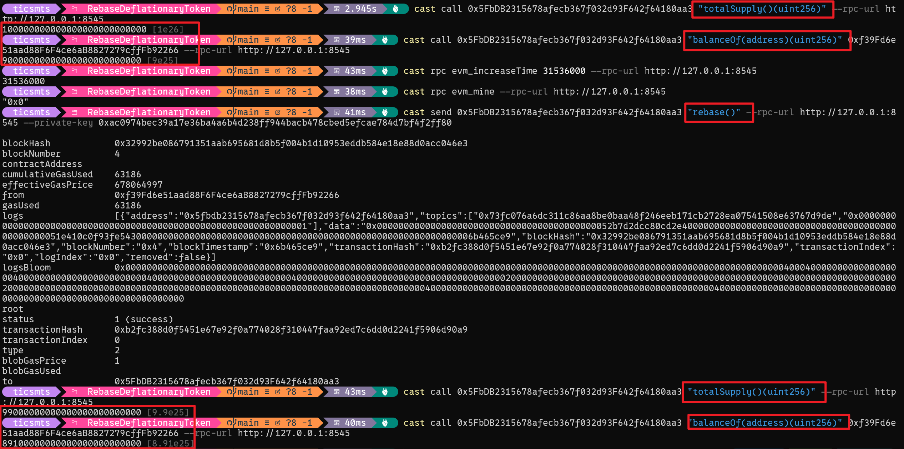

# Rebase Deflationary Token (AMPL/Gons 模型)

采用 AMPL 的 "gons（内部份额）/ fragments（对外余额）" 模型实现的通缩型 Rebase ERC20 代币。

## 核心特性

- **通缩机制**: 每年总供应量减少 1%（复利式）
- **Rebase 无遍历**: 只修改全局换算比例，不逐个修改账户余额
- **持仓占比不变**: Rebase 后所有用户的持仓比例保持一致
- **Permissionless**: 任何人都可以在时机成熟时调用 `rebase()`

## 快速开始

```bash
# 编译
forge build

# 运行测试
forge test -vvv

# 运行单个测试
forge test --match-test test_RebaseAfterOneYear -vvv
```

## 截图证明



## 测试 Rebase 通缩效果

### 方法 1: 运行演示测试（推荐）

```bash
# 单年 rebase 演示 - 显示余额变化
forge test --match-test test_RebaseDemo -vv

# 多年 rebase 演示 - 显示 5 年累计通缩
forge test --match-test test_MultiYearRebase -vv
```

### 方法 2: 本地节点手动测试

**终端 1 - 启动 Anvil：**
```bash
anvil
```

**终端 2 - 部署并测试：**
```bash
# 1. 部署合约
forge script script/RebaseDemo.s.sol --rpc-url http://127.0.0.1:8545 --broadcast

# 2. 查看初始供应量 (替换为实际合约地址)
cast call 0x5FbDB2315678afecb367f032d93F642f64180aa3 "totalSupply()(uint256)" --rpc-url http://127.0.0.1:8545

# 3. 快进一年 (31536000 秒)
cast rpc evm_increaseTime 31536000 --rpc-url http://127.0.0.1:8545
cast rpc evm_mine --rpc-url http://127.0.0.1:8545

# 4. 调用 rebase
cast send 0x5FbDB2315678afecb367f032d93F642f64180aa3 "rebase()" --rpc-url http://127.0.0.1:8545 --private-key 0xac0974bec39a17e36ba4a6b4d238ff944bacb478cbed5efcae784d7bf4f2ff80

# 5. 再次查看供应量（应减少 1%）
cast call 0x5FbDB2315678afecb367f032d93F642f64180aa3 "totalSupply()(uint256)" --rpc-url http://127.0.0.1:8545
```

## AMPL/Gons 模型详解

### 核心概念

| 术语 | 说明 |
|------|------|
| **gons** | 内部存储单位，代表用户在系统中的"份额"，总量恒定不变 |
| **fragments** | 对外显示单位，用户看到的余额，会随 rebase 变化 |
| **gonsPerFragment** | 换算比例，gons / fragments |
| **TOTAL_GONS** | 全系统 gons 总量，是一个常量 |

### 换算关系

```
gonsPerFragment = TOTAL_GONS / totalSupply
balanceOf(account) = _gonBalances[account] / gonsPerFragment
```

### 具体数字例子

#### 初始状态

```
初始供应量: INITIAL_SUPPLY = 100,000,000 * 1e18 = 1e26 (1亿个代币)

TOTAL_GONS 的计算:
  MAX_UINT256 ≈ 1.157920892373162e77
  TOTAL_GONS = MAX_UINT256 - (MAX_UINT256 % 1e26)
             = 步骤1: MAX_UINT256 % 1e26 计算余数
             = 步骤2: MAX_UINT256 - 余数 = 确保可以被 1e26 整除的最大值

初始 gonsPerFragment = TOTAL_GONS / 1e26 ≈ 1.157920892373162e51
```

#### 用户 Alice 获得 10% 的代币

```
Alice 获得 10,000,000 * 1e18 = 1e25 个 fragments

转账时:
  gonValue = 1e25 * gonsPerFragment = 1e25 * 1.157920892373162e51 ≈ 1.157920892373162e76

Alice 的 _gonBalances = 1.157920892373162e76
Alice 的 balanceOf = 1.157920892373162e76 / 1.157920892373162e51 = 1e25 ✓
```

#### 第一次 Rebase (1年后)

```
旧供应量: 1e26
新供应量: 1e26 * 99 / 100 = 9.9e25

新 gonsPerFragment = TOTAL_GONS / 9.9e25 ≈ 1.169616052902184e51
  (比之前增加了约 1.01 倍)

Alice 的 _gonBalances 不变 = 1.157920892373162e76

Alice 的新 balanceOf:
  = 1.157920892373162e76 / 1.169616052902184e51
  ≈ 9.9e24
  (减少了 1%,从 1e25 变成 9.9e24)

Alice 的持仓占比:
  旧: 1e25 / 1e26 = 10%
  新: 9.9e24 / 9.9e25 = 10% ✓ (不变)
```

#### 关键洞察

1. **为什么 balanceOf 自动变小?**
   - `gonsPerFragment` 增大了 (因为 totalSupply 减小)
   - `balanceOf = gonBalance / gonsPerFragment`
   - 分母变大 → 结果变小

2. **为什么不需要遍历修改余额?**
   - 所有账户的 `gonBalance` 都不变
   - 只修改全局的 `gonsPerFragment`
   - `balanceOf()` 函数实时计算，返回新值

3. **TOTAL_GONS 为什么这样设计?**
   - 使用 MAX_UINT256 量级，保证足够的精度
   - 减去余数，确保初始时可以整除，避免舍入误差

### Allowance 不缩放

Allowance（授权额度）以 fragments 为单位存储，且**不会**随 rebase 自动缩放。

```
场景:
1. Alice 授权 spender 50e18 个代币
2. 一年后 rebase 发生
3. allowance 仍然是 50e18（不是 49.5e18）

原因:
- 授权是用户主观设置的"允许消费的数量"
- 如果自动缩放，会违反用户预期
- 这是 AMPL 的标准行为
```

## 合约架构

```
RebaseDeflationaryToken
├── 常量
│   ├── INITIAL_FRAGMENTS_SUPPLY = 100M * 1e18
│   ├── MIN_SUPPLY = 1e18
│   ├── REBASE_INTERVAL = 365 days
│   └── TOTAL_GONS = MAX_UINT256 - (MAX_UINT256 % INITIAL_SUPPLY)
├── 状态变量
│   ├── _totalSupply (当前供应量，以 fragments 计)
│   ├── _gonsPerFragment (换算比例)
│   ├── _gonBalances (内部余额，以 gons 计)
│   ├── _allowances (授权，以 fragments 计)
│   ├── lastRebaseTimestamp
│   └── epoch
└── 函数
    ├── ERC20 标准 (balanceOf, transfer, approve, ...)
    ├── rebase() → 执行通缩
    └── gonsPerFragment(), gonBalanceOf() → 辅助查询
```

## 测试覆盖

| 测试类别 | 描述 |
|---------|------|
| 初始化 | totalSupply、deployer余额、TOTAL_GONS整除性 |
| 转账 | rebase前后转账正确性、gons计算 |
| Rebase | 供应量减少、余额减少、持仓占比不变 |
| 时间限制 | 一年内禁止二次rebase、间隔验证 |
| Allowance | 授权不缩放、transferFrom正确性 |
| 边界 | 多次rebase、零金额转账、无限授权 |

## 部署

```bash
# 部署脚本示例
forge script script/Deploy.s.sol --rpc-url $RPC_URL --broadcast
```

## 开源协议

MIT License
