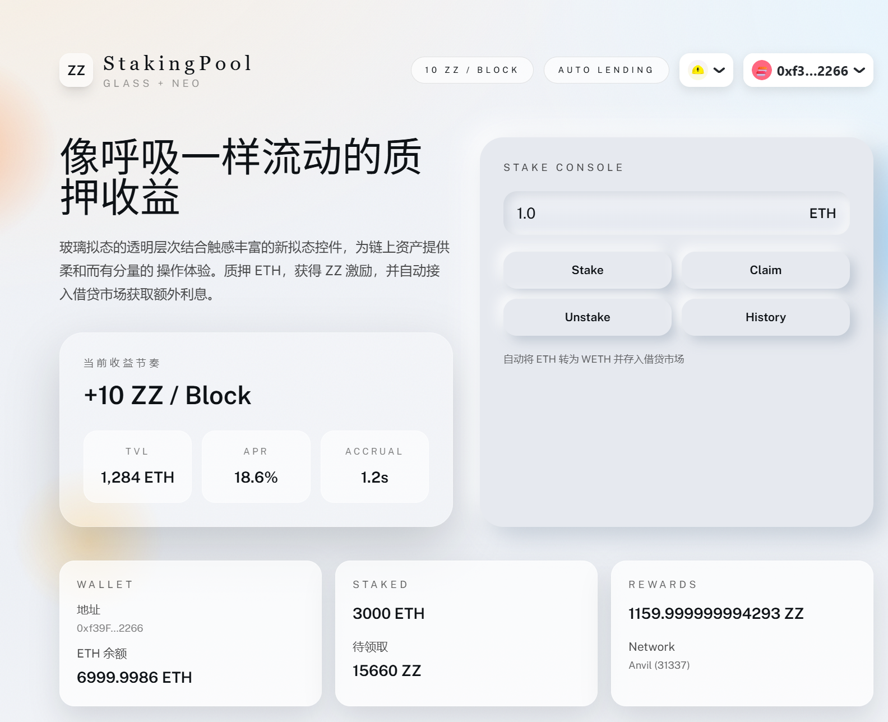
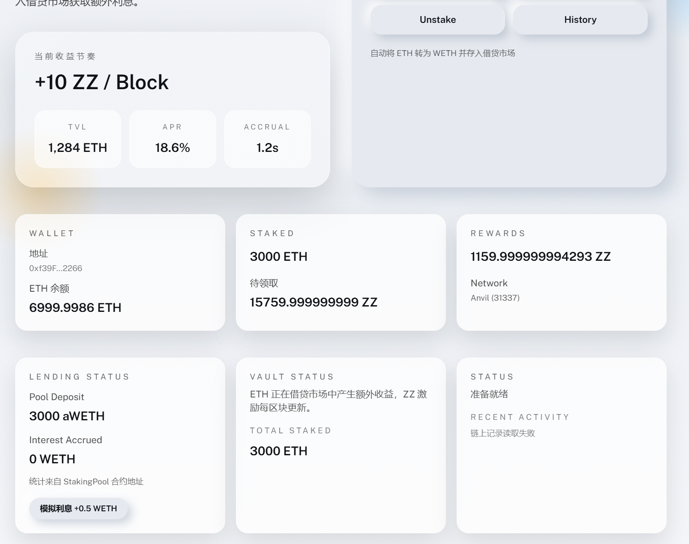

# StakingPool - ETH 质押挖矿 + 借贷市场集成

一个完整的质押挖矿示例：用户质押 ETH 获得 ZZ Token，奖励按区块与质押时间/数量公平分配。质押资金自动进入借贷市场（Aave v3 接口），同时赚取利息。包含合约、测试、部署脚本与前端集成。

## 目录

- [项目概览](#项目概览)
- [项目结构](#项目结构)
- [快速开始](#快速开始)
- [核心技术原理](#核心技术原理)
  - [1. 单位累计 accRewardPerShare](#1-单位累计-accrewardpershare)
  - [2. Stake 质押流程](#2-stake-质押流程)
  - [3. Claim 领取流程](#3-claim-领取流程)
  - [4. Unstake 赎回流程](#4-unstake-赎回流程)
  - [5. 借贷市场集成](#5-借贷市场集成)
- [智能合约详解](#智能合约详解)
  - [1. ZZToken.sol](#1-zztokensol)
  - [2. StakingPool.sol](#2-stakingpoolsol)
  - [3. MockWETH.sol](#3-mockwethsol)
  - [4. MockAToken.sol](#4-mockatokensol)
  - [5. MockLendingPool.sol](#5-mocklendingpoolsol)
- [前端集成](#前端集成)
- [测试与部署](#测试与部署)
- [安全与注意事项](#安全与注意事项)

---

## 项目概览

| 模块 | 状态 | 说明 |
|------|------|------|
| 智能合约 | 完成 | ETH 质押 + ZZ 挖矿 + 借贷市场集成 |
| 本地部署 | 完成 | Anvil + MockLendingPool + MockAToken |
| 单元测试 | 完成 | 质押/领取/赎回逻辑测试 |
| 前端 | 完成 | Next.js + RainbowKit + wagmi + viem |
| 前端链上集成 | 完成 | 读余额/待领取/事件日志 |

---

## 项目展示




---

## 项目结构

```
StakingPool/
├── contracts/
│   ├── StakingPool.sol            # 质押挖矿核心合约
│   ├── ZZToken.sol                # 奖励代币
│   └── mocks/
│       ├── MockWETH.sol           # WETH 模拟
│       ├── MockAToken.sol         # aToken 模拟
│       └── MockLendingPool.sol    # 借贷市场模拟
├── script/
│   ├── Deploy.s.sol               # 部署脚本（含 mocks）
│   ├── Flow.s.sol                 # 一键演示流程
│   └── UpdateFrontendEnv.ps1      # 自动写入前端环境变量
├── test/
│   └── StakingPool.t.sol          # 质押/领取/赎回测试
├── frontend/                       # Next.js 前端
│   ├── pages/
│   │   ├── _app.jsx                # RainbowKit + wagmi 配置
│   │   └── index.jsx               # 质押交互页面
│   ├── lib/contracts.js            # ABI + 地址配置
│   └── styles/globals.css          # 玻璃态 + 新拟态样式
├── foundry.toml
└── README.md
```

---

## 快速开始

### 1. 编译合约
```bash
forge build
```

### 2. 运行测试
```bash
forge test -vvv
```

### 3. 部署到本地 Anvil
```bash
# 终端1: 启动 Anvil（建议自动出块）
anvil --block-time 1

# 终端2: 部署合约（含 mocks）
forge script script/Deploy.s.sol --rpc-url http://127.0.0.1:8545 --broadcast -vvvv --env DEPLOY_MOCKS=true
```

### 4. 启动前端
```bash
cd frontend
npm install
npm run dev
```

---

## 核心技术原理

### 1. 单位累计 accRewardPerShare

#### 1.1 设计目标
在每个区块产生固定奖励的前提下，让质押时间更长、质押数量更大的用户获得更高收益。

#### 1.2 关键变量
```solidity
uint256 public accRewardPerShare;  // 每 1 ETH 累积到的 ZZ，放大 1e12
uint256 public lastRewardBlock;    // 上一次更新奖励的区块
uint256 public totalStaked;        // 当前总质押

struct UserInfo {
    uint256 amount;                // 用户质押的 ETH
    uint256 rewardDebt;            // 结算坐标
}
```

#### 1.3 奖励更新公式
```solidity
// blocks = block.number - lastRewardBlock
// 使用 1e12 放大精度，避免小数损失
accRewardPerShare += (blocks * REWARD_PER_BLOCK * 1e12) / totalStaked;
// 更新 lastRewardBlock 防止重复累加
lastRewardBlock = block.number;
```

#### 1.4 用户待领取计算
```solidity
// 用户的累计奖励 - 用户上次结算坐标
// rewardDebt 相当于“已领取/已结算”的边界
pending = user.amount * accRewardPerShare / 1e12 - user.rewardDebt;
```

#### 1.5 为什么公平
- 每个区块奖励按 totalStaked 分摊到“每 1 ETH”。
- 质押越久，accRewardPerShare 增长越多，收益越高。
- rewardDebt 防止重复领取（类似“已记账坐标”）。

---

### 2. Stake 质押流程

#### 2.1 核心调用路径（简化）
```solidity
function stake() external payable {
    _updatePool();
    _mintPending(msg.sender);

    // 必须先 wrap 成 WETH 才能进入借贷市场
    weth.deposit{value: msg.value}();
    // onBehalfOf = address(this)，收益归合约池子
    lendingPool.supply(address(weth), msg.value, address(this), 0);

    user.amount += msg.value;
    totalStaked += msg.value;
    // 更新 rewardDebt，避免新存入的份额参与旧奖励
    user.rewardDebt = user.amount * accRewardPerShare / 1e12;
}
```

#### 2.2 关键点说明
- 先结算再变更份额，避免新存入的 ETH 抢占旧奖励。
- 自动存入借贷市场：WETH 进入 Aave v3 `supply`。
- 更新 rewardDebt：锁定当前奖励坐标，后续只结算新增部分。

---

### 3. Claim 领取流程

#### 3.1 核心调用路径（简化）
```solidity
function claim() external {
    _updatePool();
    uint256 pending = _pending(msg.sender);
    // 直接铸 ZZ，而不是从余额池转出
    zzToken.mint(msg.sender, pending);
    // 只更新 rewardDebt，不改变质押份额
    user.rewardDebt = user.amount * accRewardPerShare / 1e12;
}
```

#### 3.2 关键点说明
- 只领取奖励，不改变质押份额。
- 每次 claim 只拿到新增部分，不会重复领取。

---

### 4. Unstake 赎回流程

#### 4.1 核心调用路径（简化）
```solidity
function unstake(uint256 amount) external {
    _updatePool();
    _mintPending(msg.sender);

    user.amount -= amount;
    totalStaked -= amount;
    user.rewardDebt = user.amount * accRewardPerShare / 1e12;

    // 先从借贷市场取回 WETH
    lendingPool.withdraw(address(weth), amount, address(this));
    // 再 unwrap 为 ETH，才能返还用户
    weth.withdraw(amount);
    payable(msg.sender).transfer(amount);
}
```

#### 4.2 关键点说明
- 先领取奖励再减少质押，保证收益正确。
- 借贷市场取回 WETH，再解包成 ETH。
- 用户可随时赎回，无锁定期。

---

### 5. 借贷市场集成

#### 5.1 质押时存入借贷市场
```solidity
weth.deposit{value: msg.value}();
lendingPool.supply(address(weth), msg.value, address(this), 0);
```

#### 5.2 赎回时取回
```solidity
lendingPool.withdraw(address(weth), amount, address(this));
weth.withdraw(amount);
```

#### 5.3 本地 Mock 的利息模拟
- MockLendingPool.supply 会铸 MockAToken 给 StakingPool。
- MockLendingPool.accrue 额外铸 aToken，前端可观察利息增长。

---

## 智能合约详解

### 1. ZZToken.sol

#### 1.1 权限与铸币
```solidity
address public minter;

function mint(address to, uint256 amount) external onlyMinter {
    // 奖励铸造由 StakingPool 统一控制
    totalSupply += amount;
    balanceOf[to] += amount;
}
```

#### 1.2 作用
- StakingPool 作为 minter，按需给用户发放奖励。

---

### 2. StakingPool.sol

#### 2.1 奖励核心：_updatePool
```solidity
function _updatePool() internal {
    if (block.number <= lastRewardBlock) return;
    // totalStaked 为 0 时仅更新区块，避免除零
    if (totalStaked == 0) { lastRewardBlock = block.number; return; }
    uint256 blocks = block.number - lastRewardBlock;
    uint256 reward = blocks * REWARD_PER_BLOCK;
    // accRewardPerShare 用 1e12 精度累积
    accRewardPerShare += reward * 1e12 / totalStaked;
    lastRewardBlock = block.number;
}
```

#### 2.2 关键事件
```solidity
event Stake(address indexed user, uint256 amount);
event Unstake(address indexed user, uint256 amount);
event Claim(address indexed user, uint256 amount);
```

#### 2.3 用户收益查询
```solidity
function earned(address account) external view returns (uint256) {
    uint256 currentAcc = accRewardPerShare;
    if (block.number > lastRewardBlock && totalStaked > 0) {
        uint256 blocks = block.number - lastRewardBlock;
        // view 中也要模拟“如果现在更新会是多少”
        currentAcc += blocks * REWARD_PER_BLOCK * 1e12 / totalStaked;
    }
    return user.amount * currentAcc / 1e12 - user.rewardDebt;
}
```

---

### 3. MockWETH.sol

#### 3.1 包装与解包
```solidity
function deposit() external payable { balanceOf[msg.sender] += msg.value; }
function withdraw(uint256 amount) external { /* burn WETH, send ETH */ }
```

---

### 4. MockAToken.sol

#### 4.1 模拟 aWETH
```solidity
function mint(address to, uint256 amount) external onlyMinter { ... }
function burn(address from, uint256 amount) external onlyMinter { ... }
```

---

### 5. MockLendingPool.sol

#### 5.1 存入与取回
```solidity
function supply(address asset, uint256 amount, address onBehalfOf, uint16) external {
    IERC20(asset).transferFrom(msg.sender, address(this), amount);
    deposits[asset][onBehalfOf] += amount;
    // supply 后铸 aToken，代表借贷存款凭证
    IMintableToken(aTokens[asset]).mint(onBehalfOf, amount);
}
```

```solidity
function withdraw(address asset, uint256 amount, address to) external returns (uint256) {
    deposits[asset][msg.sender] -= amount;
    // 赎回时必须销毁 aToken，保持 1:1 对应
    IMintableToken(aTokens[asset]).burn(msg.sender, amount);
    IERC20(asset).transfer(to, amount);
    return amount;
}
```

#### 5.2 模拟利息
```solidity
function accrue(address asset, address onBehalfOf, uint256 amount) external onlyOwner {
    // 仅用于本地模拟利息累积
    IMintableToken(aTokens[asset]).mint(onBehalfOf, amount);
}
```

---

## 前端集成

技术栈：Next.js + RainbowKit + wagmi + viem + TailwindCSS。

前端读取：
- 用户质押余额：balanceOf(address)
- 待领取奖励：earned(address)
- 已领取奖励（ZZ 余额）：ZZToken.balanceOf(address)
- 借贷存款余额：aToken.balanceOf(StakingPool)
- 利息估算：aTokenBalance - totalStaked
- Recent Activity：链上事件 Stake/Unstake/Claim

关键文件：
- frontend/pages/index.jsx：合约交互逻辑 + UI。
- frontend/lib/contracts.js：ABI 与环境变量地址。
- frontend/pages/_app.jsx：WalletConnect + wagmi 配置。

---

## 测试与部署

### 本地测试
```bash
forge test -vvv
```

### 本地部署
```bash
anvil --block-time 1
forge script script/Deploy.s.sol --rpc-url http://127.0.0.1:8545 --broadcast -vvvv --env DEPLOY_MOCKS=true
```

### 一键演示流程
```bash
$env:PRIVATE_KEY="0x59c6995e998f97a5a0044966f0945389dc9e86dae88c7a8412f4603b6b78690d"
forge script script/Flow.s.sol --rpc-url http://127.0.0.1:8545 --broadcast -vvvv
```

---

## 安全与注意事项

- nonReentrant 防止重入攻击。
- 奖励为铸造式发放（ZZToken.minter = StakingPool）。
- Anvil 若不自动出块，earned 不增长（建议 --block-time 1）。

---

## 许可证

MIT License
