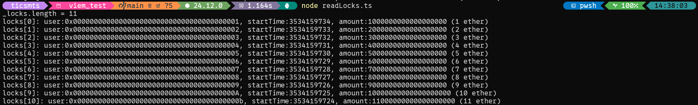

# StudyEVM

EVM 底层学习项目，包含存储槽分析、函数调用机制等学习内容。

## 项目结构

```
StudyEVM/
├── src/
│   ├── SlotStudy.sol      # esRNT 合约 - 存储槽布局学习
│   ├── Storage.sol        # 基础存储合约示例
│   └── CallFunction.sol   # 函数调用与 msg.data 学习
├── script/
│   └── DeploySlotStudy.s.sol  # 部署脚本
└── test/
    └── CallFunction.t.sol     # 测试文件
```

## 合约说明

### SlotStudy.sol (esRNT)
学习动态数组的存储槽布局，包含 `LockInfo` 结构体数组：
- `address user` - 用户地址
- `uint64 startTime` - 开始时间
- `uint256 amount` - 锁定数量

### Storage.sol
基础存储合约，演示 `store` 和 `retrieve` 操作。

### CallFunction.sol
学习函数调用机制，演示 `msg.data` 编码格式。

## 使用方法

### 编译
```bash
forge build
```

### 测试
```bash
forge test
```

### 部署
```bash
# 设置环境变量
export PRIVATE_KEY=<your_private_key>

# 本地部署
forge script script/DeploySlotStudy.s.sol --rpc-url http://127.0.0.1:8545 --broadcast
```

## 测试结果

readLocks测试结果:

