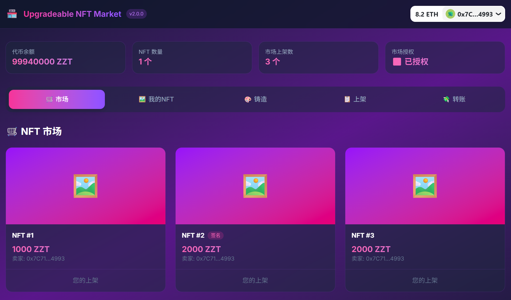

# Upgradeable NFT Market

基于 UUPS 模式的可升级 NFT 市场，支持托管式上架和 EIP-712 离线签名上架。

## ✨ 功能特性

### 智能合约
- 🔄 **UUPS 可升级架构**: 所有核心合约支持无缝升级
- 📝 **V1 托管式上架**: NFT 转移到市场合约托管，安全可靠
- ✍️ **V2 签名式上架**: EIP-712 离线签名，NFT 保留在钱包，节省 gas
- 🛡️ **重放攻击防护**: 基于 nonce 和 deadline 的双重防护机制
- 🔐 **完整测试覆盖**: 21 个测试用例，覆盖 V1/V2/升级全流程

### 前端应用
- 🎨 **现代化 UI**: TailwindCSS + 深色主题 + 渐变效果
- 🦊 **钱包集成**: RainbowKit + Wagmi v2 + Viem
- 🖼️ **我的 NFT**: 实时查看个人资产，一键快速上架
- 🛒 **市场浏览**: 网格展示所有上架 NFT，支持即时购买
- 💰 **代币管理**: 转账、授权、余额查询
- 🎯 **双模式上架**: 支持 V1 托管和 V2 签名两种上架方式

## 📁 项目结构

```
UpgradeableNFTMarket/
├── src/                           # 智能合约源码
│   ├── ZZNFTUpgradeable.sol      # 可升级 ERC721 NFT
│   ├── ZZTokenUpgradeable.sol    # 可升级 ERC20 代币
│   ├── NFTMarketV1.sol           # V1: 托管式市场
│   └── NFTMarketV2.sol           # V2: 签名式市场 (继承 V1)
├── script/                        # 部署脚本
│   ├── DeployV1.s.sol            # 部署 V1 + 所有代理
│   └── UpgradeToV2.s.sol         # 升级市场到 V2
├── test/                          # 测试文件
│   ├── NFTMarketV1.t.sol         # V1 功能测试 (9 tests)
│   ├── NFTMarketV2.t.sol         # V2 签名测试 (8 tests)
│   └── UpgradeTest.t.sol         # 升级测试 (4 tests)
├── frontend/                      # Next.js 前端
│   ├── src/
│   │   ├── app/
│   │   │   ├── page.tsx          # 主页面 (市场/我的NFT/铸造/上架/转账)
│   │   │   ├── layout.tsx        # 根布局
│   │   │   └── globals.css       # TailwindCSS 样式
│   │   ├── components/
│   │   │   └── Providers.tsx     # Wagmi + RainbowKit 配置
│   │   └── contracts/
│   │       └── index.ts          # 合约 ABI 和地址
│   ├── package.json
│   └── tailwind.config.ts
├── foundry.toml                   # Foundry 配置
└── README.md
```

## 项目展示




## 🚀 快速开始

### 1. 安装依赖

```bash
# 克隆项目
git clone <repo-url>
cd UpgradeableNFTMarket

# 安装 Foundry 依赖
forge install

# 安装前端依赖
cd frontend && npm install
```

### 2. 运行测试

```bash
# 运行所有测试
forge test

# 详细输出
forge test -vvv

# 测试覆盖率
forge coverage
```

**测试结果**: 21/21 通过 ✅

```
NFTMarketV1Test: 9 passed
NFTMarketV2Test: 8 passed
UpgradeTest: 4 passed
```

### 3. 本地部署

```bash
# 终端 1: 启动 Anvil 本地节点
anvil

# 终端 2: 部署 V1 合约
forge script script/DeployV1.s.sol --rpc-url http://127.0.0.1:8545 --broadcast

# 升级到 V2 (可选)
$env:MARKET_PROXY="<代理地址>"; forge script script/UpgradeToV2.s.sol --rpc-url http://127.0.0.1:8545 --broadcast
```

### 4. 启动前端

```bash
cd frontend
npm run dev
```

访问 http://localhost:3000

## 🔧 核心技术实现

### 1. UUPS 可升级模式

```solidity
// NFTMarketV1.sol
contract NFTMarketV1 is 
    Initializable,
    OwnableUpgradeable,
    UUPSUpgradeable,
    ReentrancyGuard
{
    // 禁用实现合约初始化
    constructor() {
        _disableInitializers();
    }

    // 初始化函数替代构造函数
    function initialize() public initializer {
        __Ownable_init(msg.sender);
    }

    // 仅 owner 可升级
    function _authorizeUpgrade(address newImplementation) 
        internal override onlyOwner {}
}
```

**升级流程**:
1. 部署新实现合约 `NFTMarketV2`
2. 调用代理的 `upgradeToAndCall(newImpl, initData)`
3. 代理存储保持不变，逻辑指向新实现

> 📖 **详细部署说明**: 查看 [DEPLOYMENT.md](./DEPLOYMENT.md) 了解完整的 UUPS 代理部署、升级流程和 Sepolia 测试网配置。

### 2. V1 托管式上架 (Escrow)

V1 采用传统的托管模式，NFT 在上架时转移到市场合约进行托管。

```solidity
// NFTMarketV1.sol

function list(
    address nftContract,
    uint256 tokenId,
    address payToken,
    uint256 price
) external nonReentrant returns (uint256 listingId) {
    // 1. 验证价格
    if (price == 0) revert ZeroPrice();
    
    // 2. 验证所有权
    address owner = IERC721(nftContract).ownerOf(tokenId);
    if (owner != msg.sender) revert NotOwner();
    
    // 3. 转移 NFT 到市场合约（托管）
    IERC721(nftContract).safeTransferFrom(
        msg.sender,
        address(this),  // 市场合约地址
        tokenId
    );
    
    // 4. 创建上架记录
    listingId = nextListingId++;
    listings[listingId] = Listing({
        seller: msg.sender,
        nft: nftContract,
        tokenId: tokenId,
        payToken: payToken,
        price: price,
        active: true
    });
    
    emit Listed(listingId, msg.sender, nftContract, tokenId, payToken, price);
}
```

**托管模式特点**:
- ✅ 简单直接，逻辑清晰
- ✅ NFT 安全托管在合约中
- ❌ 每次上架需要转移 NFT (gas 成本高)
- ❌ 卖家失去 NFT 控制权

**购买流程**:

```solidity
function buyNFT(uint256 listingId, uint256 payAmount) external nonReentrant {
    Listing storage L = listings[listingId];
    
    // 验证
    if (!L.active) revert ListingNotActive();
    if (msg.sender == L.seller) revert BuySelf();
    if (payAmount != L.price) revert WrongPayment();
    
    L.active = false;
    
    // 转移代币：买家 -> 卖家
    IERC20(L.payToken).transferFrom(msg.sender, L.seller, payAmount);
    
    // 转移 NFT：市场合约 -> 买家
    IERC721(L.nft).safeTransferFrom(address(this), msg.sender, L.tokenId);
    
    emit Bought(listingId, msg.sender, L.price);
}
```

**前端实现** (`page.tsx`):

```typescript
// 1. 授权 NFT 给市场
const handleApproveNFT = (tokenId: string) => {
  writeContract({
    address: CONTRACT_ADDRESSES.NFT,
    abi: ZZNFTABI,
    functionName: 'approve',
    args: [CONTRACT_ADDRESSES.MARKET, BigInt(tokenId)]
  });
};

// 2. 上架 NFT (托管模式)
const handleList = () => {
  if (!listTokenId || !listPrice) return;
  writeContract({
    address: CONTRACT_ADDRESSES.MARKET,
    abi: NFTMarketABI,
    functionName: 'list',
    args: [
      CONTRACT_ADDRESSES.NFT,
      BigInt(listTokenId),
      CONTRACT_ADDRESSES.TOKEN,
      parseEther(listPrice)
    ]
  });
  setTxStatus('上架 NFT (托管模式)...');
};
```

**用户流程**:
1. 授权单个 NFT 或批量授权 (`setApprovalForAll`)
2. 调用 `list()` 上架
3. NFT 转移到市场合约
4. 买家调用 `buyNFT()` 购买

---

### 3. EIP-712 签名上架 (V2 核心)

V2 版本引入 EIP-712 签名上架，用户只需一次 `setApprovalForAll`，之后每次上架通过离线签名完成。

**关键修复**: 使用 `EIP712Upgradeable` 而非 `EIP712`，确保代理模式下 domain separator 正确。

```solidity
// NFTMarketV2.sol
contract NFTMarketV2 is NFTMarketV1, EIP712Upgradeable {
    
    // 签名类型哈希
    bytes32 public constant LISTING_PERMIT_TYPEHASH = keccak256(
        "ListingPermit(address nftContract,uint256 tokenId,address payToken,uint256 price,uint256 deadline,uint256 nonce)"
    );

    // V2 初始化 (reinitializer)
    function initializeV2() external reinitializer(2) {
        __EIP712_init("NFTMarketV2", "1");
    }

    // 签名上架
    function listWithSignature(
        address nftContract,
        uint256 tokenId,
        address payToken,
        uint256 price,
        uint256 deadline,
        uint8 v, bytes32 r, bytes32 s
    ) external nonReentrant returns (uint256) {
        // 1. 验证 deadline
        if (block.timestamp > deadline) revert ExpiredDeadline();
        
        // 2. 获取 NFT 所有者和 nonce
        address seller = IERC721(nftContract).ownerOf(tokenId);
        uint256 nonce = sellerNonces[seller];
        
        // 3. 构造 EIP-712 消息
        bytes32 structHash = keccak256(abi.encode(
            LISTING_PERMIT_TYPEHASH,
            nftContract, tokenId, payToken, price, deadline, nonce
        ));
        bytes32 hash = _hashTypedDataV4(structHash);
        
        // 4. 验证签名
        address signer = ECDSA.recover(hash, v, r, s);
        if (signer != seller) revert InvalidSignature();
        
        // 5. 验证授权
        if (!IERC721(nftContract).isApprovedForAll(seller, address(this))) {
            revert NotApprovedForAll();
        }
        
        // 6. 递增 nonce (防重放)
        sellerNonces[seller]++;
        
        // 7. 创建上架 (NFT 不转移)
        // ...
    }
}
```

**签名参数说明**:
- `nftContract`: NFT 合约地址
- `tokenId`: NFT ID
- `payToken`: 支付代币地址
- `price`: 价格
- `deadline`: 签名过期时间 (Unix timestamp)
- `nonce`: 卖家当前 nonce (防重放)

### 3. 购买逻辑 (支持双模式)

```solidity
function buyNFT(uint256 listingId, uint256 payAmount) external override nonReentrant {
    Listing storage L = listings[listingId];
    
    // 验证
    if (!L.active) revert ListingNotActive();
    if (msg.sender == L.seller) revert BuySelf();
    if (payAmount != L.price) revert WrongPayment();
    
    L.active = false;
    
    // 转移代币: 买家 -> 卖家
    IERC20(L.payToken).transferFrom(msg.sender, L.seller, payAmount);
    
    // 根据上架类型转移 NFT
    if (isSignatureListing[listingId]) {
        // 签名式: 从卖家直接转移
        if (IERC721(L.nft).ownerOf(L.tokenId) != L.seller) revert NFTNotOwned();
        IERC721(L.nft).safeTransferFrom(L.seller, msg.sender, L.tokenId);
    } else {
        // 托管式: 从合约转移
        IERC721(L.nft).safeTransferFrom(address(this), msg.sender, L.tokenId);
    }
}
```

## 🎨 前端功能

### 主要页面

| 标签 | 功能 | 说明 |
|------|------|------|
| 🛒 市场 | 浏览所有上架 NFT | 网格展示，支持授权代币和购买 |
| 🖼️ 我的NFT | 查看个人资产 | 实时查询所有权，一键跳转上架 |
| 🎨 铸造 | 铸造新 NFT | 支持指定接收地址 |
| 📋 上架 | 上架 NFT | 支持 V1 托管和 V2 签名两种模式 |
| 💸 转账 | 转账代币 | ZZToken 转账功能 |

### 核心组件

```typescript
// OwnedNFTCard - 我的 NFT 卡片
function OwnedNFTCard({ tokenId, userAddress, onList }) {
  const { data: owner } = useReadContract({
    address: CONTRACT_ADDRESSES.NFT,
    abi: ZZNFTABI,
    functionName: 'ownerOf',
    args: [tokenId]
  });
  
  // 仅显示当前用户拥有的 NFT
  if (owner?.toLowerCase() !== userAddress?.toLowerCase()) return null;
  
  return (
    <div className="nft-card">
      <h3>NFT #{tokenId}</h3>
      <button onClick={() => onList(tokenId)}>去上架</button>
    </div>
  );
}
```

### 签名上架流程

```typescript
// 1. 用户签名
const handleSignListing = async () => {
  const deadline = BigInt(Math.floor(Date.now() / 1000) + 3600);
  
  signTypedData({
    domain: {
      name: 'NFTMarketV2',
      version: '1',
      chainId: 31337,
      verifyingContract: CONTRACT_ADDRESSES.MARKET
    },
    types: LISTING_PERMIT_TYPES,
    primaryType: 'ListingPermit',
    message: {
      nftContract: CONTRACT_ADDRESSES.NFT,
      tokenId: BigInt(listTokenId),
      payToken: CONTRACT_ADDRESSES.TOKEN,
      price: parseEther(listPrice),
      deadline,
      nonce: sellerNonce
    }
  });
};

// 2. 提交签名
const handleSubmitSignatureListing = () => {
  writeContract({
    address: CONTRACT_ADDRESSES.MARKET,
    abi: NFTMarketABI,
    functionName: 'listWithSignature',
    args: [
      CONTRACT_ADDRESSES.NFT,
      BigInt(listTokenId),
      CONTRACT_ADDRESSES.TOKEN,
      parseEther(listPrice),
      BigInt(deadline),
      v, r, s  // 签名参数
    ]
  });
};
```

## 📊 合约地址

### 本地 Anvil (默认)

| 合约 | 地址 |
|------|------|
| ZZToken Proxy | `0xe7f1725E7734CE288F8367e1Bb143E90bb3F0512` |
| ZZNFT Proxy | `0xCf7Ed3AccA5a467e9e704C703E8D87F634fB0Fc9` |
| NFTMarket Proxy | `0x5FC8d32690cc91D4c39d9d3abcBD16989F875707` |

### Sepolia Testnet

待部署...

## 🧪 测试用例

### NFTMarketV1Test (9 tests)
- ✅ `test_List_Success` - 上架成功
- ✅ `test_List_Fail_ZeroPrice` - 零价格失败
- ✅ `test_List_Fail_NotOwner` - 非所有者失败
- ✅ `test_BuyNFT_Success` - 购买成功
- ✅ `test_BuyNFT_Fail_BuySelf` - 自买失败
- ✅ `test_BuyNFT_Fail_WrongPayment` - 错误支付失败
- ✅ `test_CancelListing_Success` - 取消成功
- ✅ `test_CancelListing_Fail_NotOwner` - 非所有者取消失败
- ✅ `test_Version` - 版本检查

### NFTMarketV2Test (8 tests)
- ✅ `test_ListWithSignature_Success` - 签名上架成功
- ✅ `test_ListWithSignature_Fail_ExpiredDeadline` - 过期签名失败
- ✅ `test_ListWithSignature_Fail_InvalidSignature` - 无效签名失败
- ✅ `test_ListWithSignature_Fail_NotApproved` - 未授权失败
- ✅ `test_BuySignatureListing_Success` - 购买签名上架成功
- ✅ `test_MultipleListingsWithSingleApproval` - 单次授权多次上架
- ✅ `test_ListWithSignature_Fail_ReplayAttack` - 重放攻击防护
- ✅ `test_GetSellerNonce` - Nonce 查询

### UpgradeTest (4 tests)
- ✅ `test_Upgrade_PreservesState` - 升级保持状态
- ✅ `test_Upgrade_V1ListingStillWorks` - V1 上架升级后仍可购买
- ✅ `test_Upgrade_NewFeatureWorks` - 升级后 V2 功能可用
- ✅ `test_Upgrade_OnlyOwner` - 仅所有者可升级

## 🛠️ 技术栈

### 智能合约
- **Solidity**: ^0.8.30
- **框架**: Foundry
- **升级模式**: OpenZeppelin UUPS
- **签名标准**: EIP-712
- **库**: OpenZeppelin Contracts Upgradeable

### 前端
- **框架**: Next.js 16.1.1 (App Router)
- **UI**: React 19, TailwindCSS 4
- **Web3**: 
  - Wagmi v2.19.5
  - Viem v2.43.5
  - RainbowKit v2.2.10
- **状态管理**: TanStack React Query v5

## 🔍 关键问题解决

### 1. EIP-712 Domain Separator 问题

**问题**: 使用非升级版 `EIP712` 导致签名验证失败。

**原因**: UUPS 代理模式下，`verifyingContract` 应为代理地址，而非实现地址。

**解决方案**:
```solidity
// ❌ 错误: 使用 EIP712 (构造函数初始化)
contract NFTMarketV2 is NFTMarketV1, EIP712 {
    constructor() EIP712("NFTMarketV2", "1") {
        _disableInitializers();
    }
}

// ✅ 正确: 使用 EIP712Upgradeable (reinitializer)
contract NFTMarketV2 is NFTMarketV1, EIP712Upgradeable {
    constructor() {
        _disableInitializers();
    }
    
    function initializeV2() external reinitializer(2) {
        __EIP712_init("NFTMarketV2", "1");
    }
}
```

### 2. Wagmi v3 兼容性问题

**问题**: Wagmi v3 与 RainbowKit v2 不兼容，导致钱包连接失败。

**解决方案**: 降级到 Wagmi v2.19.5

### 3. Webpack Fallback 配置

**问题**: 浏览器环境缺少 Node.js 模块导致构建错误。

**解决方案**:
```typescript
// next.config.ts
const nextConfig: NextConfig = {
  webpack: (config) => {
    config.resolve.fallback = { fs: false, net: false, tls: false };
    config.externals.push("pino-pretty", "lokijs", "encoding");
    return config;
  },
};
```

## 📝 License

MIT

## 🙏 致谢

- [OpenZeppelin](https://www.openzeppelin.com/) - 可升级合约库
- [Foundry](https://getfoundry.sh/) - 智能合约开发框架
- [RainbowKit](https://www.rainbowkit.com/) - 钱包连接 UI
