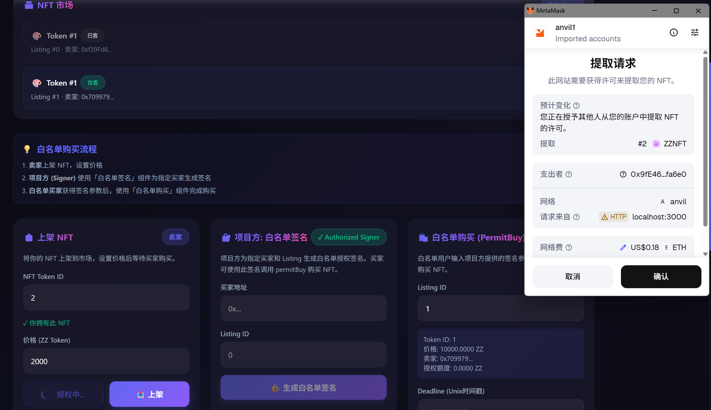
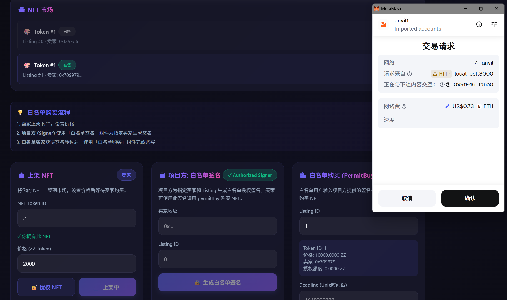
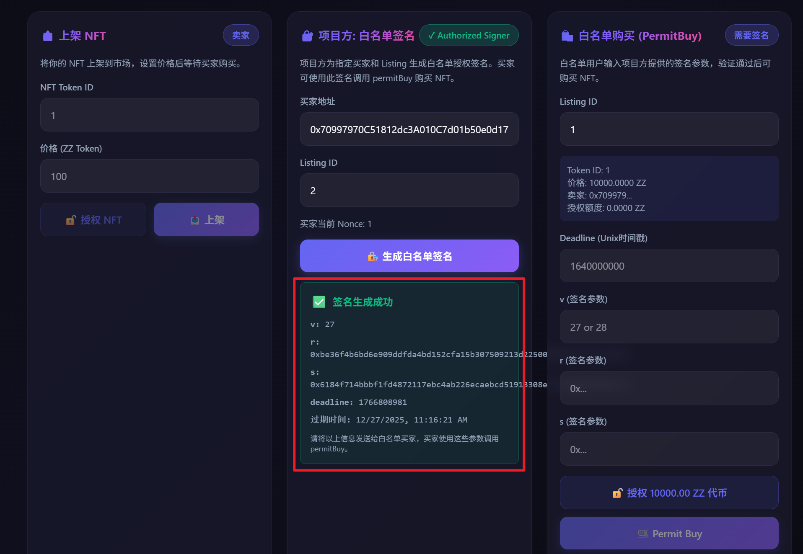
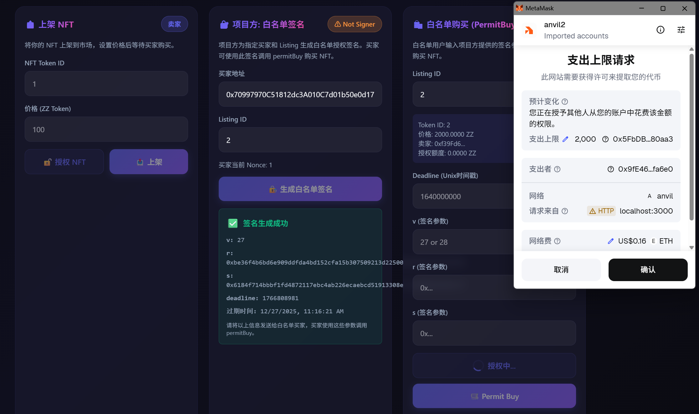
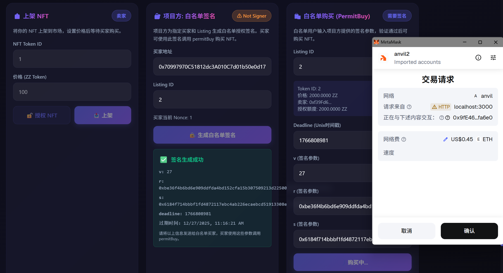

# ZZNFTMarketV3

NFT Marketplace with EIP-712 Whitelist Permit Purchase.

## Features

- 🎨 **NFT Listing**: Sellers can list NFTs with custom prices
- 🔐 **Whitelist Permit**: Project owner signs offline authorization for buyers
- ✅ **Signature Verification**: Only authorized buyers can purchase via `permitBuy()`
- 🛡️ **Replay Protection**: Nonce-based signature replay prevention

## Project Structure

```
ZZNFTMarketV3/
├── src/
│   ├── ZZNFTMarketV3.sol    # Market contract with permitBuy
│   ├── ZZNFT.sol            # ERC721 NFT
│   ├── ZZToken.sol          # ERC20 Token
│   └── interfaces/
├── test/
│   └── ZZNFTMarketV3.t.sol  # Comprehensive tests
├── script/
│   └── Deploy.s.sol         # Deployment script
└── frontend/                 # Next.js frontend
```

## Quick Start

### 1. Install Dependencies
```bash
forge install
cd frontend && npm install
```

### 2. Run Tests
```bash
forge test -vvv
```

### 3. Deploy (Anvil)
```bash
anvil  # Terminal 1
forge script script/Deploy.s.sol --rpc-url http://127.0.0.1:8545 --broadcast  # Terminal 2
```

### 4. Start Frontend
```bash
cd frontend
npm run dev
```

## Whitelist Purchase Flow

1. **Seller** lists NFT on the marketplace





2. **Project Owner (Signer)** generates EIP-712 signature for authorized buyer




3. **Buyer** receives signature parameters (v, r, s, deadline)


4. **Buyer** calls `permitBuy()` with signature to complete purchase





## Tech Stack

- **Smart Contracts**: Solidity 0.8.30, Foundry
- **Frontend**: Next.js 16, RainbowKit, Wagmi, Viem
- **Standards**: ERC721, ERC20, EIP-712
