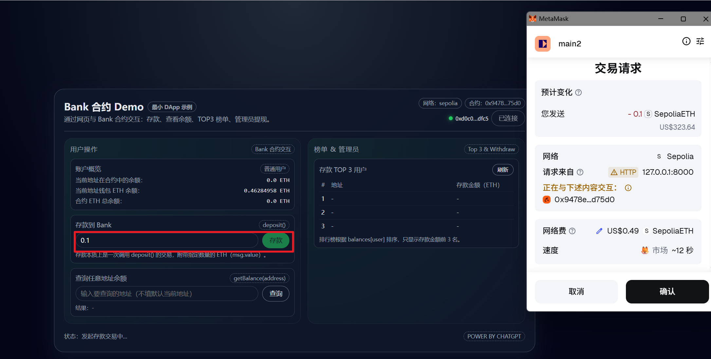
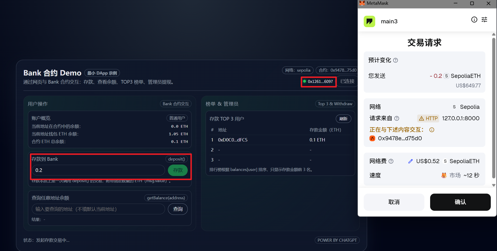
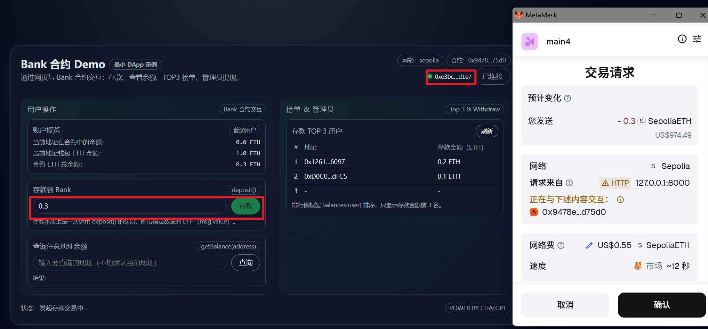
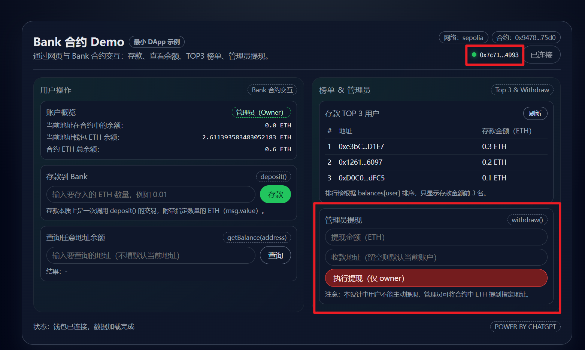
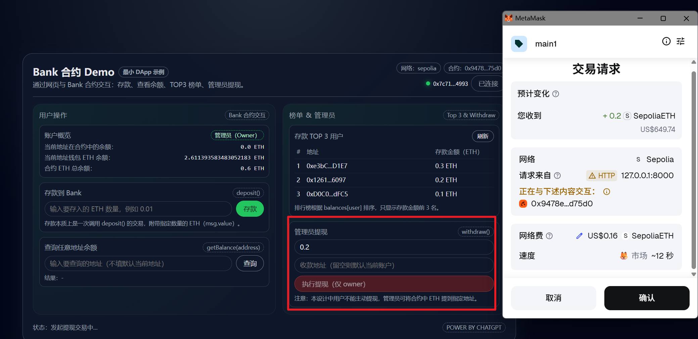
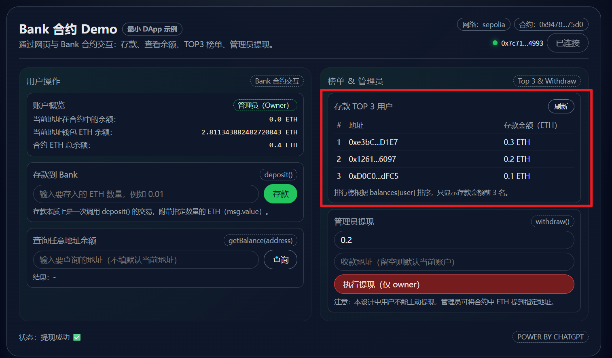
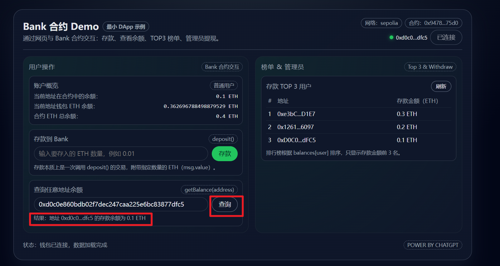

# 实现 Bank 功能

## 启动本地 Http Server, 以访问前端功能
python -m http.server 8000

## 实现
### 账户1存款0.1:

### 账户2存款0.2:

### 账户3存款0.3:

### 部署交易的账户（管理员账户）连接钱包:

### 管理员账户发起提现

### 显示存款金额的前三名账户

### 查询指定账户余额

