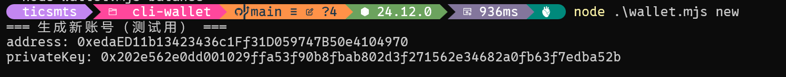
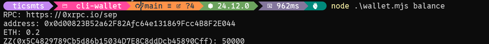
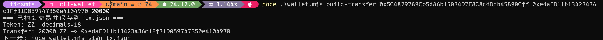
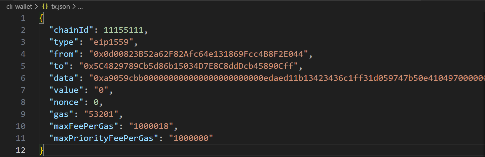
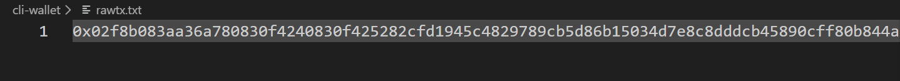
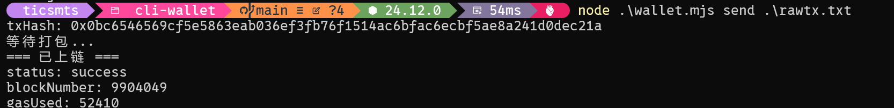
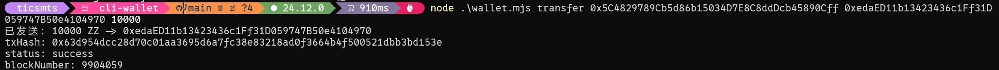
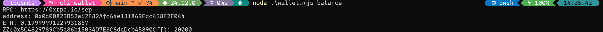

# 命令行wallet
## 题目要求
编写一个脚本（可以基于 Viem.js 、Ethers.js 或其他的库来实现）来模拟一个命令行钱包，钱包包含的功能有：

1. 生成私钥、查询余额（可人工转入金额）
2. 构建一个 ERC20 转账的 EIP 1559 交易
3. 用 1 生成的账号，对 ERC20 转账进行签名
4. 发送交易到 Sepolia 网络。

## 简单实现
### 生成私钥，地址

### 查询地址余额

### 打包交易信息

### 对交易进行签名

### 发送交易

### 一键打包签名发送交易

