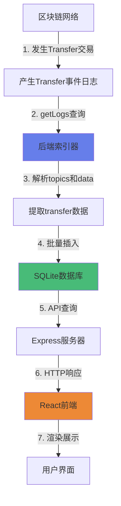

# 如何获取链上的ERC20转账记录 - 技术详解

## 📚 目录
1. [ERC20 Transfer事件基础](#1-erc20-transfer事件基础)
2. [获取历史事件日志](#2-获取历史事件日志)
3. [解析事件数据](#3-解析事件数据)
4. [批量处理与优化](#4-批量处理与优化)
5. [实时监听新事件](#5-实时监听新事件)
6. [完整数据流程](#6-完整数据流程)

---

## 1. ERC20 Transfer事件基础

### 📝 什么是Transfer事件?

ERC20标准规定,每次代币转账都必须触发一个`Transfer`事件。这个事件会被记录在区块链的事件日志中。

**事件定义:**
```solidity
event Transfer(address indexed from, address indexed to, uint256 value);
```

**关键点:**
- `indexed`关键字:使参数可以被索引和过滤
- `from`:发送方地址
- `to`:接收方地址  
- `value`:转账金额(非indexed)

### 🔍 事件在区块链上的存储结构

当事件被触发时,它会被存储为一个**日志(Log)**,包含:

```typescript
{
  address: "0x5fbdb...",        // 合约地址
  topics: [                      // 事件签名和indexed参数
    "0xddf252ad...",            // topics[0]: Transfer事件的keccak256哈希
    "0x000...f39fd...",         // topics[1]: from地址(32字节)
    "0x000...70997..."          // topics[2]: to地址(32字节)
  ],
  data: "0x0000...03e8",        // 非indexed参数:value
  blockNumber: 5,
  transactionHash: "0xabc...",
  logIndex: 0
}
```

---

## 2. 获取历史事件日志

### 🎯 使用viem的getLogs方法

我们使用viem库的`getLogs`方法来查询历史事件:

```typescript
// 第60-65行: erc20Indexer.ts
const logs = await client.getLogs({
    address: tokenAddress,                    // 过滤:只查询特定合约
    event: parseAbiItem('event Transfer(address indexed from, address indexed to, uint256 value)'),
    fromBlock: processedBlocks,               // 起始区块
    toBlock: toBlock,                         // 结束区块
});
```

**参数说明:**
- **address**: ERC20代币合约地址,只获取这个合约的事件
- **event**: 事件签名,viem会自动计算事件哈希用于过滤
- **fromBlock/toBlock**: 区块范围,避免一次查询太多数据

### 📊 分批查询策略

**为什么要分批?**
- RPC节点通常限制单次查询的区块范围(如1000-5000个区块)
- 避免超时和内存溢出

**实现代码:**(第52-79行)
```typescript
// 分批获取日志(避免RPC限制)
let processedBlocks = fromBlock;
while (processedBlocks <= currentBlock) {
    // 计算本批次的结束区块
    const toBlock = processedBlocks + BigInt(config.batchSize) > currentBlock 
        ? currentBlock 
        : processedBlocks + BigInt(config.batchSize);

    // 获取本批次的日志
    const logs = await client.getLogs({...});
    
    // 处理日志
    await this.processLogs(logs, chainId, tokenAddress);
    
    // 继续下一批
    processedBlocks = toBlock + 1n;
}
```

### 🔄 断点续传机制

**获取最后索引的区块:**(第44-46行)
```typescript
// 从数据库获取已索引的最大区块号
const lastIndexedBlock = this.db.getLastIndexedBlock(chainId, tokenAddress);
// 从下一个区块开始索引
const fromBlock = lastIndexedBlock > 0 ? BigInt(lastIndexedBlock + 1) : config.indexFromBlock;
```

这样即使程序重启,也能从上次中断的地方继续索引,不会重复处理。

---

## 3. 解析事件数据

### 🔑 理解topics和data

**日志结构:**
```
topics[0] = keccak256("Transfer(address,address,uint256)")  // 事件签名
topics[1] = from地址 (32字节,左边填充0)
topics[2] = to地址 (32字节,左边填充0)
data = value (32字节,uint256编码)
```

### 🎯 提取地址和金额

**解析代码:**(第94-106行)
```typescript
const transfer: Transfer = {
    chain_id: chainId,
    token: tokenAddress,
    tx_hash: log.transactionHash as string,
    log_index: Number(log.logIndex),
    block_number: Number(log.blockNumber),
    block_hash: log.blockHash as string,
    
    // 从topics[1]提取from地址,去掉前面的填充0
    from_address: (log.topics[1] as string).replace('0x000000000000000000000000', '0x'),
    
    // 从topics[2]提取to地址
    to_address: (log.topics[2] as string).replace('0x000000000000000000000000', '0x'),
    
    // 从data解析value,转换为字符串避免精度丢失
    value: BigInt(log.data).toString(),
    
    timestamp: Number(block.timestamp),
    created_at: Date.now(),
};
```

**关键技巧:**
1. **地址提取**: `topics[1]`是32字节,地址只有20字节,需要去掉前面的24个0
2. **金额处理**: 使用`BigInt`处理,避免JavaScript Number的精度问题
3. **转字符串存储**: 数据库中存储为字符串,前端展示时再格式化

### ⏰ 获取时间戳

**为什么需要额外查询区块?**

事件日志本身不包含时间戳,需要根据`blockHash`查询区块信息:

```typescript
// 第90-92行
const client = chainId === config.anvilChainId ? this.anvilClient : this.sepoliaClient;
const block = await client!.getBlock({ blockHash: log.blockHash as Hash });
// 使用区块的时间戳
timestamp: Number(block.timestamp)
```

---

## 4. 批量处理与优化

### 📦 批量插入数据库

**为什么要批量?**
- 减少数据库I/O次数
- 使用SQLite的事务,保证原子性

**实现:**(第114-118行)
```typescript
// 批量插入数据库
if (transfers.length > 0) {
    this.db.insertTransfers(transfers);  // 内部使用事务
    console.log(`💾 Saved ${transfers.length} transfers to database`);
}
```

**数据库端实现:**
```typescript
// database.ts中的批量插入
insertTransfers(transfers: Transfer[]): void {
    const stmt = this.db.prepare(`INSERT OR IGNORE INTO transfers (...) VALUES (...)`);
    
    // 使用事务包装
    const insertMany = this.db.transaction((transfers: Transfer[]) => {
        for (const transfer of transfers) {
            stmt.run(...transfer);
        }
    });
    
    insertMany(transfers);  // 一次性提交
}
```

### 🎯 防止重复索引

**使用复合主键:**
```sql
PRIMARY KEY (chain_id, tx_hash, log_index)
```

**INSERT OR IGNORE策略:**
- 如果记录已存在(相同chain_id + tx_hash + log_index),则跳过
- 保证幂等性,重复运行不会产生重复数据

---

## 5. 实时监听新事件

### 👀 使用watchEvent进行实时监听

除了索引历史数据,还可以实时监听新产生的Transfer事件:

```typescript
// 第122-143行
async watchNewTransfers(chainId: number): Promise<void> {
    const client = chainId === config.anvilChainId ? this.anvilClient : this.sepoliaClient;
    const tokenAddress = (chainId === config.anvilChainId 
        ? config.anvilTokenAddress 
        : config.sepoliaTokenAddress) as Address;

    client.watchEvent({
        address: tokenAddress,
        event: parseAbiItem('event Transfer(address indexed from, address indexed to, uint256 value)'),
        onLogs: async (logs) => {
            console.log(`🆕 Received ${logs.length} new transfer event(s)`);
            // 使用相同的processLogs处理
            await this.processLogs(logs, chainId, tokenAddress);
        },
    });
}
```

**工作原理:**
1. `watchEvent`会订阅区块链的新区块
2. 每当新区块产生,检查是否有匹配的Transfer事件
3. 如果有,触发`onLogs`回调
4. 自动处理并存入数据库

**优势:**
- 低延迟:新交易几秒内就能被索引
- 自动重连:网络断开会自动重试
- 统一处理:复用`processLogs`逻辑

---

## 6. 完整数据流程

### 🔄 从区块链到前端的完整流程



### 📋 详细步骤说明

#### 步骤1-2: 区块链事件产生
- 用户调用ERC20合约的`transfer`或`transferFrom`
- 合约执行成功后触发`Transfer`事件
- 事件被编码为日志并存储在区块中

#### 步骤3: 后端索引器查询
```typescript
// 查询指定区块范围的Transfer事件
const logs = await client.getLogs({
    address: tokenAddress,
    event: parseAbiItem('event Transfer(...)'),
    fromBlock: 0,
    toBlock: 100
});
// 返回: [{topics: [...], data: '0x...', ...}, ...]
```

#### 步骤4: 解析和转换
```typescript
for (const log of logs) {
    const transfer = {
        from: extractAddress(log.topics[1]),   // 0x000...f39 -> 0xf39...
        to: extractAddress(log.topics[2]),     // 0x000...abc -> 0xabc...
        value: BigInt(log.data).toString(),    // 0x03e8 -> "1000"
        ...
    };
}
```

#### 步骤5: 数据库存储
```sql
INSERT OR IGNORE INTO transfers 
(chain_id, tx_hash, log_index, from_address, to_address, value, ...)
VALUES (31337, '0xabc...', 0, '0xf39...', '0x123...', '1000000000000000000', ...)
```

#### 步骤6: API服务
```typescript
// GET /api/transfers/:address?chainId=31337
app.get('/api/transfers/:address', (req, res) => {
    const transfers = db.getTransfersByAddress(address, chainId);
    res.json({ data: transfers });
});
```

#### 步骤7: 前端展示
```javascript
const response = await fetch(`/api/transfers/${address}?chainId=31337`);
const data = await response.json();
// 渲染转账列表
```

---

## 🎯 关键技术点总结

### 1. **事件过滤效率**
- 使用`address`参数只查询特定合约
- 使用`event`签名过滤特定事件类型
- 利用`indexed`参数进行高效查找

### 2. **数据解析准确性**
- 理解EVM日志编码格式(topics + data)
- 正确处理地址的32字节填充
- 使用BigInt处理大数避免精度丢失

### 3. **性能优化**
- 分批查询避免RPC限制
- 批量插入减少数据库I/O
- 断点续传避免重复处理

### 4. **数据一致性**
- 使用复合主键保证唯一性
- INSERT OR IGNORE实现幂等性
- 事务保证批量操作原子性

### 5. **实时性**
- `getLogs`索引历史数据(离线)
- `watchEvent`监听新事件(实时)
- 两者结合实现完整覆盖

---

## 📚 延伸学习

### 可以进一步优化的方向:

1. **处理链重组(Reorg)**
   - 监听区块确认数
   - 检测并处理被重组的区块

2. **多合约并行索引**
   - 使用Promise.all并行查询多个合约
   - 提高索引效率

3. **增量索引策略**
   - 定时任务索引最新区块
   - WebSocket实时推送给前端

4. **高级过滤**
   - 根据`from`或`to`地址过滤
   - 组合多个条件查询

5. **数据聚合**
   - 计算地址余额
   - 统计转账频率
   - 生成图表数据

---

## 🔗 相关资源

- [ERC20标准](https://eips.ethereum.org/EIPS/eip-20)
- [Viem文档 - getLogs](https://viem.sh/docs/actions/public/getLogs.html)
- [Ethereum日志与事件](https://ethereum.org/en/developers/docs/smart-contracts/anatomy/#events-and-logs)
- [SQLite事务](https://www.sqlite.org/lang_transaction.html)

---

**总结**: 获取链上转账记录的核心是理解EVM事件日志的存储格式,使用合适的工具(viem)高效查询,正确解析数据,并优化存储和查询性能。本项目实现了一个完整的、生产级的ERC20转账索引器! 🎉
