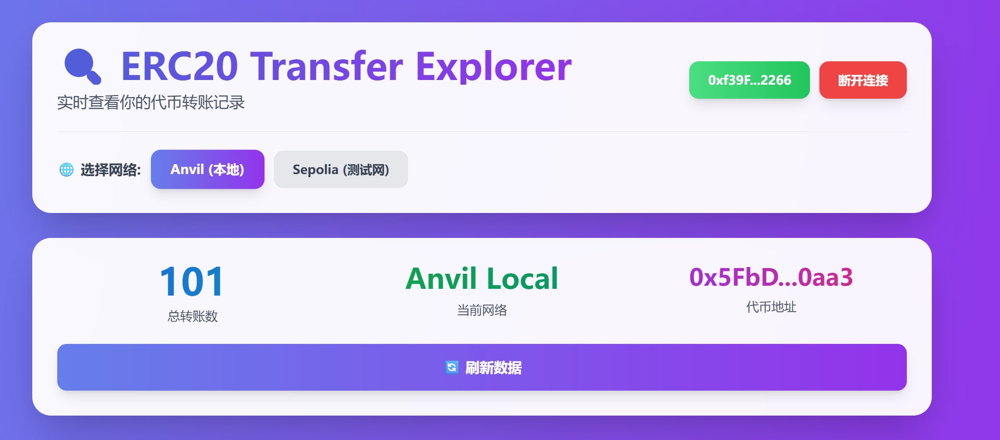
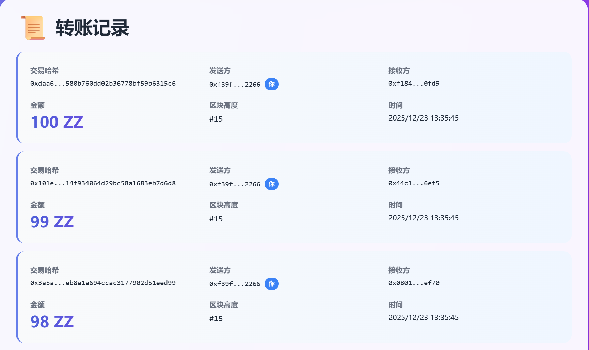

# ERC20转账索引系统 - 部署和运行手册

## 📋 项目概述

本项目是一个完整的ERC20转账数据索引系统,包含:
- **智能合约**: ZZTOKEN (ERC20代币)
- **后端服务**: 使用Viem索引链上Transfer事件并存储到SQLite数据库
- **前端界面**: HTML+vanilla JS,支持钱包连接和转账记录查询
- **支持链**: Anvil本地链(31337)和Sepolia测试网(11155111)

---

## 📸 运行截图




## ⚙️ 环境准备

### 必需工具
- **Node.js**: v18或更高版本
- **Foundry**: 最新版本 ([安装指南](https://book.getfoundry.sh/getting-started/installation))
- **MetaMask**: 浏览器扩展

### 验证安装
```bash
node --version    # 应显示 v18.x.x 或更高
forge --version   # 应显示 forge x.x.x
anvil --version   # 应显示 anvil x.x.x
```

---

## 🚀 快速开始

###步骤1: 启动Anvil本地链

在**新终端窗口**中运行:
```bash
anvil
```

**预期输出**:
```
Available Accounts
==================
(0) 0xf39Fd6e51aad88F6F4ce6aB8827279cffFb92266 (10000.000000000000000000 ETH)
(1) 0x70997970C51812dc3A010C7d01b50e0d17dc79C8 (10000.000000000000000000 ETH)
...

Private Keys
==================
(0) 0xac0974bec39a17e36ba4a6b4d238ff944bacb478cbed5efcae784d7bf4f2ff80
...

Listening on 127.0.0.1:8545
```

> ⚠️ **保持此终端窗口打开!** Anvil需要持续运行

---

### 步骤2: 部署ZZTOKEN合约

在**新终端窗口**中:

```bash
# 进入合约目录
cd c:\Users\ticsmts\Desktop\web3_study_code\erc20_indexer\contracts

# 部署合约
forge script script/Deploy.s.sol:DeployScript --rpc-url http://127.0.0.1:8545 --broadcast
```

**预期输出**:
```
== Logs ==
ZZTOKEN deployed at: 0x5fbdb2315678afecb367f032d93f642f64180aa3
Token name: ZZTOKEN
Token symbol: ZZ
Total supply: 100000000000000000000000000

ONCHAIN EXECUTION COMPLETE & SUCCESSFUL.
```

> 📝 **记录合约地址**: `0x5fbdb2315678afecb367f032d93f642f64180aa3`

---

### 步骤3: 生成100条测试转账

合约部署成功后,生成测试数据:

```bash
# 在相同终端继续执行
forge script script/GenerateTransfers.s.sol:GenerateTransfersScript --rpc-url http://127.0.0.1:8545 --broadcast
```

**预期输出**:
```
== Logs ==
Starting to generate 100 transfer transactions...
Generated 20 transfers
Generated 40 transfers
Generated 60 transfers
Generated 80 transfers
Generated 100 transfers
Successfully generated 100 transfers

ONCHAIN EXECUTION COMPLETE & SUCCESSFUL.
```

---

### 步骤4: 安装后端依赖并启动服务

在**新终端窗口**中:

```bash
# 进入后端目录
cd c:\Users\ticsmts\Desktop\web3_study_code\erc20_indexer\backend

# 安装依赖(首次运行)
npm install

# 启动后端服务
npm run dev
```

**预期输出**:
```
🚀 Starting ERC20 Transfer Indexer...

✅ Database initialized

📚 Indexing Anvil chain historical transfers...
🔍 Indexing historical transfers for chain 31337, token 0x5fbdb2315678afecb367f032d93f642f64180aa3
📊 Indexing from block 0 to 102
📦 Found 100 transfer events in blocks 0 - 102
💾 Saved 100 transfers to database
✅ Indexing complete for chain 31337

🚀 API server running on http://localhost:3001
📍 Endpoints:
   GET /health
   GET /api/transfers/:address?chainId=<chainId>&page=<page>&limit=<limit>
   GET /api/stats

📊 Total indexed transfers: 100
```

> ✅ 如果看到`Total indexed transfers: 100`,说明索引成功!

---

### 步骤5: 打开前端界面

1. 使用浏览器打开:
   ```
   c:\Users\ticsmts\Desktop\web3_study_code\erc20_indexer\frontend\index.html
   ```

2. 或者在VS Code中右键`index.html` → `Open with Live Server`

---

## 🎮 使用指南

### 配置MetaMask连接Anvil本地链

1. 打开MetaMask
2. 点击网络下拉菜单 → 添加网络 → 手动添加网络
3. 填入以下信息:
   - 网络名称: **Anvil Local**
   - RPC URL: **http://127.0.0.1:8545**
   - Chain ID: **31337**
   - 货币符号: **ETH**
4. 点击保存

### 导入Anvil测试账户

1. 在MetaMask中点击账户图标 → 导入账户
2. 粘贴Anvil的私钥(在Anvil启动时显示的第一个私钥):
   ```
   0xac0974bec39a17e36ba4a6b4d238ff944bacb478cbed5efcae784d7bf4f2ff80
   ```
3. 导入后会看到账户余额为10000 ETH

### 查看转账记录

1. 在前端页面点击 **"连接 MetaMask"**
2. 在MetaMask中授权连接
3. 确保选择 **"Anvil (本地)"** 网络
4. 页面会自动加载该地址的转账记录

**预期结果**: 会看到100条转账记录,每条包含:
- 交易哈希
- 发送方/接收方地址
- 转账金额(1 ZZ, 2 ZZ, ..., 100 ZZ)
- 区块高度
- 时间戳

---

## 🧪 测试API接口

### 测试1: 健康检查
```bash
curl http://localhost:3001/health
```
**预期输出**:
```json
{"status":"ok","timestamp":1734944000000}
```

### 测试2: 查询部署账户的转账记录
```bash
curl "http://localhost:3001/api/transfers/0xf39Fd6e51aad88F6F4ce6aB8827279cffFb92266?chainId=31337&page=1&limit=10"
```
**预期输出**: JSON格式的转账列表

### 测试3: 获取统计信息
```bash
curl http://localhost:3001/api/stats
```
**预期输出**:
```json
{"totalTransfers":100,"chainId":"all","timestamp":1734944000000}
```

---

## 📊 项目结构

```
erc20_indexer/
├── contracts/                 # Foundry智能合约项目
│   ├── src/
│   │   ├── ZZTOKEN.sol       # ERC20代币合约
│   │   └── interfaces/
│   │       └── ITokenReceiver.sol
│   ├── script/
│   │   ├── Deploy.s.sol      # 部署脚本
│   │   └── GenerateTransfers.s.sol  # 生成100条转账
│   ├── test/
│   │   └── ZZTOKEN.t.sol     # 合约测试
│   ├── .env                   # 环境配置(gitignored)
│   └── foundry.toml
│
├── backend/                   # 后端索引服务
│   ├── src/
│   │   ├── db/
│   │   │   ├── schema.ts     # 数据库类型定义
│   │   │   └── database.ts   # SQLite操作类
│   │   ├── indexer/
│   │   │   └── erc20Indexer.ts  # Viem索引器
│   │   ├── api/
│   │   │   └── server.ts     # Express API服务器
│   │   ├── config.ts         # 配置管理
│   │   └── index.ts          # 主入口
│   ├── transfers.db           # SQLite数据库(自动生成)
│   ├── package.json
│   ├── tsconfig.json
│   └── .env                   # 环境配置(gitignored)
│
└── frontend/                  # 前端界面
    └── index.html            # 单页应用(HTML+JS)
```

---

## ⚙️ 配置文件说明

### contracts/.env
```env
# Anvil本地链默认私钥(账户0)
PRIVATE_KEY=0xac0974bec39a17e36ba4a6b4d238ff944bacb478cbed5efcae784d7bf4f2ff80

# ZZTOKEN合约地址
TOKEN_ADDRESS=0x5fbdb2315678afecb367f032d93f642f64180aa3

# RPC URL
RPC_URL=http://127.0.0.1:8545
```

### backend/.env
```env
# Anvil本地链
ANVIL_RPC_URL=http://127.0.0.1:8545
ANVIL_TOKEN_ADDRESS=0x5fbdb2315678afecb367f032d93f642f64180aa3

# Sepolia测试网(可选)
SEPOLIA_RPC_URL=
SEPOLIA_TOKEN_ADDRESS=

# API配置
API_PORT=3001

# 数据库路径
DB_PATH=transfers.db

# 索引起始区块
INDEX_FROM_BLOCK=0
```

---

## 🔧 常见问题

### Q1: `anvil`命令不存在
**A**: 需要安装Foundry:
```bash
curl -L https://foundry.paradigm.xyz | bash
foundryup
```

### Q2: 后端提示"Cannot find module 'better-sqlite3'"
**A**: 运行`npm install`安装依赖

### Q3: 前端显示"加载失败: API请求失败"
**A**: 检查:
1. 后端服务是否在运行(`http://localhost:3001`)
2. 浏览器控制台是否有CORS错误
3. .env中的TOKEN_ADDRESS是否正确

### Q4: MetaMask无法连接到Anvil
**A**: 
1. 确保Anvil正在运行(`http://127.0.0.1:8545`)
2. 在MetaMask中重置账户(设置 → 高级 → 重置账户)
3. 检查Chain ID是否为31337

### Q5: 前端显示"暂无转账记录"
**A**: 确保:
1. 已运行`GenerateTransfers.s.sol`脚本
2. 后端成功索引(查看后端日志)
3. 连接的钱包地址有转账记录(尝试使用部署账户`0xf39Fd...`)

### Q6: 后端索引失败
**A**: 检查:
```bash
# 测试Anvil是否可访问
curl http://127.0.0.1:8545 -X POST -H "Content-Type: application/json" --data '{"jsonrpc":"2.0","method":"eth_blockNumber","params":[],"id":1}'
```

---

## 🌐 部署到Sepolia测试网(可选)

### 1. 获取Sepolia测试ETH
访问 [Sepolia Faucet](https://www.alchemy.com/faucets/ethereum-sepolia) 获取测试ETH

### 2. 配置环境变量
在`contracts/.env`中添加:
```env
SEPOLIA_RPC_URL=https://rpc.sepolia.org
# 或使用Alchemy/Infura RPC
```

### 3. 部署合约到Sepolia
```bash
forge script script/Deploy.s.sol:DeployScript --rpc-url $SEPOLIA_RPC_URL --broadcast --verify
```

### 4. 更新后端配置
在`backend/.env`中填入Sepolia合约地址:
```env
SEPOLIA_RPC_URL=https://rpc.sepolia.org
SEPOLIA_TOKEN_ADDRESS=<Sepolia上的合约地址>
```

### 5. 重启后端索引Sepolia
重新运行`npm run dev`,后端会自动索引Sepolia链的数据

---

## 📝 API文档

### GET /health
健康检查

**响应**:
```json
{
  "status": "ok",
  "timestamp": 1734944000000
}
```

### GET /api/transfers/:address
查询指定地址的转账记录

**参数**:
- `address`: 钱包地址(path参数)
- `chainId`: 链ID,31337(Anvil)或11155111(Sepolia)(query参数,必需)
- `page`: 页码,默认1(query参数,可选)
- `limit`: 每页数量,默认50(query参数,可选)

**响应**:
```json
{
  "data": [
    {
      "chain_id": 31337,
      "token": "0x5fbdb2315678afecb367f032d93f642f64180aa3",
      "tx_hash": "0x...",
      "log_index": 0,
      "block_number": 2,
      "block_hash": "0x...",
      "from_address": "0xf39fd...",
      "to_address": "0x1234...",
      "value": "1000000000000000000",
      "timestamp": 1734943000,
      "created_at": 1734944000
    }
  ],
  "pagination": {
    "page": 1,
    "limit": 50,
    "total": 100,
    "totalPages": 2
  }
}
```

### GET /api/stats
获取索引统计信息

**响应**:
```json
{
  "totalTransfers": 100,
  "chainId": "all",
  "timestamp": 1734944000000
}
```

---

## 🎯 验证清单

完成以下步骤确认系统正常运行:

- [ ] Anvil本地链正在运行(`http://127.0.0.1:8545`)
- [ ] ZZTOKEN合约已部署(地址: `0x5fbdb...`)
- [ ] 已生成100条测试转账
- [ ] 后端服务正在运行(`http://localhost:3001`)
- [ ] 后端成功索引100条转账(查看启动日志)
- [ ] API健康检查通过(`curl http://localhost:3001/health`)
- [ ] MetaMask已配置Anvil网络(Chain ID: 31337)
- [ ] 前端页面可以正常打开
- [ ] 可以连接MetaMask钱包
- [ ] 可以查看转账记录列表

全部完成后,系统successfully运行! 🎉

---

## 📚 技术栈

- **智能合约**: Solidity 0.8.30, Foundry
- **后端**: Node.js, TypeScript, Viem, Express, better-sqlite3
- **前端**: HTML5, Vanilla JavaScript, MetaMask
- **区块链**: Ethereum (Anvil本地链 + Sepolia测试网)

---

## 🔗 相关链接

- [Foundry Book](https://book.getfoundry.sh/)
- [Viem Documentation](https://viem.sh/)
- [MetaMask Developer Docs](https://docs.metamask.io/)
- [ERC20 Standard](https://eips.ethereum.org/EIPS/eip-20)

---

**祝使用愉快! 如有问题,请检查常见问题部分或查看终端日志输出。**
