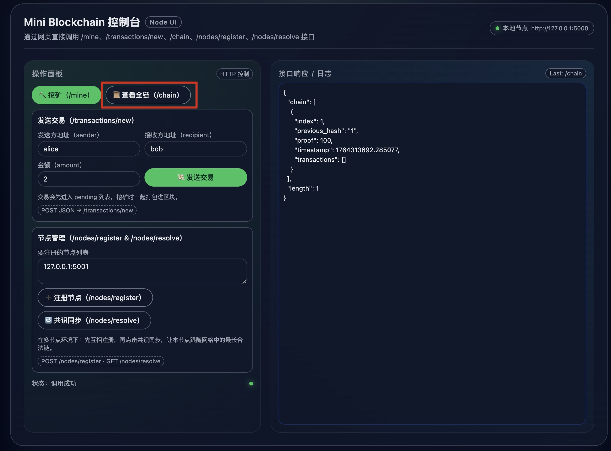
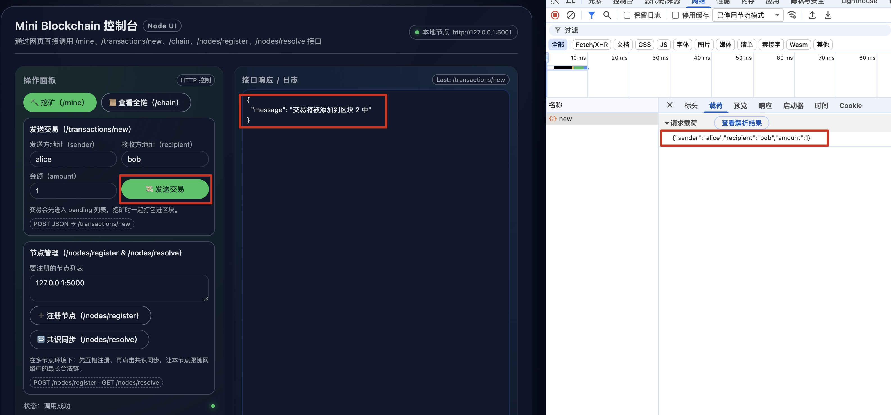
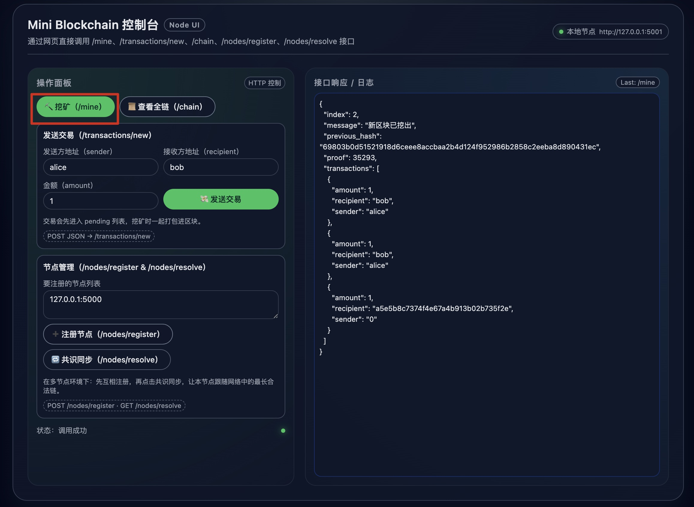
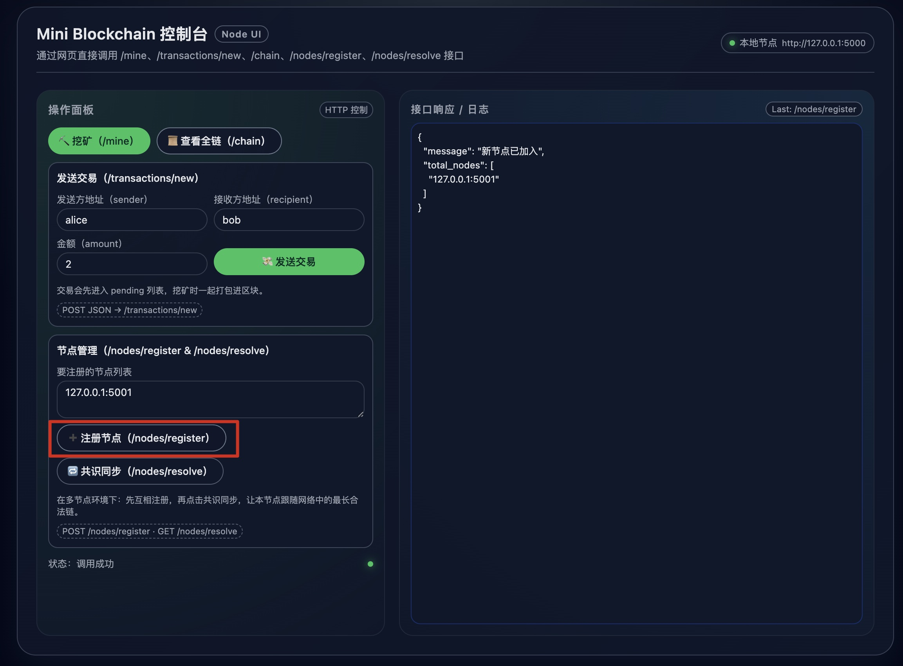
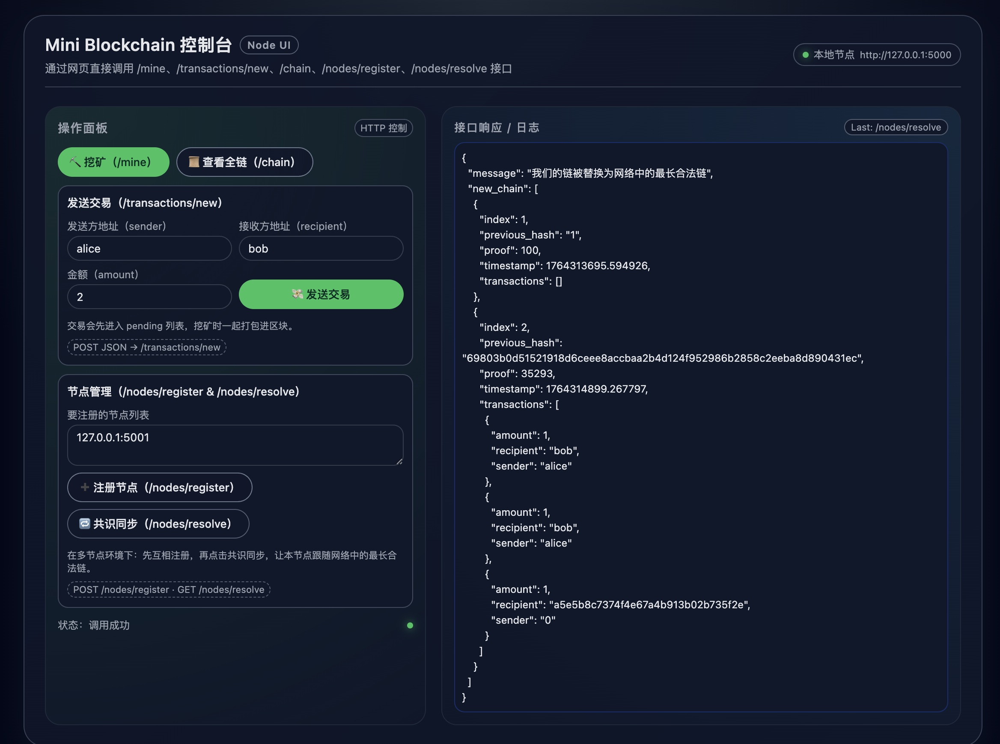

# blockchain 实现
## 运行环境
pip install flask requests

## 启动2个区块链节点
python3 blockchain_node_useFlask.py --port 5000
python3 blockchain_node_useFlask.py --port 5001

节点1功能测试：http://127.0.0.1:5000/
节点2功能测试：http://127.0.0.1:5001/

## 调用/node, 查看当前节点的区块链

## 调用/new/transaction, 创建新交易

## 调用/mine, 打包交易, 创建新块

## 调用/node/register, 注册节点

## 调用/node/resolve, 共识同步, 同步最长合法链
